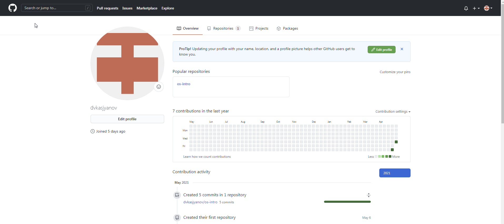
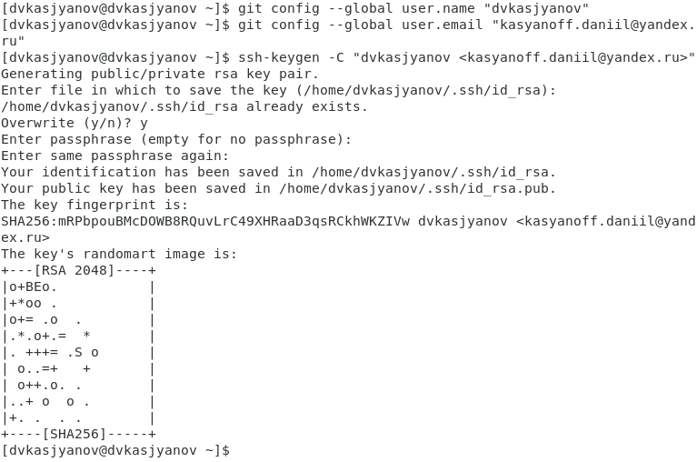
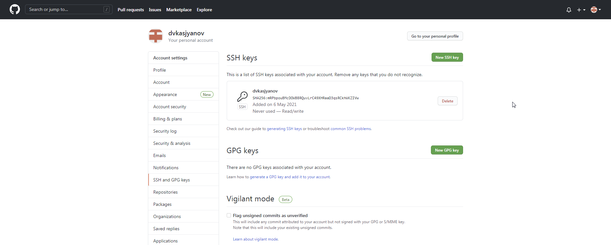
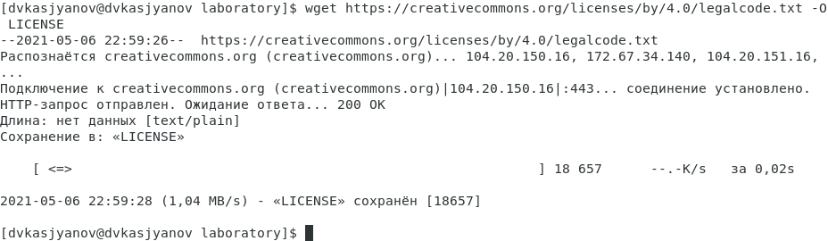
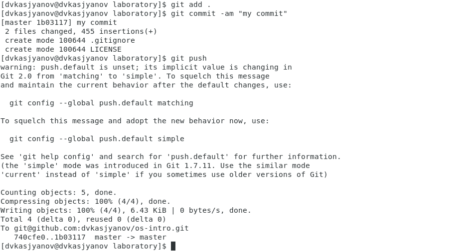
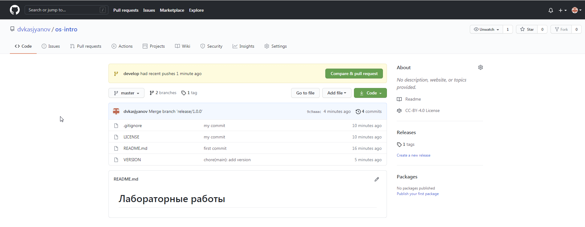

---
## Front matter
lang: ru-RU
title: Операционные системы 
author: Касьянов Даниил Владимирович
institute: РУДН, Москва, Россиия

date: 13 мая 2021 год

## Formatting
toc: false
slide_level: 2
theme: metropolis
header-includes: 
 - \metroset{progressbar=frametitle,sectionpage=progressbar,numbering=fraction}
 - '\makeatletter'
 - '\beamer@ignorenonframefalse'
 - '\makeatother'
aspectratio: 43
section-titles: true
---

# Лабораторная работа №2

## Цель работы

Изучить идеологию и применение средств контроля версий.

## Ход работы

Я создал учетную запись на сайте github, провёл настройку системы git в консоли Linux, сгенерировал пару ключей и загрузил их на сайт. Создал локальный репозиторий через терминал.

 Создание учётной записи 

##

 Генерация ключей 

## 

 Готовые ключи 

##

Провёл первичную конфигурацию: добавил лицензию, шаблон игнорируемых файлов, скачал шаблон для С.

 Добавление лицензии 

 Шаблон игнорируемых файлов для C 

##

Синхронизировал локальный и удаленный репозиторий. Инициализировал и настроил git-flow.  Отправил все данные на github.

 Отправка на github 

##

Убедился в корректности выполненной работы. 

 Проверка 

## Выводы

Я изучил идеологию и применение средств контроля версий.

## {.standout}

Спасибо за внимание!
