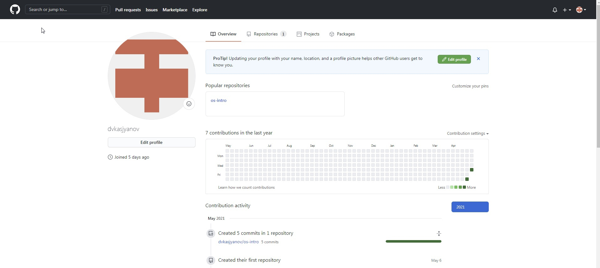
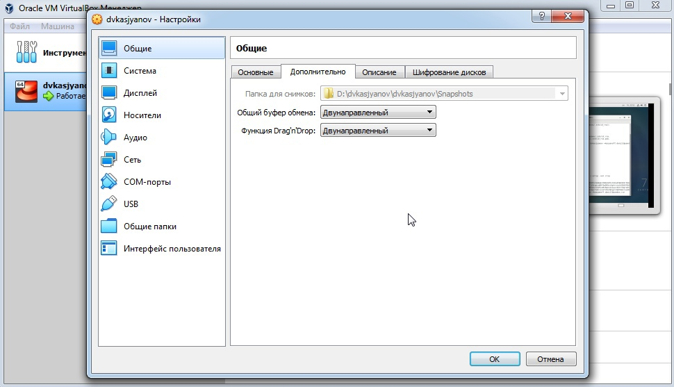
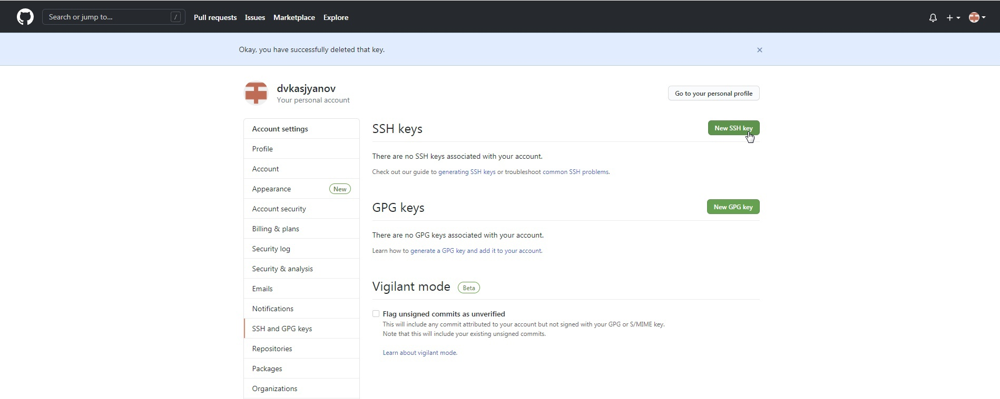
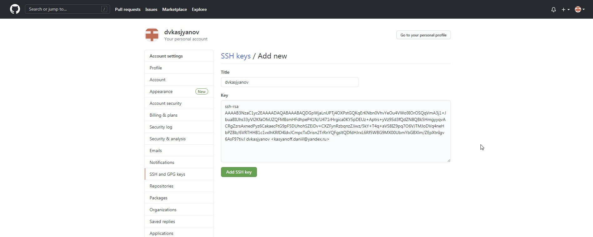
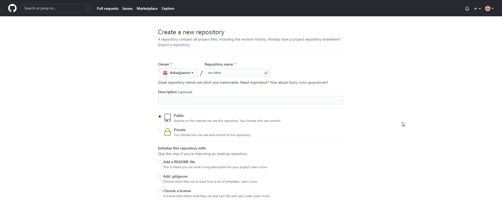
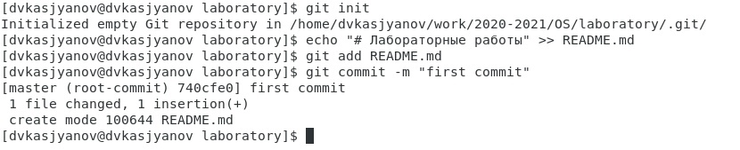
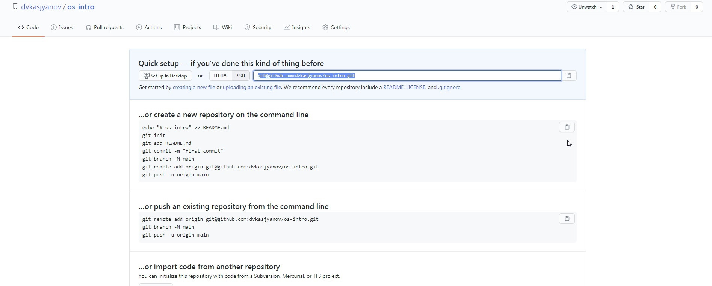
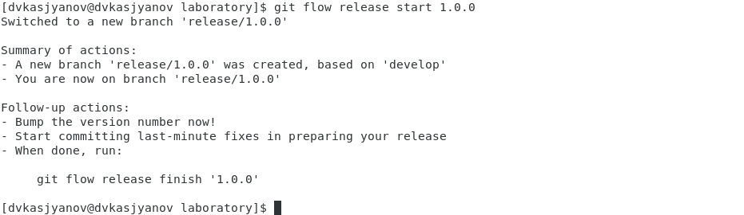
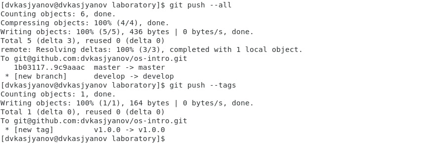
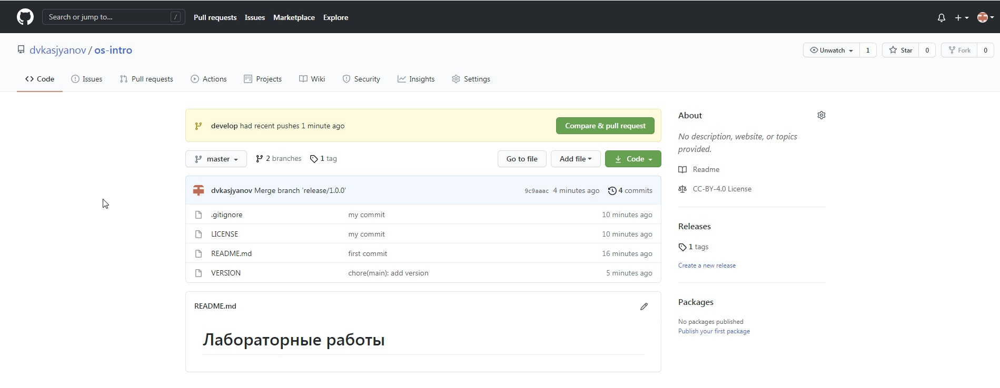

---
# Front matter
lang: ru-RU
title: "Отчёт лабораторной работы №3"
subtitle: "Дисциплина: Операционные системы"
author: "Касьянов Даниил Владимирович"

# Formatting
toc-title: "Содержание"
toc: true # Table of contents
toc_depth: 2
lof: true # List of figures
lot: true # List of tables
fontsize: 12pt
linestretch: 1.5
papersize: a4paper
documentclass: scrreprt
polyglossia-lang: russian
polyglossia-otherlangs: english
mainfont: PT Serif
romanfont: PT Serif
sansfont: PT Sans
monofont: PT Mono
mainfontoptions: Ligatures=TeX
romanfontoptions: Ligatures=TeX
sansfontoptions: Ligatures=TeX,Scale=MatchLowercase
monofontoptions: Scale=MatchLowercase
indent: true
pdf-engine: lualatex
header-includes:
  - \linepenalty=10 # the penalty added to the badness of each line within a paragraph (no associated penalty node) Increasing the value makes tex try to have fewer lines in the paragraph.
  - \interlinepenalty=0 # value of the penalty (node) added after each line of a paragraph.
  - \hyphenpenalty=50 # the penalty for line breaking at an automatically inserted hyphen
  - \exhyphenpenalty=50 # the penalty for line breaking at an explicit hyphen
  - \binoppenalty=700 # the penalty for breaking a line at a binary operator
  - \relpenalty=500 # the penalty for breaking a line at a relation
  - \clubpenalty=150 # extra penalty for breaking after first line of a paragraph
  - \widowpenalty=150 # extra penalty for breaking before last line of a paragraph
  - \displaywidowpenalty=50 # extra penalty for breaking before last line before a display math
  - \brokenpenalty=100 # extra penalty for page breaking after a hyphenated line
  - \predisplaypenalty=10000 # penalty for breaking before a display
  - \postdisplaypenalty=0 # penalty for breaking after a display
  - \floatingpenalty = 20000 # penalty for splitting an insertion (can only be split footnote in standard LaTeX)
  - \raggedbottom # or \flushbottom
  - \usepackage{float} # keep figures where there are in the text
  - \floatplacement{figure}{H} # keep figures where there are in the text
---

# Цель работы

Целью данной работы является изучение идеологии применения средств контроля версий.

# Задание

– Сделайте отчёт по предыдущей лабораторной работе в формате Markdown.

– В качестве отчёта просьба предоставить отчёты в 3 форматах: pdf, docx и md (в архиве, поскольку он должен содержать скриншоты, Makefile и т.д.).

# Выполнение лабораторной работы

Создаем учётную запись на [https://github.com](https://github.com) (Рисунок 1).




(Рисунок 1)


Настраиваем систему контроля версий git c использованием сервера репозиториев https://github.com/. Сделаем  предварительную  конфигурацию,  указав  имя  и  email  владельца репозитория (dvkasjyanov, kasyanoff.daniil@yandex.ru) (Рисунок 2).


(Рисунок 2)


Для  последующей  идентификации  пользователя  на сервере репозиториев необходимо сгенерировать пару ключей (приватный и открытый) (Рисунок 3): 
```
ssh-keygen -C "dvkasjyanov <kasyanoff.daniil@yandex.ru>"
```


(Рисунок 3)


Перехожу в «Настройки» → «Общие» → «Дополнительно» в виртуальной машине.  В  параметрах  «Общий буфер  обмена» и  «Функция Drag’n’Drop» выбираю «Двунаправленный» (Рисунок 4). Это необходимо для того, чтобы ключ, сгенерированный в терминале Linux, можно было вставить в браузере в Windows.




(Рисунок 4)


Используем  команду `cat ~/.ssh/id_rsa.pub | xclip-sel clip` для  копирования ключа в буфер обмена. В моем случае команда выдает ошибку, поэтому я использую команду `cat ~/.ssh/id_rsa.pub` и копирую сгенерированный ключ самостоятельно (Рисунок 5).


(Рисунок 5)


Загрузим  ключ  на  сайте https://github.com/. Переходим в  меню «GitHub setting», выбираем в боковом меню «GitHub setting» (Рисунок 6), «SSH-ключи» и нажимаем кнопку «Добавить ключ» (Рисунок 7).


(Рисунок 6)




(Рисунок 7)


Вставляем ключ в появившееся на сайте поле (Рис. 8, 9).




(Рисунок 8)


(Рисунок 9)


Создаём репозиторий на https://github.com/, выбрав в меню «Репозитории» → «Создать репозиторий» (Рисунок 10).
Назову репозиторий os-intro и открою общий доступ (Рисунок 11).


(Рисунок 10)




(Рисунок 11)


Создадим рабочий  каталог laboratory,  указав  его  расположение  согласно соглашению об именовании (Рисунок 12).


(Рисунок 12)


Инициализируем системы git:
```
git init
```
Создаём заготовку для файла README.md: 
```
echo "# Лабораторные работы" >> README.md 
git add README.md
```
Делаем первый коммит и выкладываем на github (Рисунок 13):
```
git commit -m "first commit"
```




(Рисунок 13)


Копируем SSH ссылку на репозиторий с сайта github (Рисунок 14), выкладываем созданный репозиторий на github, используя ссылку в формате SSH (Рисунок 15): 
```
git remote add origin git@github.com:<username>/sciproc-intro.git
git push -u origin master
```




(Рисунок 14)


(Рисунок 15)


Проведём первичную конфигурацию. 
Добавим файл лицензии (Рисунок 16): 
```
wget https://creativecommons.org/licenses/by/4.0/legalcode.txt -O LICENSE 
```


(Рисунок 16)


Добавим шаблон игнорируемых файлов. Просмотреть список имеющихся шаблонов можно с помощью команды: 
```
curl -L -s https://www.gitignore.io/api/list
```
Скачаем шаблон для C (Рисунок 17):
```
curl -L -s https://www.gitignore.io/api/c >> .gitignore
```


(Рисунок 17)


Добавим новые файлы:
```
git add .
```
Выполним коммит: 
```
git commit –am 'my commit'
```
Отправим на github (Рисунок 18):
```
git push
```


(Рисунок 18)


Инициализируем git-flow: 
```
git flow init
```
Оставим префиксы master, develop, feature/, release/, hotfix/, support/ без изменений; префикс для ярлыков установим в v (Рисунок 19). 


(Рисунок 19)


Проверим, что мы на ветке develop: `git branch` (Рисунок 20).


(Рисунок 20)


Создадим релиз с версией 1.0.0: `git flow release start 1.0.0` (Рисунок 21).




(Рисунок 21)


Запишем версию: `echo "1.0.0" >> VERSION` (Рисунок 22).


(Рисунок 22)


Добавим в индекс: 
```
git add .
```
Сделаем commit (Рисунок 23):
```
git commit -am 'chore(main): add version'
```


(Рисунок 23)


Зальём релизную ветку в основную ветку (Рисунок 24): 
```
git flow release finish 1.0.0
```


(Рисунок 24)


В открывшихся окнах вводим произвольные сообщения (Рис. 25, 26).

 


(Рисунок 25)


(Рисунок 26)


Отправим данные на github (Рисунок 27): 
```
git push --all
git push –tags
```




(Рисунок 27)


Убедимся в том, что репозиторий был создан верно (Рис. 28, 29).


(Рисунок 28)




(Рисунок 29)


# Контрольные вопросы
1) VCS (VersionControlSystem), система контроля версий – программное обеспечение, используемое для работы с различными версиями проекта; применяются при работе нескольких человек над одним проектом. Обычно основное дерево проекта хранится в локальном или удалённом репозитории, к которому настроен доступ для участников проекта. При внесении изменений в содержание проекта система контроля версий позволяет их фиксировать, совмещать изменения, произведённые разными участниками проекта, производить откат к любой более ранней версии проекта, если это требуется. Сервер может проводить дельта-компрессию, сохраняя не полные версии проекта, а изменения между последовательными версиями, уменьшая объем хранимых данных и упрощая взаимодействие между локальным и удаленным репозиторием. Системы контроля версий поддерживают возможность отслеживания и разрешения конфликтов, которые могут возникнуть при работе нескольких человек над одним файлом. Можно объединить (слить) изменения, сделанные разными участниками (автоматически или вручную), вручную выбрать нужную версию, отменить изменения вовсе или заблокировать файлы для изменения. В зависимости от настроек блокировка не позволяет другим пользователям получить рабочую копию или препятствует изменению рабочей копии файла средствами файловой системы ОС, обеспечивая таким образом, привилегированный доступ только одному пользователю, работающему с файлом. Системы контроля версий также могут обеспечивать дополнительные, более гибкие функциональные возможности. Например, они могут поддерживать работу с несколькими версиями одного файла, сохраняя общую историю изменений до точки ветвления версий и собственные истории изменений каждой ветви. Кроме того, обычно доступна информация о том, кто из участников, когда и какие изменения вносил. Обычно такого рода информация хранится в журнале изменений, доступ к которому можно ограничить. 


2) Хранилище (репозиторий) - место, где хранятся и поддерживаются какие-либо данные. Сохранение локальных изменений, синхронизация с репозиторием производится с помощью команды commit (в системе git для загрузки изменений на репозитории используется затем команда push). Commit так же некоторая точка сохранения версии. История – список всех изменений. Рабочая копия – копия проекта из репозитория, над которой проводит изменения (с которой работает) пользователь.


3) Централизованная VCS: один центральный репозиторий, с которым разработчики взаимодействуют по сетиили локально. Примеры: CVS, SVN (Subversion). Распределенные VCS (DVCS) не нуждаются в централизованном хранилище: вся история изменения документов хранится на каждом компьютере, в локальном хранилище, и при необходимости отдельные фрагменты истории локального хранилища синхронизируются с аналогичным хранилищем на другом компьютере. В некоторых таких системах локальное хранилище располагается непосредственно в каталогах рабочей копии. Примеры: Git, Mercurial, Bazaar.


4) 
- Создать новый репозиторий на локальном устройстве (если он не был создан);

- Внести изменения в исходные файлы;

- Выполнить индексацию необходимых файлов; 

- Проверить внесенные изменения; 

- Выполнить commit; 

- Отправить локальный репозиторий на удаленный сервер, при необходимости.


5)
- Загрузить проект из общего удаленного хранилища;

- Необходимо создать свою рабочую ветку;

- Внести изменения внутри своей рабочей ветки;

- Выполнить индексацию необходимых файлов на своем локальном устройстве;

- Проверить внесенные изменения;

- Выполнить commit;

- Свою рабочую ветку отправить в общее хранилище;

- При необходимости внести изменения и отправить снова;

- После администратор объединит вашу ветку с master branch.


6) У Git две основных задачи: первая − хранить информацию о всех изменениях в проекте, а вторая − обеспечение удобства командной работы над кодом. Git запоминает не все изменения, а только те, которые указывает пользователь. Осуществляется это при помощи индекса репозитория (посредник между компьютером и удаленным репозиторием) и команд git add, git rm.


7) 
`git init` – создание (инициализация) основного дерева репозитория;

`git pull` - получение  обновлений (изменений)  текущего  дерева  из центрального репозитория;

`git push` - отправка всех произведённых изменений локального дерева в центральный репозиторий;

`git status` - просмотр списка изменённых файлов в текущей директории

`git diff` - просмотр текущих изменений;

добавление текущих изменений:

`git  add .` - добавить  все  изменённые  и/или  созданные  файлы  и/или каталоги;

`git  add  имена_файлов` - добавить  конкретные  изменённые  и/или созданные файлы и/или каталоги;

`git rm имена_файлов` - удалить файл и/или каталог из индекса репозитория (при этом файл и/или каталог остаётся в локальной директории);


сохранение добавленных изменений:

`git   commit -am  'Описание  коммита'` - сохранить  все  добавленные изменения и все изменённые файлы;

`git    commit` - сохранить  добавленные  изменения  с  внесением комментария через встроенный редактор;

`git branch` – создание ветки;

`git checkout имя_ветки` - переключение на некоторую ветку;

`git  checkout -b  имя_ветки` - создание новой ветки,  базирующейся  на текущей (заменяет команды `git branch` и `git checkout имя_ветки`);

`git  push  origin  имя_ветки` - отправка  изменений  конкретной  ветки  в центральный репозиторий;

`git merge --no-ff имя_ветки` - слияние ветки с текущим деревом;


удаление ветки: 

`git  branch -d имя_ветки` - удаление локальной уже слитой с основным деревом ветки;

`git branch -D имя_ветки` - принудительное удаление локальной ветки;

`git push origin :имя_ветки` - удаление ветки с центрального репозитория.


8) 
Примеры использования VCS при работе с локальными репозиториями: 

Создание небольшого проекта на своем локальном устройстве, работа с файлами  (например,  каталог,  содержащий  документы,  презентации, которые будут часто редактироваться), работа с фотографиями, видео и т.д. 


Примеры использования VCS при работе с удаленными репозиториями: 

Примеры могут быть те же, но теперь над ними работают несколько человек.  Такая  система  позволяет  следить  за  работой  других пользователей.


9) Ветвление («ветка», branch) − один из параллельных участков истории в одном хранилище, исходящих из одной версии (точки ветвления).

* Обычно есть главная ветка (master), или ствол (trunk). 
* Между ветками, то есть их концами, возможно слияние. 

Ветки  используются  для  разработки  одной  части функционала изолированно от других. Каждая ветка представляет собой отдельную копию  кода  проекта.  Ветки  позволяют  одновременно  работать  над разными версиями проекта. Каждый репозиторий по умолчанию имеет ветку  master.  Всякий  раз,  когда  требуется  разработка нового функционала,  не  внося  при  этом  изменений  в  основную  рабочую версию,  можно  создавать  новую  ветку,  на  основе  рабочей,  и  вести разработку  в  ней  −  новой  копии  кода  проекта.  Когда  функционал доделан и оттестирован, можно сделать merge − слить отдельную ветку обратно с основной. При слиянии этой временной ветки в основную, все её коммиты разом перенесутся из одной в другую. Ветвление позволяет обеспечить процесс, при котором всегда в наличии будет рабочая версия проекта,  в  которой  не  будет  частично  завершённого  функционала находящегося в активной разработке или же непротестированных фич.


10) Во время работы над проектом так или иначе могут создаваться файлы, которые не требуется добавлять в последствии в репозиторий. Например, временные файлы, создаваемые редакторами, или объектные файлы,  создаваемые  компиляторами.  Можно  прописать  шаблоны игнорируемых  при  добавлении  в  репозиторий  типов  файлов  в  файл .gitignore  с  помощью  сервисов.  Для  этого  сначала  нужно  получить список имеющихся шаблонов: `curl -L -s https://www.gitignore.io/api/list`.Затем скачать шаблон, например, для C и C++: `curl -L -s https://www.gitignore.io/api/c >> .gitignore curl -L -s https://www.gitignore.io/api/c++ >> .gitignore`.


# Выводы

Я изучил идеологию и применение средств контроля версий.
