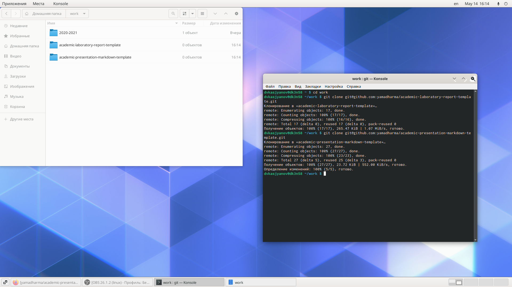
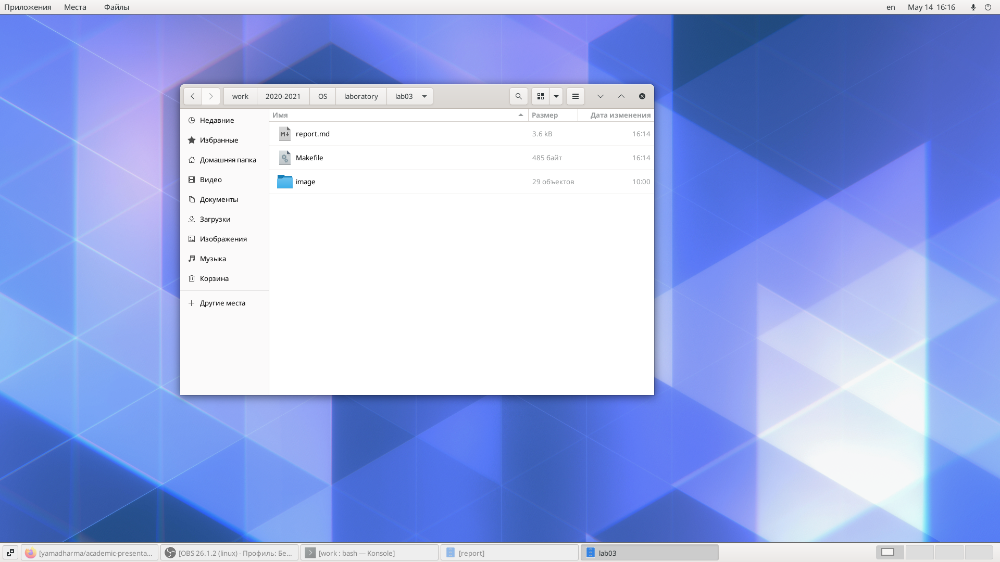
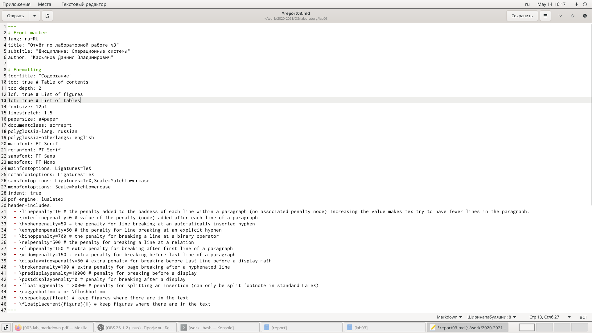
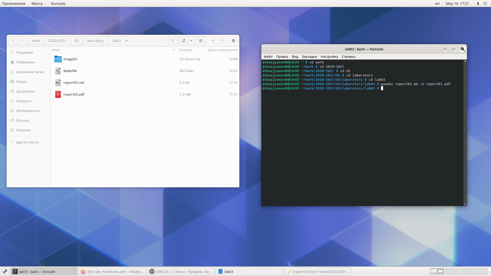
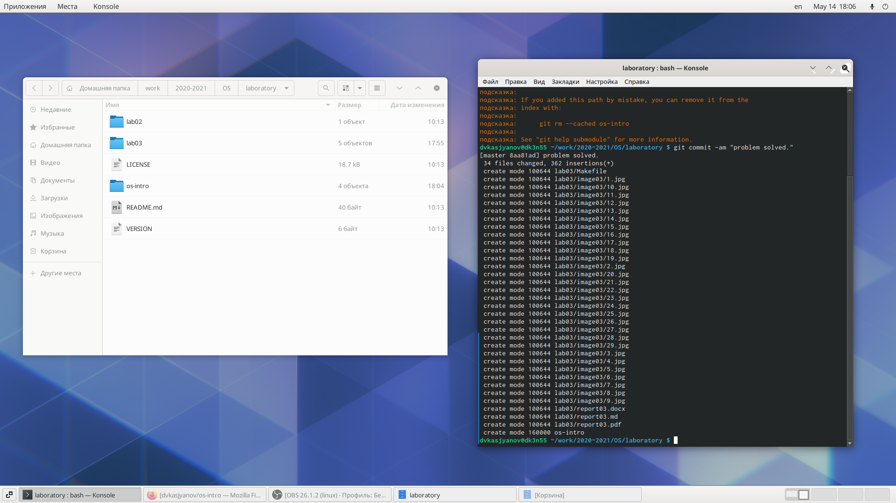

---
## Front matter
lang: ru-RU
title: Structural approach to the deep learning method
author: |
	Leonid A. Sevastianov\inst{1,3}
	\and
	Anton L. Sevastianov\inst{1}
	\and
	Edik A. Ayrjan\inst{2}
	\and
	Anna V. Korolkova\inst{1}
	\and
	Dmitry S. Kulyabov\inst{1,2}
	\and
	Imrikh Pokorny\inst{4}
institute: |
	\inst{1}RUDN University, Moscow, Russian Federation
	\and
	\inst{2}LIT JINR, Dubna, Russian Federation
	\and
	\inst{3}BLTP JINR, Dubna, Russian Federation
	\and
	\inst{4}Technical University of Košice, Košice, Slovakia
date: NEC--2019, 30 September -- 4 October, 2019 Budva, Montenegro

## Formatting
toc: false
slide_level: 2
theme: metropolis
header-includes: 
 - \metroset{progressbar=frametitle,sectionpage=progressbar,numbering=fraction}
 - '\makeatletter'
 - '\beamer@ignorenonframefalse'
 - '\makeatother'
aspectratio: 43
section-titles: true
---

# Цель работы

Научиться оформлять отчёты с помощью легковесного языка разметки Markdown.

# Ход работы

Я скопировал репозитории с шаблонами отчёта и презентации.

В рабочей директории создал папку image03 с пронумерованными для удобства скриншотами; переместил в рабочую директорию шаблон лабораторной работы в формате Markdown и Makefile.

С помощью тектового редактора оформил титульный лист, скопировал текст из оформленного отчёта и вставил в шаблон. Исправил все ошибки, появившиеся в процессе копирования. 

Используя команду `pandoc README.md -o README.pdf` создал отчёт в формате pdf. Анологично для отчёта в формате docx.

Сохраняю все локальные изменения и передаю их на репозиторий github.

Проверяю репозиторий

# Вывод

Я научился оформлять отчёты с помощью легковесного языка разметки Markdown.

## {.standout}

Wer's nicht glaubt, bezahlt einen Taler
