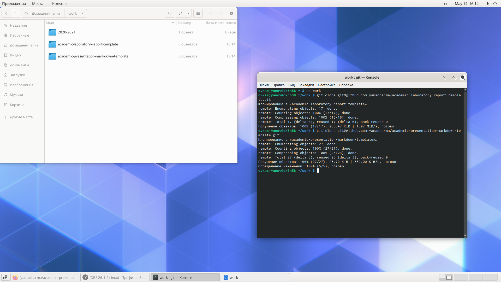
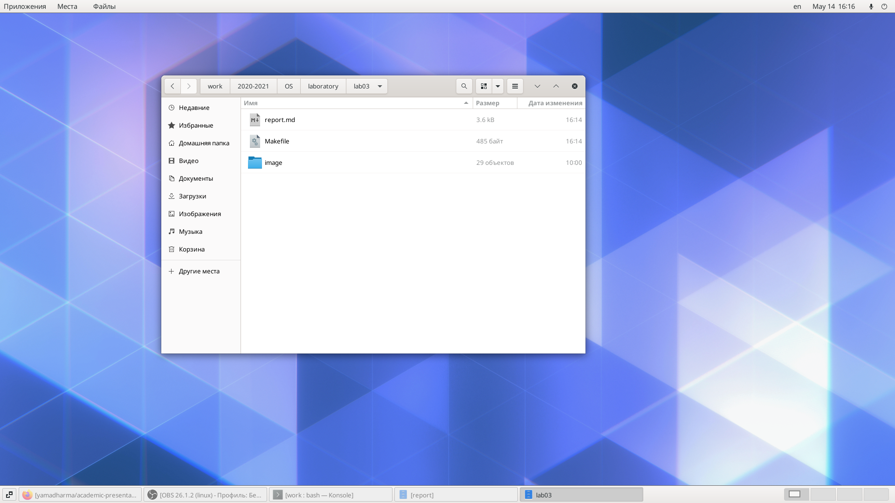
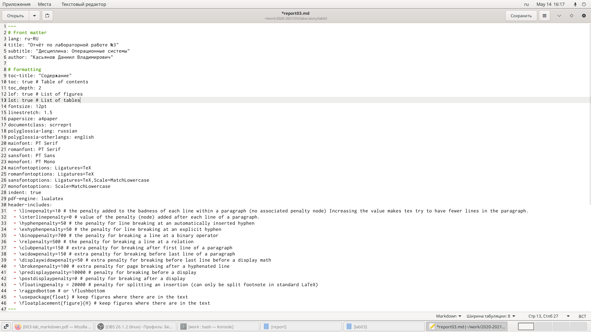
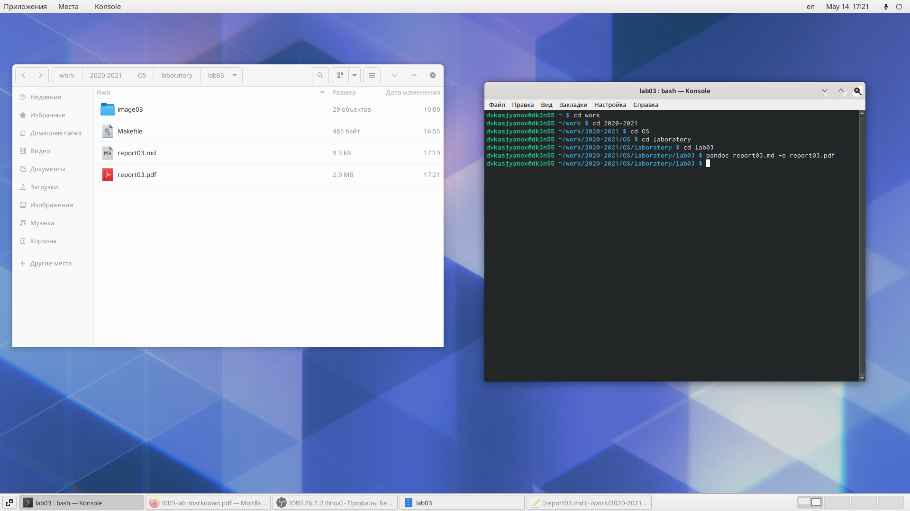
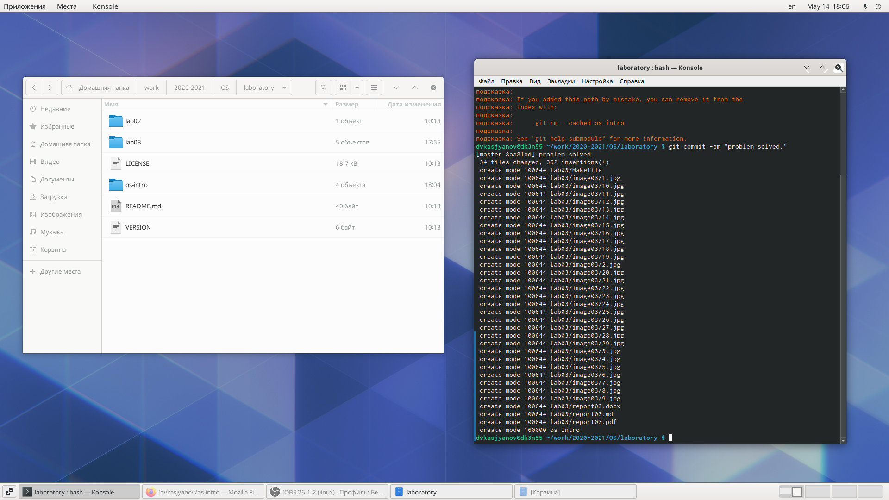
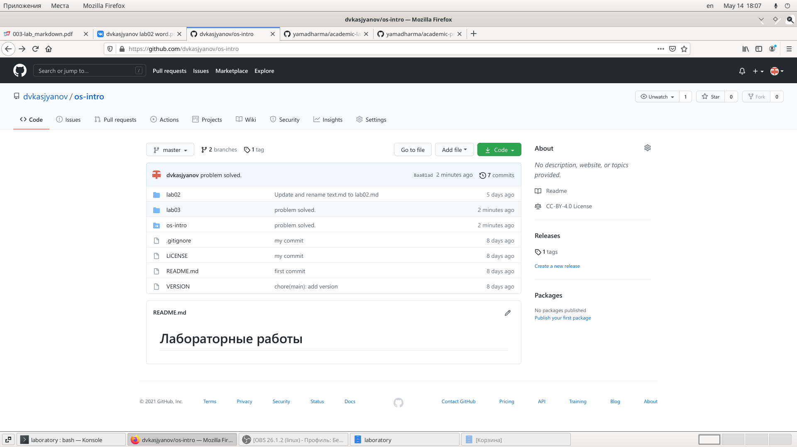
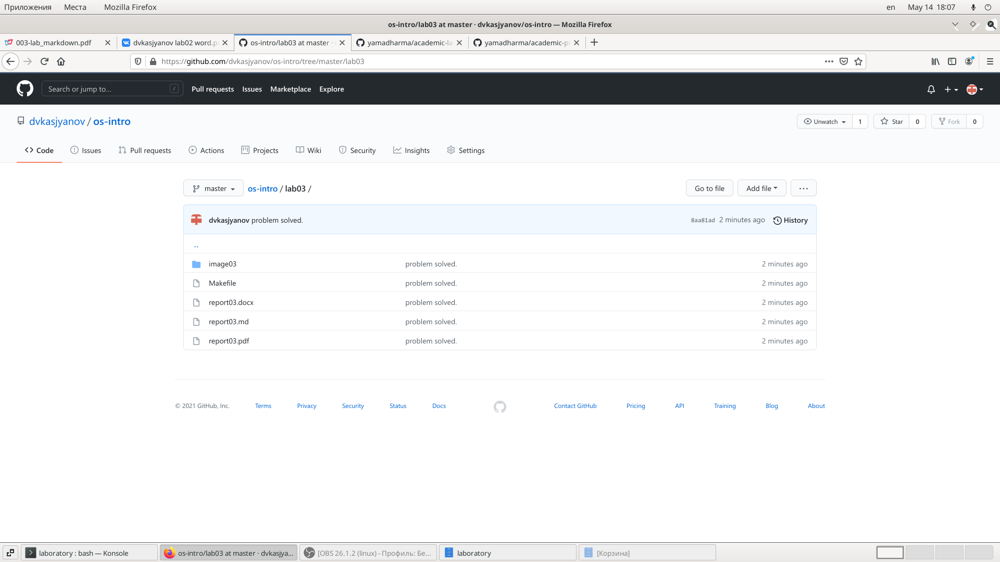

---
## Front matter
lang: ru-RU
title: Операционные системы 
author: Касьянов Даниил Владимирович
institute: RUDN University, Moscow, Russian Federation

date: 13 мая 2021 год

## Formatting
toc: false
slide_level: 2
theme: metropolis
header-includes: 
 - \metroset{progressbar=frametitle,sectionpage=progressbar,numbering=fraction}
 - '\makeatletter'
 - '\beamer@ignorenonframefalse'
 - '\makeatother'
aspectratio: 43
section-titles: true
---

# Лабораторная работа №3

## Ход работы

Я скопировал репозитории с шаблонами отчёта и презентации.

Клонирование репозиториев

## 

В рабочей директории создал папку image03 с пронумерованными для удобства скриншотами; переместил в рабочую директорию шаблон лабораторной работы в формате Markdown и Makefile.

Создание папки по шаблону

##

С помощью тектового редактора оформил титульный лист, скопировал текст из оформленного отчёта и вставил в шаблон. Исправил все ошибки, появившиеся в процессе копирования. 

Оформление отчёта

##

Используя команду `pandoc README.md -o README.pdf` создал отчёт в формате pdf. Анологично для отчёта в формате docx.

Создание отчёта в формате pdf и docx

##

Сохраняю все локальные изменения и передаю их на репозиторий github.

Передача изменений на github

##

Проверяю репозиторий

Проверка

##

Проверка

## Выводы

Я научился оформлять отчёты с помощью легковесного языка разметки Markdown.

## {.standout}

Спасибо за внимание!
