---
# Front matter
lang: ru-RU
title: "Отчёт лабораторной работы №3"
subtitle: "Дисциплина: Операционные системы"
author: "Касьянов Даниил Владимирович"

# Formatting
toc-title: "Содержание"
toc: true # Table of contents
toc_depth: 2
lof: true # List of figures
lot: true # List of tables
fontsize: 12pt
linestretch: 1.5
papersize: a4paper
documentclass: scrreprt
polyglossia-lang: russian
polyglossia-otherlangs: english
mainfont: PT Serif
romanfont: PT Serif
sansfont: PT Sans
monofont: PT Mono
mainfontoptions: Ligatures=TeX
romanfontoptions: Ligatures=TeX
sansfontoptions: Ligatures=TeX,Scale=MatchLowercase
monofontoptions: Scale=MatchLowercase
indent: true
pdf-engine: lualatex
header-includes:
  - \linepenalty=10 # the penalty added to the badness of each line within a paragraph (no associated penalty node) Increasing the value makes tex try to have fewer lines in the paragraph.
  - \interlinepenalty=0 # value of the penalty (node) added after each line of a paragraph.
  - \hyphenpenalty=50 # the penalty for line breaking at an automatically inserted hyphen
  - \exhyphenpenalty=50 # the penalty for line breaking at an explicit hyphen
  - \binoppenalty=700 # the penalty for breaking a line at a binary operator
  - \relpenalty=500 # the penalty for breaking a line at a relation
  - \clubpenalty=150 # extra penalty for breaking after first line of a paragraph
  - \widowpenalty=150 # extra penalty for breaking before last line of a paragraph
  - \displaywidowpenalty=50 # extra penalty for breaking before last line before a display math
  - \brokenpenalty=100 # extra penalty for page breaking after a hyphenated line
  - \predisplaypenalty=10000 # penalty for breaking before a display
  - \postdisplaypenalty=0 # penalty for breaking after a display
  - \floatingpenalty = 20000 # penalty for splitting an insertion (can only be split footnote in standard LaTeX)
  - \raggedbottom # or \flushbottom
  - \usepackage{float} # keep figures where there are in the text
  - \floatplacement{figure}{H} # keep figures where there are in the text
---

# Цель работы

Целью данной работы является изучение идеологии применения средств контроля версий.

# Задание

– Сделайте отчёт по предыдущей лабораторной работе в формате Markdown.

– В качестве отчёта просьба предоставить отчёты в 3 форматах: pdf, docx и md (в архиве, поскольку он должен содержать скриншоты, Makefile и т.д.).

# Выполнение лабораторной работы

Создаем учётную запись на [https://github.com](https://github.com) (Рисунок 1).


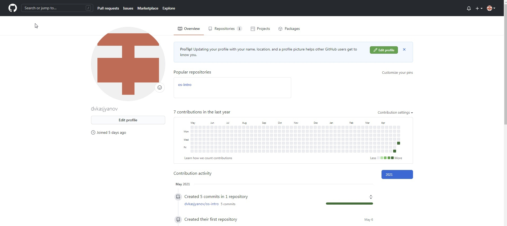

(Рисунок 1)


Настраиваем систему контроля версий git c использованием сервера репозиториев https://github.com/. Сделаем  предварительную  конфигурацию,  указав  имя  и  email  владельца репозитория (dvkasjyanov, kasyanoff.daniil@yandex.ru) (Рисунок 2).


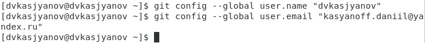

(Рисунок 2)


Для  последующей  идентификации  пользователя  на сервере репозиториев необходимо сгенерировать пару ключей (приватный и открытый) (Рисунок 3): 
```
ssh-keygen -C "dvkasjyanov <kasyanoff.daniil@yandex.ru>"
```


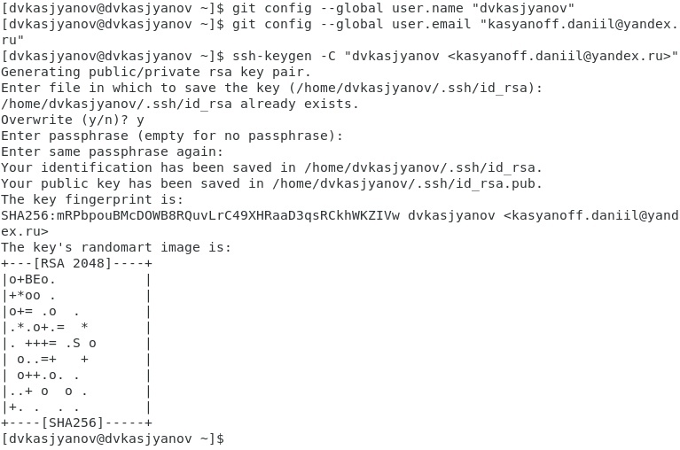

(Рисунок 3)


Перехожу в «Настройки» → «Общие» → «Дополнительно» в виртуальной машине.  В  параметрах  «Общий буфер  обмена» и  «Функция Drag’n’Drop» выбираю «Двунаправленный» (Рисунок 4). Это необходимо для того, чтобы ключ, сгенерированный в терминале Linux, можно было вставить в браузере в Windows.


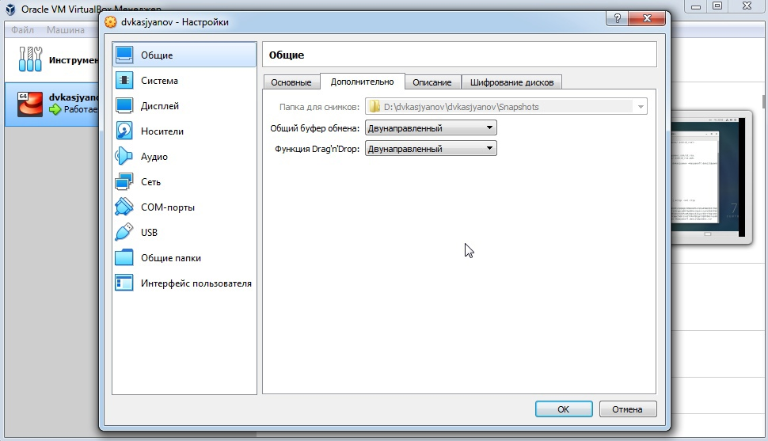

(Рисунок 4)


Используем  команду `cat ~/.ssh/id_rsa.pub | xclip-sel clip` для  копирования ключа в буфер обмена. В моем случае команда выдает ошибку, поэтому я использую команду `cat ~/.ssh/id_rsa.pub` и копирую сгенерированный ключ самостоятельно (Рисунок 5).


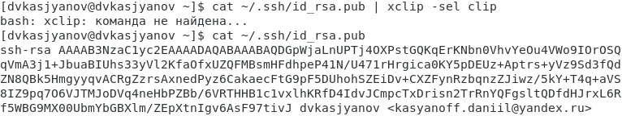

(Рисунок 5)


Загрузим  ключ  на  сайте https://github.com/. Переходим в  меню «GitHub setting», выбираем в боковом меню «GitHub setting» (Рисунок 6), «SSH-ключи» и нажимаем кнопку «Добавить ключ» (Рисунок 7).


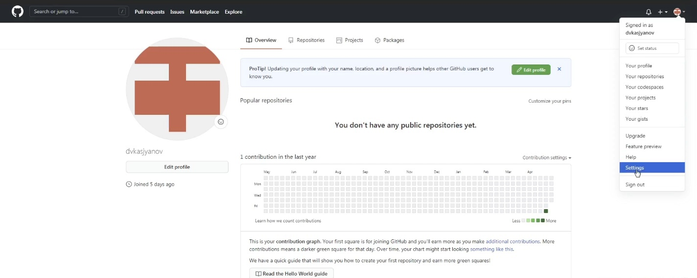

(Рисунок 6)


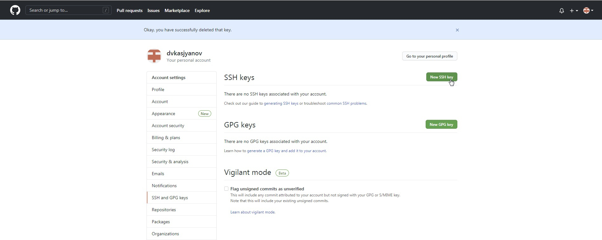

(Рисунок 7)


Вставляем ключ в появившееся на сайте поле (Рис. 8, 9).


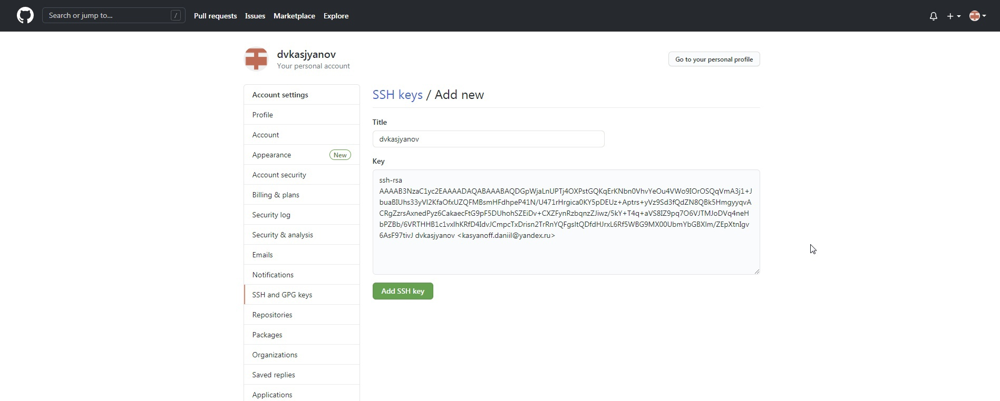

(Рисунок 8)


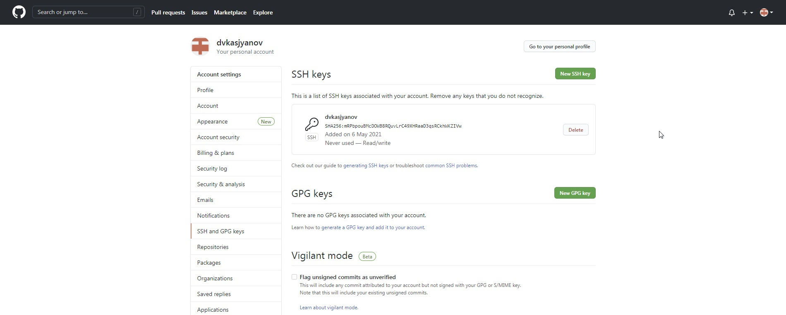

(Рисунок 9)


Создаём репозиторий на https://github.com/, выбрав в меню «Репозитории» → «Создать репозиторий» (Рисунок 10).
Назову репозиторий os-intro и открою общий доступ (Рисунок 11).


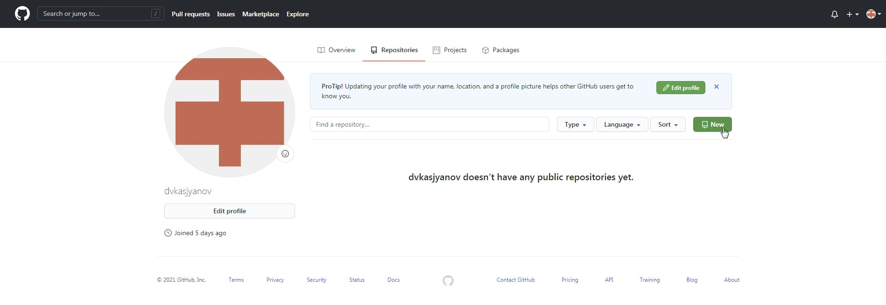

(Рисунок 10)


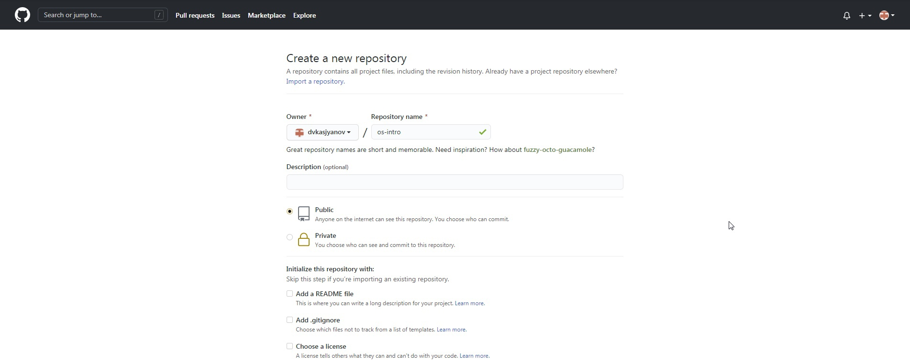

(Рисунок 11)


Создадим рабочий  каталог laboratory,  указав  его  расположение  согласно соглашению об именовании (Рисунок 12).


(Рисунок 12)


Инициализируем системы git:
```
git init
```
Создаём заготовку для файла README.md: 
```
echo "# Лабораторные работы" >> README.md 
git add README.md
```
Делаем первый коммит и выкладываем на github (Рисунок 13):
```
git commit -m "first commit"
```


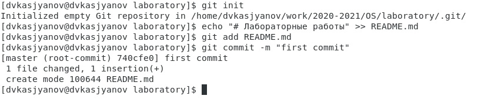

(Рисунок 13)


Копируем SSH ссылку на репозиторий с сайта github (Рисунок 14), выкладываем созданный репозиторий на github, используя ссылку в формате SSH (Рисунок 15): 
```
git remote add origin git@github.com:<username>/sciproc-intro.git
git push -u origin master
```


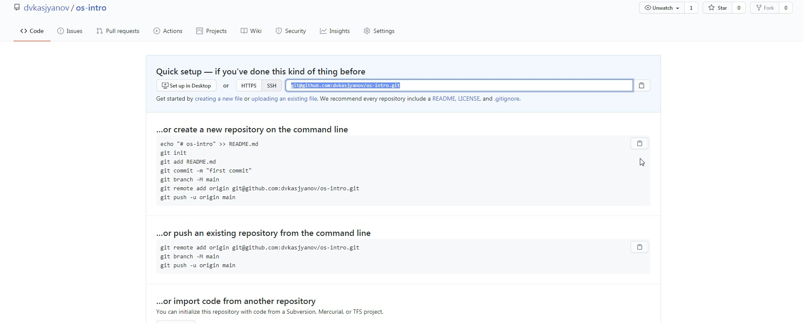

(Рисунок 14)


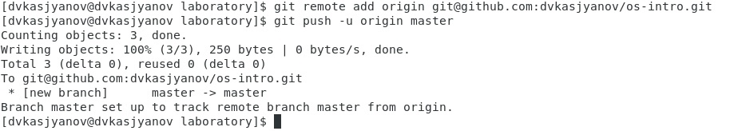

(Рисунок 15)


Проведём первичную конфигурацию. 
Добавим файл лицензии (Рисунок 16): 
```
wget https://creativecommons.org/licenses/by/4.0/legalcode.txt -O LICENSE 
```


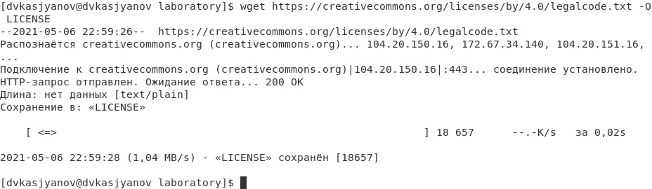

(Рисунок 16)


Добавим шаблон игнорируемых файлов. Просмотреть список имеющихся шаблонов можно с помощью команды: 
```
curl -L -s https://www.gitignore.io/api/list
```
Скачаем шаблон для C (Рисунок 17):
```
curl -L -s https://www.gitignore.io/api/c >> .gitignore
```


(Рисунок 17)


Добавим новые файлы:
```
git add .
```
Выполним коммит: 
```
git commit –am 'my commit'
```
Отправим на github (Рисунок 18):
```
git push
```


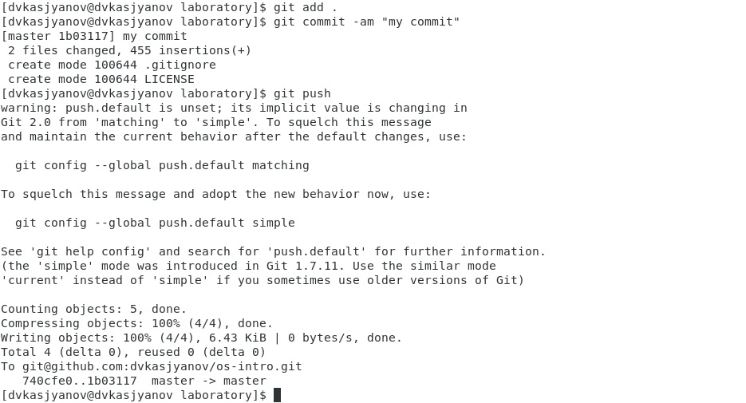

(Рисунок 18)


Инициализируем git-flow: 
```
git flow init
```
Оставим префиксы master, develop, feature/, release/, hotfix/, support/ без изменений; префикс для ярлыков установим в v (Рисунок 19). 


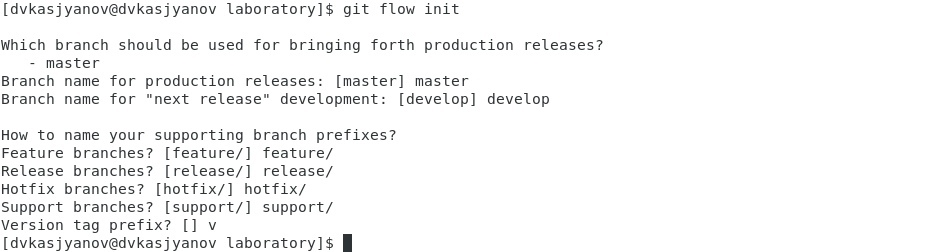

(Рисунок 19)


Проверим, что мы на ветке develop: `git branch` (Рисунок 20).


(Рисунок 20)


Создадим релиз с версией 1.0.0: `git flow release start 1.0.0` (Рисунок 21).


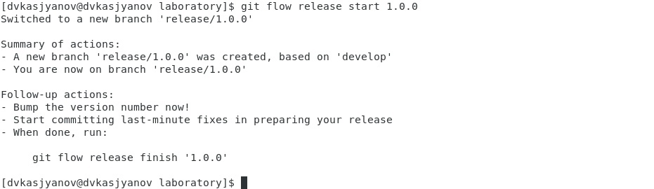

(Рисунок 21)


Запишем версию: `echo "1.0.0" >> VERSION` (Рисунок 22).


(Рисунок 22)


Добавим в индекс: 
```
git add .
```
Сделаем commit (Рисунок 23):
```
git commit -am 'chore(main): add version'
```


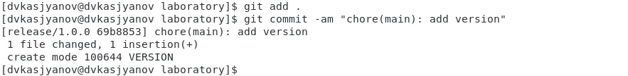

(Рисунок 23)


Зальём релизную ветку в основную ветку (Рисунок 24): 
```
git flow release finish 1.0.0
```


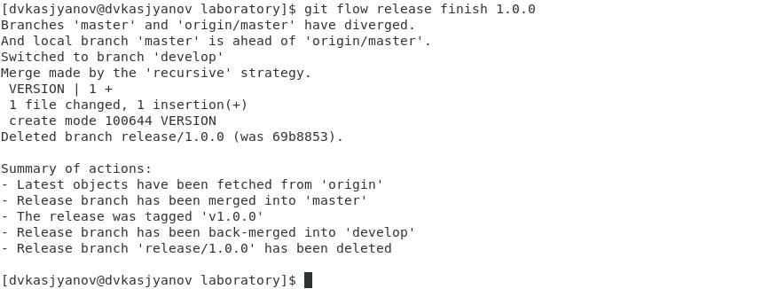

(Рисунок 24)


В открывшихся окнах вводим произвольные сообщения (Рис. 25, 26).

 


(Рисунок 25)


(Рисунок 26)


Отправим данные на github (Рисунок 27): 
```
git push --all
git push –tags
```


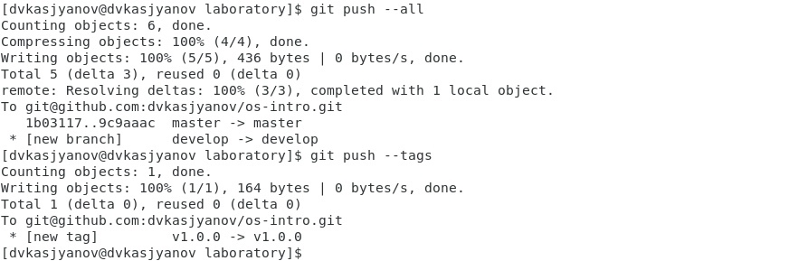

(Рисунок 27)


Убедимся в том, что репозиторий был создан верно (Рис. 28, 29).


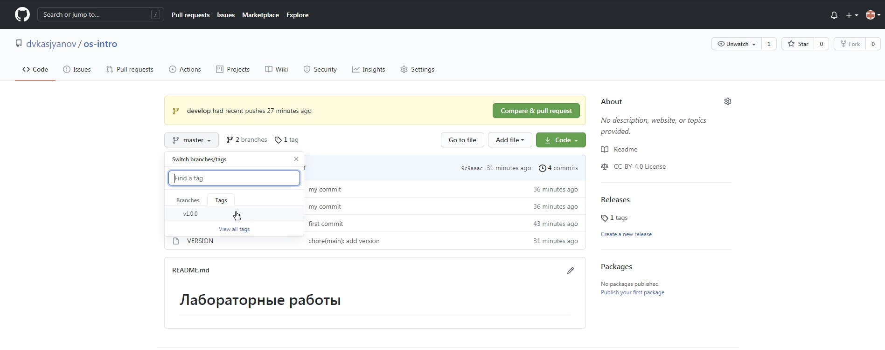

(Рисунок 28)


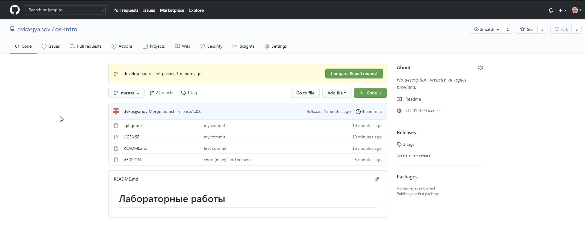

(Рисунок 29)


# Выводы

Я изучил идеологию и применение средств контроля версий.
