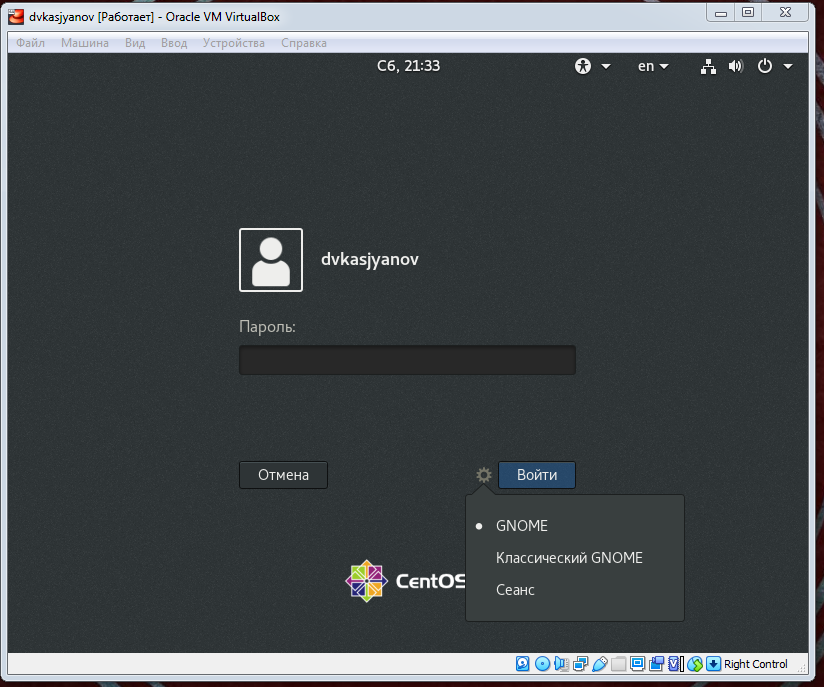
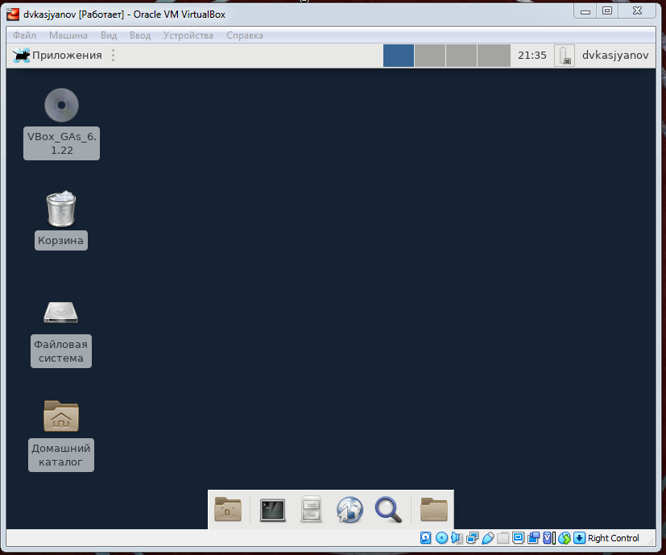

---
# Front matter
lang: ru-RU
title: "Отчёт лабораторной работы №5"
subtitle: "Дисциплина: Операционные системы"
author: "Касьянов Даниил Владимирович"

# Formatting
toc-title: "Содержание"
toc: true # Table of contents
toc_depth: 2
lof: true # List of figures
lot: true # List of tables
fontsize: 12pt
linestretch: 1.5
papersize: a4paper
documentclass: scrreprt
polyglossia-lang: russian
polyglossia-otherlangs: english
mainfont: PT Serif
romanfont: PT Serif
sansfont: PT Sans
monofont: PT Mono
mainfontoptions: Ligatures=TeX
romanfontoptions: Ligatures=TeX
sansfontoptions: Ligatures=TeX,Scale=MatchLowercase
monofontoptions: Scale=MatchLowercase
indent: true
pdf-engine: lualatex
header-includes:
  - \linepenalty=10 # the penalty added to the badness of each line within a paragraph (no associated penalty node) Increasing the value makes tex try to have fewer lines in the paragraph.
  - \interlinepenalty=0 # value of the penalty (node) added after each line of a paragraph.
  - \hyphenpenalty=50 # the penalty for line breaking at an automatically inserted hyphen
  - \exhyphenpenalty=50 # the penalty for line breaking at an explicit hyphen
  - \binoppenalty=700 # the penalty for breaking a line at a binary operator
  - \relpenalty=500 # the penalty for breaking a line at a relation
  - \clubpenalty=150 # extra penalty for breaking after first line of a paragraph
  - \widowpenalty=150 # extra penalty for breaking before last line of a paragraph
  - \displaywidowpenalty=50 # extra penalty for breaking before last line before a display math
  - \brokenpenalty=100 # extra penalty for page breaking after a hyphenated line
  - \predisplaypenalty=10000 # penalty for breaking before a display
  - \postdisplaypenalty=0 # penalty for breaking after a display
  - \floatingpenalty = 20000 # penalty for splitting an insertion (can only be split footnote in standard LaTeX)
  - \raggedbottom # or \flushbottom
  - \usepackage{float} # keep figures where there are in the text
  - \floatplacement{figure}{H} # keep figures where there are in the text
---

# Цель работы

Познакомиться с операционной системой Linux, получить практические навыки работы с консолью и некоторыми графическими менеджерами рабочих столов операционной
системы.

# Выполнение лабораторной работы
1. Ознакомился с теоретическими материалами
2. Загрузил компьютер
3. Перешёл на текстовую консоль. Всего получилось открыть четыре консоли (Рисунок 1).
 
    

    (Рисунок 1)

4. Перемещался между текстовыми консолями с помощью сочетаний клавиш `Alt+Fn`, где n - число от 1 до 6 - номер консоли (F7 позволяет переключиться в графический интерфейс).
   
5. Зарегистрировался в текстовой консоли, используя логин и пароль от учетной записи (Рисунок 2). При вводе пароля символы не отображаются.

    

    (Рисунок 2)

6. Завершил консольный сеанс, нажав комбинацию клавиш `Ctrl+D`.

7. Нажатием комбинации `Ctrl+Alt+F7` переключился в графический интерфейс (Рисунок 3).
   
    

    (Рисунок 3)

8. Ознакомился с менеджером рабочих столов. По умолчанию запускается классический GNOME (Рисунок 4).

    
    
    (Рисунок 4)

9.  Поочерёдно зарегистрировался в разных менеджерах рабочих столов (Рисунок 5).

    

    (Рисунок 5)

10. Изучил список установленных программ, обратил внимание на избранные приложения (Рисунок 6).

    

    (Рисунок 6)

    Поочерёдно запустил браузер Firefox (Рисунок 7), текстовый редактор (Рисунок 8) и эмулятор консоли, - Терминал (Рисунок 9).

    

    (Рисунок 7)

    

    (Рисунок 8)

    

    (Рисунок 9)

    Текстовый процессор здесь, как выяснилось, не установлен.

# Выводы

Я познакомился с операционной системой Linux, получил практические навыки работы с консолью и некоторыми графическими менеджерами рабочих столов операционной
системы.

# Контрольные вопросы

1. `Компьютерный терминал` — устройство ввода–вывода, основные функции которого заключаются в вводе и отображении данных. Я не думаю, что у него есть серьёзные преимущества перед графическим интерфейсом, но иногда (например, на серверных машинах) установка второго совсем не обязательна. Здесь вполне может пригодиться терминал.
2. `Входное имя пользователя`, или `логин (login)` - название учетной записи пользователя.
3. В файле `/etc/shadow`, который недоступен для просмотра обычным пользователям. Поэтому пароли в нём имеют вид X.
4. В домашнем каталоге.
5. root.
6. Да, его права обычно не ограничены.
7. Пользователь с обычными правами может действовать только в рамках выделенного ему пространства, не влияя на работоспособность системы и/или других пользователей. А пользователи с правами администратора таких ограничений не имеют.
8. Внутренний идентификатор пользователя `(User ID)`, идентификатор группы `(Group ID)`, анкетные данные пользователя `(General Information)`, домашний каталог `(Home Dir)`, указатель на программную оболочку `(Shell)`.
9. Идентификатор пользователя, Идентификатор группы.
10. Анкетные данные пользователя. Необязательный параметр учетной записи, в который могут быть записаны адрес, номер телефона и т.д.
11. Домашний каталог у каждого пользователя свой, обычно он недоступен другим пользователям. В нём хранятся данные программ, пользовательские файлы и настройки.
12. /home
13. Да, хотя домашний каталог пользователя и недоступен другим пользователям с обычными правами.
14. Пароли пользователей.
15. Если в поле пароля пользователя стоит *, пользователь не может войти в систему.
16. `Виртуальные консоли` — реализация концепции многотерминальной работы в рамках одного устройства.
На мой взгляд слово "виртаульные" здесь значит "возможные концептульно", ведь консоли позволяют переключаться между несколькоми терминалами, а значит, теоретически, реализовывать многопользовательскую работу.
17. Для управления доступом к терминалам (физическим и виртуальным).
18. Весь процесс взаимодействия с системой, начиная с регистрации в ней и заканчивая выходом из неё.
19. Кроссплатформенная библиотека базовых элементов графического интерфейса, распространяемая
с открытыми исходными текстами.
20.  - `GTK+` (сокращение от GIMP Toolkit) — кроссплатформенная библиотека элементов
интерфейса;
     - `Qt` — кроссплатформенный инструментарий разработки программного обеспечения на языке программирования C++.