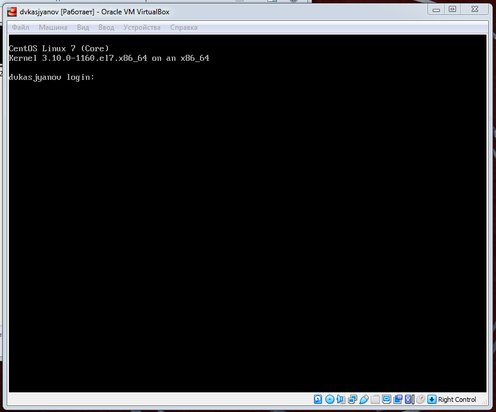
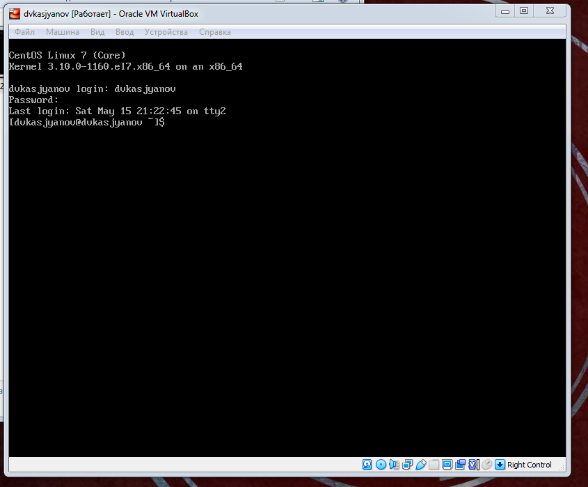
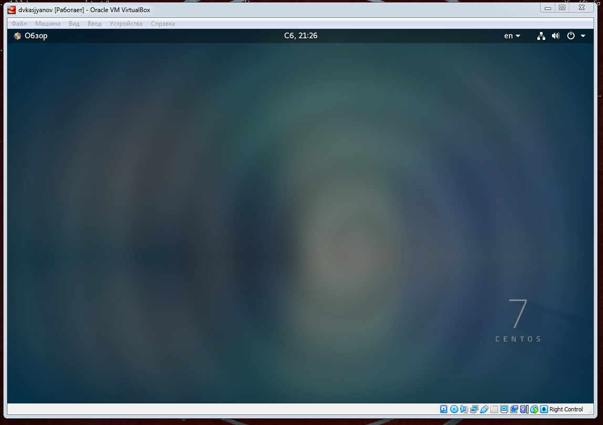
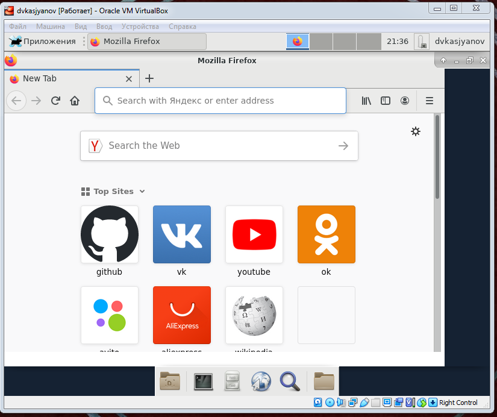
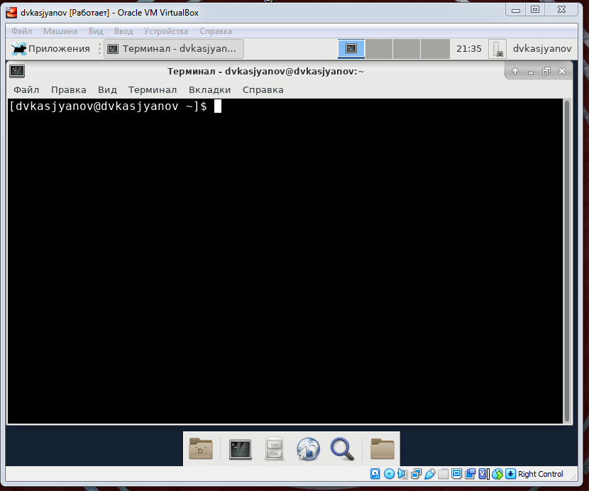

---
## Front matter
lang: ru-RU
title: Операционные системы 
author: Касьянов Даниил Владимирович
institute: RUDN University, Moscow, Russian Federation

date: 18 мая 2021 год

## Formatting
toc: false
slide_level: 2
theme: metropolis
header-includes: 
 - \metroset{progressbar=frametitle,sectionpage=progressbar,numbering=fraction}
 - '\makeatletter'
 - '\beamer@ignorenonframefalse'
 - '\makeatother'
aspectratio: 43
section-titles: true
---

# Лабораторная работа №4

## Ход работы

Прохожу обязательный процесс регистрации в консолях.

Ввод логина и пароля

##

Перехожу между консолями. Перехожу в графический интерфейс.

Регистрация в консоли

##

Переход в графический интерфейс

##

Захожу в **Xfce**. Знакомлюсь с приложениями.

Mozilla Firefox

##

Терминал

## Выводы

Я познакомился с операционной системой Linux, получил практические навыки работы с консолью и некоторыми графическими менеджерами рабочих столов операционной системы.

## {.standout}

Спасибо за внимание!
