---
# Front matter
lang: ru-RU
title: "Отчёт лабораторной работы №5"
subtitle: "Дисциплина: Операционные системы"
author: "Касьянов Даниил Владимирович"

# Formatting
toc-title: "Содержание"
toc: true # Table of contents
toc_depth: 2
lof: true # List of figures
lot: true # List of tables
fontsize: 12pt
linestretch: 1.5
papersize: a4paper
documentclass: scrreprt
polyglossia-lang: russian
polyglossia-otherlangs: english
mainfont: PT Serif
romanfont: PT Serif
sansfont: PT Sans
monofont: PT Mono
mainfontoptions: Ligatures=TeX
romanfontoptions: Ligatures=TeX
sansfontoptions: Ligatures=TeX,Scale=MatchLowercase
monofontoptions: Scale=MatchLowercase
indent: true
pdf-engine: lualatex
header-includes:
  - \linepenalty=10 # the penalty added to the badness of each line within a paragraph (no associated penalty node) Increasing the value makes tex try to have fewer lines in the paragraph.
  - \interlinepenalty=0 # value of the penalty (node) added after each line of a paragraph.
  - \hyphenpenalty=50 # the penalty for line breaking at an automatically inserted hyphen
  - \exhyphenpenalty=50 # the penalty for line breaking at an explicit hyphen
  - \binoppenalty=700 # the penalty for breaking a line at a binary operator
  - \relpenalty=500 # the penalty for breaking a line at a relation
  - \clubpenalty=150 # extra penalty for breaking after first line of a paragraph
  - \widowpenalty=150 # extra penalty for breaking before last line of a paragraph
  - \displaywidowpenalty=50 # extra penalty for breaking before last line before a display math
  - \brokenpenalty=100 # extra penalty for page breaking after a hyphenated line
  - \predisplaypenalty=10000 # penalty for breaking before a display
  - \postdisplaypenalty=0 # penalty for breaking after a display
  - \floatingpenalty = 20000 # penalty for splitting an insertion (can only be split footnote in standard LaTeX)
  - \raggedbottom # or \flushbottom
  - \usepackage{float} # keep figures where there are in the text
  - \floatplacement{figure}{H} # keep figures where there are in the text
---

# Цель работы

Приобретение практических навыков взаимодействия пользователя с системой
посредством командной строки.

# Задание

– Сделать отчёт по предыдущей лабораторной работе в формате Markdown.

– В качестве отчёта предоставить отчёты в 3 форматах: pdf, docx и md (в архиве, поскольку он должен содержать скриншоты, Makefile и т.д.).

# Выполнение лабораторной работы

1. Определяю полное имя моего домашнего каталога, используя команду `pwd`.

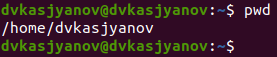

(Рисунок 1)

2. Выполняю следующие действия:
  
2.1. Перехожу в каталог /tmp (Рисунок 2).

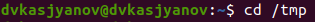

(Рисунок 2)

2.2. Вывожу на экран содержимое каталога /tmp. Для этого использую команду `ls` с различными опциями:

Для того, чтобы отобразить имена скрытых файлов, необходимо использовать команду `ls` с опцией `a` (Рисунок 3): 

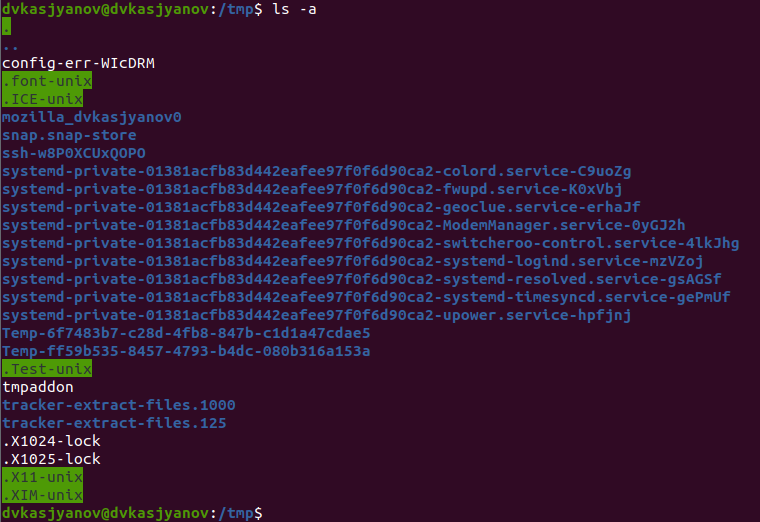

(Рисунок 3)

Чтобы вывести на экран подробную информацию о файлах и каталогах, необходимо использовать опцию `l` (Рис. 4, 5): 

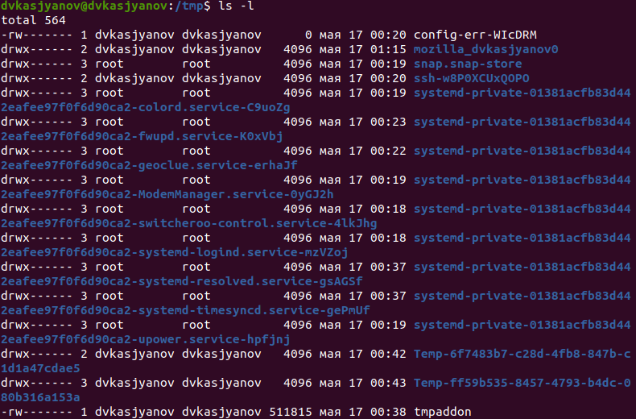

(Рисунок 4)

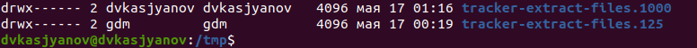

(Рисунок 5)

Чтобы получить информацию о типах файлов (каталог, исполняемый файл, ссылка), используется опция `F` (Рисунок 6):

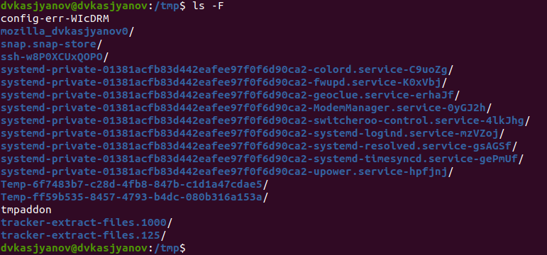

(Рисунок 6)

2.3. Определяю, есть ли в каталоге /var/spool подкаталог с именем cron. Для этого использую команду:
```
ls -aF
```
Если файл cron существует, то данная команда позволяет найти его, даже если он скрытый, определить его тип и убедиться в том, что он является каталогом (Рисунок 7).

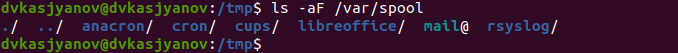

(Рисунок 7)

2.4. Перехожу в мой домашний каталог и вывожу на экран его содержимое. Для этого использую команду `ls -al`, чтобы вывести все файлы с их подробным описанием.
Определяю, что владельцами файлов и подкаталогов являются dvkasjyanov и root (Рисунок 8).

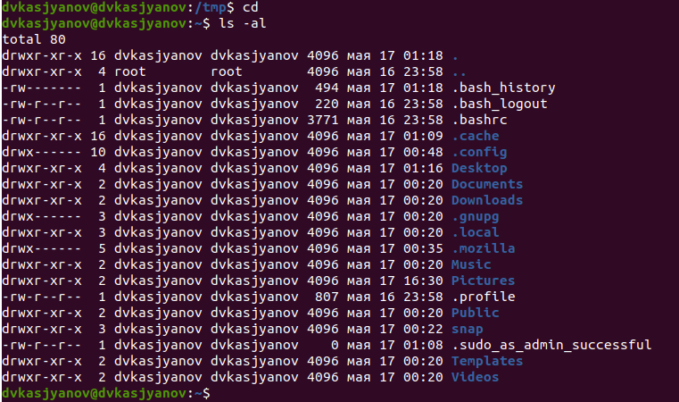

(Рисунок 8)

3. Выполняю следующие действия:
   
3.1. В домашнем каталоге создаю новый каталог с именем newdir (Рисунок 9):


(Рисунок 9)

3.2. В каталоге ~/newdir создаю новый каталог с именем morefun (Рисунок 10):


(Рисунок 10)

3.3. В домашнем каталоге создаю одной командой три новых каталога с именами letters, memos, misk; проверяю, появились ли они в домашнем каталоге. Затем удаляю их одной командой и проверяю, были ли они удалены (Рисунок 11).

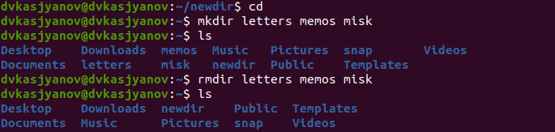

(Рисунок 11)

3.4. Попробую удалить ранее созданный каталог ~/newdir командой `rm`. Каталог не был удалён (Рисунок 12).

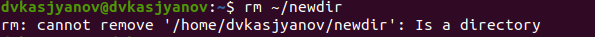

(Рисунок 12)

3.5. Удаляю каталог ~/newdir/morefun из домашнего каталога. Каталог был удалён (Рисунок 13).


(Рисунок 13)

1. С помощью команды `man` определяю, какую опцию команды `ls` нужно использовать для просмотра содержимого не только указанного каталога, но и подкаталогов, входящих в него. Это `-R, --recursive` (Рис. 14, 15).


(Рисунок 14)


(Рисунок 15)

5. С помощью команды `man` определяю набор опций команды `ls`, позволяющий отсортировать по времени последнего изменения выводимый список содержимого каталога с развёрнутым описанием файлов. Это опция `-a, --all`, `-l`, `-t` (Рис. 16-18).


(Рисунок 16)


(Рисунок 17)


(Рисунок 18)

6. Использую команду `man` для просмотра описания следующих команд: `cd`, `pwd`,
`mkdir`, `rmdir`, `rm`. 


Команда `cd` не имеет опций (Рисунок 19).

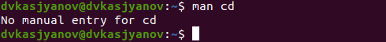

(Рисунок 19)


Команда `pwd` (Рисунок 20): 

* `-L, --logical`: 
  не разыменовывать символические ссылки. Если путь содержит символические ссылки, то выводить их без преобразования в исходный путь;

* `-P, --physical`: 
  преобразовывать (отбрасывать) символические ссылки в исходные имена. Если путь содержит символические ссылки, то они будут преобразованы в названия исходных директорий, на которые они указывают;

* `--help`:
показать справку по команде `pwd`;

* `--version`:
  показать версию утилиты `pwd`.

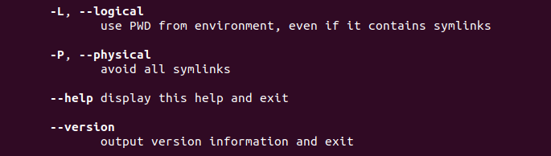

(Рисунок 20)


Команда `mkdir` (Рисунок 21): 

* `-m, --mode=MODE`: 
  устанавливает права доступа для создаваемой директории. Синтаксис MODE такой же как у команды `chmod`;

* `-p, --parents`:
создать все директории, которые указаны внутри пути. Если какая либо директория существует, то предупреждение об этом не выводится;

* `-v, --verbose`:
  выводить сообщение о каждой создаваемой директории;

* `-z`:
  установить контекст SELinux для создаваемой директории по умолчанию;

* `--context[=CTX]`:
  установить контекст SELinux для создаваемой директории в значение CTX;

* `--help`:
  показать справку по команде `mkdir`;

* `--version`:
  показать версию утилиты `mkdir`.

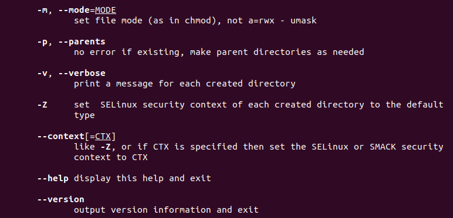

(Рисунок 21)


Команда `rmdir` (Рисунок 22):

* `--ignore-fail-on-non-empty`:
  игнорировать директории, которые содержат в себе файлы;

* `-p, --parents`:
  в этой опции каждый аргумент каталога обрабатывается как путь, из которого будут удалены все компоненты, если они уже пусты, начиная с последнего компонента;

* `-v, --verbose`:
  отображение подробной информации для каждого обрабатываемого каталога;

* `--help`: 
  показать справку по команде `rmdir`;

* `--version`: 
  показать версию утилиты `rmdir`.

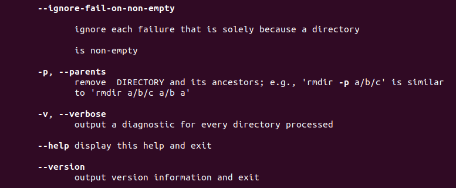

(Рисунок 22)


Команда `rm` (Рис. 23, 24):

* `-f, --force`:
  игнорировать несуществующие файлы и аргументы. Никогда не выдавать запросы на подтверждение удаления;

* `-i`:
  выводить запрос на подтверждение удаления каждого файла;

* `-I`:
  выдать один запрос на подтверждение удаления всех файлов, если удаляется более трех файлов или используется рекурсивное удаление. Позволяет удалять большое количество файлов без постоянных запросов и при этом защищает от большего числа ошибок;

* `--interactive[= WHEN]`:
  вместо WHEN можно использовать:

  * `-never`:
  никогда не выдавать запросы на подтверждение удаления;

  * `-once`:
  выводить запрос один раз (аналог опции `I`);

  * `-always`:
  выводить запрос всегда (аналог опции `i`);

  * `-Е`:
  Если значение КОГДА не задано, то используется `always`.

* `--one-file-system`:
  во время рекурсивного удаления пропускать директории, которые находятся на других файловых системах;

* `--no-preserve-root`:
  если в качестве директории для удаления задан корневой раздел /, то считать, что это обычная директория и начать удаление;

* `--preserve-root [=all]`:
  если в качестве директории для удаления задан корневой раздел /, то запретить выполнять команду `rm` над корневым разделом. Данное поведение используется по умолчанию;

* `-r, -R, --recursive`:
  удаление директорий и их содержимого; рекурсивное удаление;

* `-d, --dir`:
  удалять пустые директории;

* `-v, --verbose`:
  выводить информацию об удаляемых файлах;

* `--help`:
  показать справку по команде rm;

* `--version`:
  показать версию утилиты `rm`.

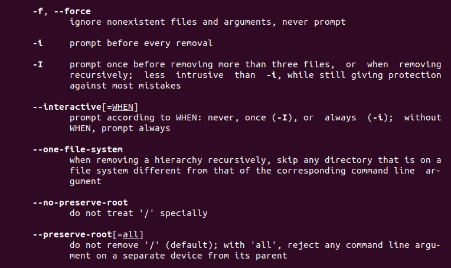

(Рисунок 23)

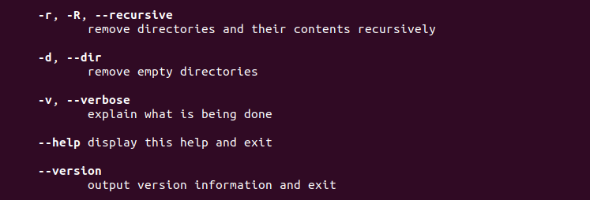

(Рисунок 24)


7. Использую команду `history` (Рис. 25-28).

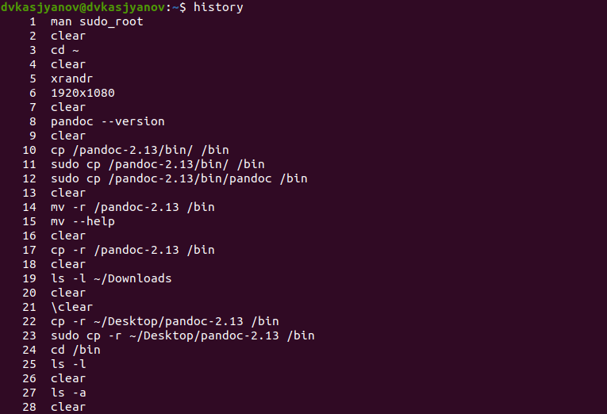

(Рисунок 25)

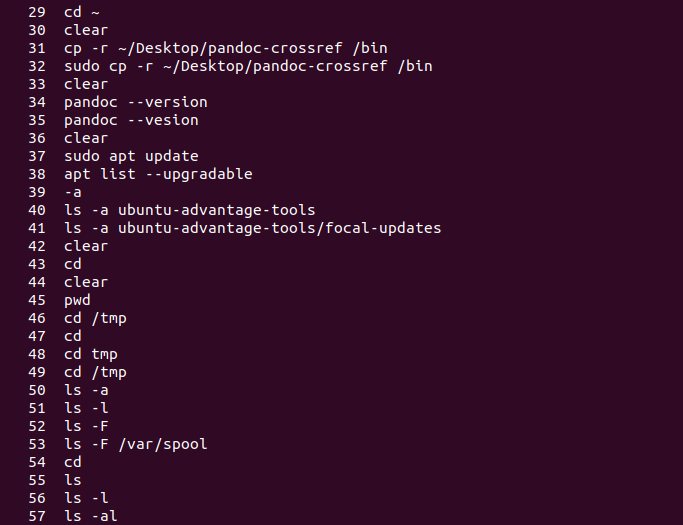

(Рисунок 26)

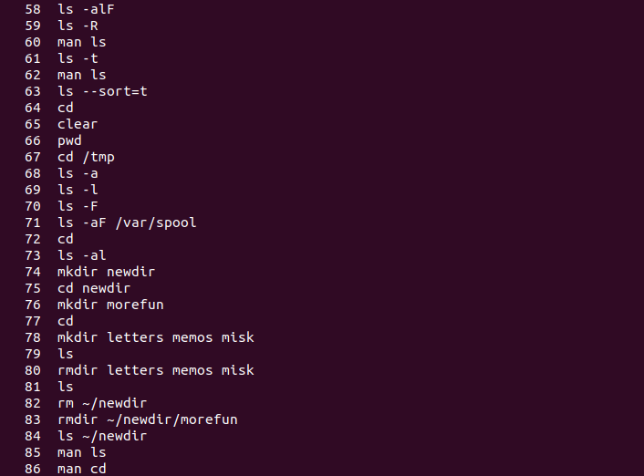

(Рисунок 27)

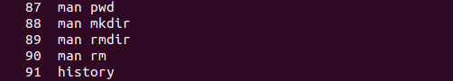

(Рисунок 28)
  
Выполняю модификацию и исполнение нескольких команд из буфера команд. 
Например, вызываю команду под номером 73 `ls -al` и заменяю опции `al` на `l` (Рисунок 29): 

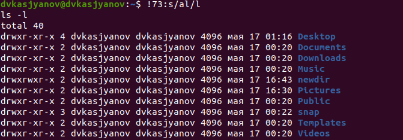

(Рисунок 29)

вызываю команду под номером 61 `ls -t` и заменяю опцию `t` на `a` (Рисунок 30):

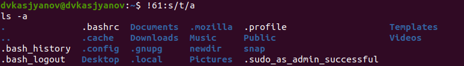

(Рисунок 30)


# Контрольные вопросы

1) Командная строка – специальная программа, позволяющая управлять 
операционной системой при помощи текстовых команд, вводимых в окне приложения.

2) Для определения абсолютного пути к текущему каталогу используется команда `pwd` (print working directory). 
Например, команда `pwd` в моем домашнем каталоге выведет: /home/dvkasjyanov (Рисунок 1).

3) Команда `ls -F` (или `ls -aF`со скрытыми файлами) выведет имена файлов в текущем каталоге и их типы. 
Тип каталога обозначается /, тип исполняемого файла обозначается *, тип ссылки обозначается @.

4) Имена скрытых файлов начинаются с точки. 
Для того, чтобы отобразить имена скрытых файлов, необходимо использовать команду `ls –a`.

5) Команда rm используется для удаления файлов и/или каталогов.
Команда `rm -i` выдает запрос подтверждения на удаление файла.
Команда `rm -r` необходима, чтобы удалить каталог, содержащий файлы.
Без указания этой опции команда не будет выполняться. Если каталог
пуст, то можно воспользоваться командой `rmdir`. Если удаляемый
каталог содержит файлы, то команда не будет выполнена – нужно
использовать `rm -r имя_каталога`.
Таким образом, каталог, не содержащий файлов, можно удалить и
командой `rm`, и командой `rmdir`. Файл командой `rmdir` удалить нельзя.

6) Чтобы определить, какие команды выполнил пользователь в сеансе
работы, необходимо воспользоваться командой `history`.

7) Чтобы исправить или запустить на выполнение команду, которую
пользователь уже использовал в сеансе работы, необходимо: в первом
случае: воспользоваться конструкцией
`!<номер_команды>:s/<что_меняем>/<на_что_меняем>`, во втором
случае: `!<номер_команды>`. 

8) Чтобы записать в одной строке несколько команд, необходимо между
ними поставить ; . Например, `cd /tmp; ls`.

9) Символ обратного слэша \ позволяет использовать управляющие
символы ( ".", "/", "$", "*", "[", "]", "^", "&") без их интерпретации
командной оболочкой; процедура добавления данного символа перед
управляющими символами называется экранированием символов.
Например, команда `ls newdir\/morefun` отобразит содержимое
каталога newdir/morefun.

10) Команда `ls -l` отображает список каталогов и файлов с подробной
информацией о них (тип файла, право доступа, число ссылок,
владелец, размер, дата последней ревизии, имя файла или каталога).

1)  Полный, абсолютный путь от корня файловой системы – путь
начинающийся от корня "/" и описывает весь путь к файлу или каталогу;
Относительный путь – это путь к файлу относительно текущего
каталога (каталога, где находится пользователь). 
Например, `cd /newdir/morefun` – абсолютный путь; 
`cd newdir` – относительный путь.

12) Чтобы получить необходимую информацию о команде, необходимо
воспользоваться конструкцией `man [имя_команды]`, либо использовать
опцию `help`, которая предусмотрена для некоторых команд.

13) Для автоматического дополнения вводимых команд служит клавиша Tab.


# Выводы

Я приобрёл практические навыки взаимодействия пользователя с системой
посредством командной строки.


# Библиография

[https://esystem.rudn.ru/mod/resource/view.php?id=718586](https://esystem.rudn.ru/mod/resource/view.php?id=718586) - 
Лабораторная работа №5 - "Основы интерфейса взаимодействия пользователя с системой Unix на уровне командной строки"