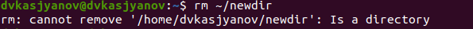
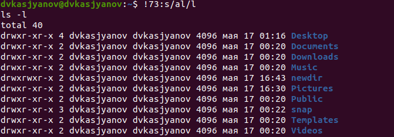
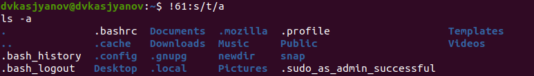

---
## Front matter
lang: ru-RU
title: Операционные системы 
author: Касьянов Даниил Владимирович
institute: RUDN University, Moscow, Russian Federation

date: 15 мая 2021 год

## Formatting
toc: false
slide_level: 2
theme: metropolis
header-includes: 
 - \metroset{progressbar=frametitle,sectionpage=progressbar,numbering=fraction}
 - '\makeatletter'
 - '\beamer@ignorenonframefalse'
 - '\makeatother'
aspectratio: 43
section-titles: true
---

# Лабораторная работа №5

## Ход работы

Я скопировал репозитории с шаблонами отчёта и презентации.

Клонирование репозиториев

## 

Определяю полное имя моего домашнего каталога, используя команду `pwd`.

Полное имя домашнего каталога

##

Перехожу в каталог /tmp, вывожу на экран его содержимое, используя команду `ls` с различными опциями.

Вывод содержимого каталога с использованием опции `F`

##

В домашнем каталоге создаю новые каталоги. Использую команды `rm` и `rmdir` для их удаления.

Создание и удаление каталогов

Неудачная попытка удаления каталога командой `rm`

##

С помощью команды `man` определяю, какую опцию команды `ls` нужно использовать для просмотра содержимого не только указанного каталога, но и подкаталогов, входящих в него.

Опция `-R, --recursive`

##

С помощью команды `man` определяю набор опций команды `ls`, позволяющий отсортировать по времени последнего изменения выводимый список содержимого каталога с развёрнутым описанием файлов.

Опция `-a, --all`

Опция `-l`

Опция `-t`

##

Использую команду `man` для просмотра описания команд `cd`, `pwd`, `mkdir`, `rmdir`, `rm`.

Опции команды `mkdir`

##

Использую команду `history`.  Выполняю модификацию и исполнение нескольких команд из буфера команд. 

Вызов команды 73 `ls -al`. Замена опции `al` на `l`

Вызов команды 61 `ls -t`. Замена опции `t` на `a`

## Выводы

Я приобрёл практические навыки взаимодействия пользователя с системой
посредством командной строки.

## {.standout}

Спасибо за внимание!
