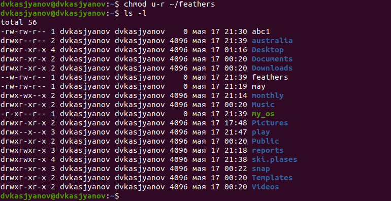

---
# Front matter
lang: ru-RU
title: "Отчёт лабораторной работы №5"
subtitle: "Дисциплина: Операционные системы"
author: "Касьянов Даниил Владимирович"

# Formatting
toc-title: "Содержание"
toc: true # Table of contents
toc_depth: 2
lof: true # List of figures
lot: true # List of tables
fontsize: 12pt
linestretch: 1.5
papersize: a4paper
documentclass: scrreprt
polyglossia-lang: russian
polyglossia-otherlangs: english
mainfont: PT Serif
romanfont: PT Serif
sansfont: PT Sans
monofont: PT Mono
mainfontoptions: Ligatures=TeX
romanfontoptions: Ligatures=TeX
sansfontoptions: Ligatures=TeX,Scale=MatchLowercase
monofontoptions: Scale=MatchLowercase
indent: true
pdf-engine: lualatex
header-includes:
  - \linepenalty=10 # the penalty added to the badness of each line within a paragraph (no associated penalty node) Increasing the value makes tex try to have fewer lines in the paragraph.
  - \interlinepenalty=0 # value of the penalty (node) added after each line of a paragraph.
  - \hyphenpenalty=50 # the penalty for line breaking at an automatically inserted hyphen
  - \exhyphenpenalty=50 # the penalty for line breaking at an explicit hyphen
  - \binoppenalty=700 # the penalty for breaking a line at a binary operator
  - \relpenalty=500 # the penalty for breaking a line at a relation
  - \clubpenalty=150 # extra penalty for breaking after first line of a paragraph
  - \widowpenalty=150 # extra penalty for breaking before last line of a paragraph
  - \displaywidowpenalty=50 # extra penalty for breaking before last line before a display math
  - \brokenpenalty=100 # extra penalty for page breaking after a hyphenated line
  - \predisplaypenalty=10000 # penalty for breaking before a display
  - \postdisplaypenalty=0 # penalty for breaking after a display
  - \floatingpenalty = 20000 # penalty for splitting an insertion (can only be split footnote in standard LaTeX)
  - \raggedbottom # or \flushbottom
  - \usepackage{float} # keep figures where there are in the text
  - \floatplacement{figure}{H} # keep figures where there are in the text
---

# Цель работы

Ознакомление с файловой системой Linux, её структурой, именами и содержанием каталогов. Приобретение практических навыков по применению команд для
работы с файлами и каталогами, по управлению процессами (и работами), по проверке использования диска и обслуживанию файловой системы.


# Выполнение лабораторной работы

1. Выполняю все примеры, приведённые в первой части описания лабораторной работы.

1.1. Копирование файла в текущем каталоге. Скопировать файл ~/abc1 в файл april и в файл may (Рисунок 1):


(Рисунок 1)

1.2. Копирование нескольких файлов в каталог. Скопировать файлы april и may в каталог monthly (Рисунок 2):


(Рисунок 2)

1.3. Копирование файлов в произвольном каталоге. Скопировать файл monthly/may в файл с именем june (Рисунок 3):


(Рисунок 3)

2.1. Копирование каталогов в текущем каталоге. Скопировать каталог monthly в каталог monthly.00 (Рисунок 4):


(Рисунок 4)

2.2. Копирование каталогов в произвольном каталоге. Скопировать каталог monthly.00 в каталог /tmp (Рисунок 5):


(Рисунок 5)

3.1. Переименование файлов в текущем каталоге. Изменить название файла april на july в домашнем каталоге (Рисунок 6):


(Рисунок 6)

3.2. Перемещение файлов в другой каталог. Переместить файл july в каталог monthly.00 (Рисунок 7):


(Рисунок 7)

3.3. Переименование каталогов в текущем каталоге. Переименовать каталог monthly.00 в monthly.01 (Рисунок 8):


(Рисунок 8)

3.4. Перемещение каталога в другой каталог. Переместить каталог monthly.01в каталог reports (Рисунок 9):


(Рисунок 9)

3.5. Переименование каталога, не являющегося текущим. Переименовать каталог reports/monthly.01 в reports/monthly (Рисунок 10):


(Рисунок 10)

4.1. Требуется создать файл ~/may с правом выполнения для владельца (Рисунок 11):


(Рисунок 11)

4.2. Требуется лишить владельца файла ~/may права на выполнение (Рисунок 12):


(Рисунок 12)

4.3. Требуется создать каталог monthly с запретом на чтение для членов группы и всех остальных пользователей (Рисунок 13):


(Рисунок 13)

4.4. Требуется создать файл ~/abc1 с правом записи для членов группы: (Рисунок 14):


(Рисунок 14)

2. Выполню следующие действия:

2.1. Скопирую файл /usr/include/sys/io.h в домашний каталог и назову его equipment (Рисунок 15).


(Рисунок 15)

Файла io.h нет, как и папки, в которой он должен быть. Создаю от имени администратора каталог /usr/include/sys/, а также файл io.h внутри него:

```
sudo mkdir /usr/include/sys/
sudo touch /usr/include/sys/io.h
```

Затем копирую файл в домашний каталог. Переименовываю файл (Рисунок 16):
```
sudo cp /usr/include/sys/io.h
mv io.h equipment
```


(Рисунок 16)

2.2. В домашнем каталоге создаю директорию ~/ski.plases, используя команду `mkdir ~/ski.plases` (Рисунок 17):


(Рисунок 17)

2.3. Перемещаю файл equipment в каталог ~/ski.plases, используя команду `mv equipment ~/ski.plases` (Рисунок 18):


(Рисунок 18)

2.4. Переименую файл ~/ski.plases/equipment в ~/ski.plases/equiplist (Рисунок 19), используя команду 
```
mv ~/ski.plases/equipment ~/ski.plases/equiplist
``` 


(Рисунок 19)

2.5. Создаю в домашнем каталоге файл abc1: `touch abc1`; скопирую его в каталог ~/ski.plases: `cp abc1 ~/ski.plases`; назову его equiplist2: `mv ~/ski.plases/abc1 ~/ski.plases/equiplist2` (Рис. 20, 21).


(Рисунок 20)


(Рисунок 21)

2.6. Создаю каталог с именем equipment в каталоге ~/ski.plases: `mkdir ~/ski.plases/equipment` (Рисунок 22).


(Рисунок 22)

2.7. Перемещаю файлы ~/ski.plases/equiplist и equiplist2 в каталог ~/ski.plases/equipment: `mv ~/ski.plases/equiplist ~/ski.plases/equiplist2 ~/ski.plases/equipment` (Рисунок 23).


(Рисунок 23)

2.8. Создаю и перемещаю каталог ~/newdir в каталог ~/ski.plases: 
```
mkdir ~/newdir
mv ~/newdir ~/ski.plases
```
и называю его plans: `mv ~/ski.plases/newdir ~/ski.plases/plans` (Рисунок 24).


(Рисунок 24)

3. Определяю опции команды `chmod`, необходимые для того, чтобы присвоить перечисленным 
ниже файлам выделенные права доступа, считая, что в начале таких прав нет:

3.1. `drwxr--r-- ... australia`

3.2. `drwx--x--x ... play`

3.3. `-r-xr--r-- ... my_os`

3.4. `-rw-rw-r-- ... feathers`

Используя таблицу 3.2 из лабораторной работы (Рисунок 25), определяю типы указанных файлов и их права в цифровой записи (восьмеричное значение): 

* Файл australia является каталогом (тип `d`); ему нужно присвоить права доступа `744`;

* Файл play является каталогом (тип `d`); ему нужно присвоить права доступа `711`;

* Файл my_os является файлом (тип `-`); ему нужно присвоить права доступа `544`;

* Файл feathers является каталогом (тип `-`); ему нужно присвоить права доступа `664`.


Создаю указанные файлы (Рисунок 26). Первые два файла являются папками, а последние - файлами:


(Рисунок 26)

Присваиваю права доступа файлам. Убеждаюсь в том, что были присвоены выделенные права (Рисунок 27):


(Рисунок 27)


4. Проделаю приведённые ниже упражнения, записывая в отчёт по лабораторной работе используемые при этом команды:

4.1. Просмотрю содержимое файла /etc/password, используя `cat`. Указанного файла не существует, поэтому создаю его и просматриваю содержимое (Рисунок 28).


(Рисунок 28)

4.2. Скопирую файл ~/feathers в файл ~/file.old с помощью `cp` (Рисунок 29).


(Рисунок 29)

4.3. Перемещу файл ~/file.old в каталог ~/play с помощью `mv` (Рисунок 30).


(Рисунок 30)

4.4. Скопирую каталог ~/play в каталог ~/fun, используя `cp -r` (Рисунок 31).


(Рисунок 31)

4.5. Перемещу каталог ~/fun в каталог ~/play и назову его games, используя команду `mv` (Рисунок 32).


(Рисунок 32)

4.6. Лишу владельца файла ~/feathers права на чтение с помощью команды `chmod u-r` (Рисунок 33).



(Рисунок 33)

4.7. Если я попытаюсь просмотреть файл ~/feathers командой `cat`, то получу ошибку, ведь был установлен запрет на чтение владельцем файла (4.6) (Рисунок 34).


(Рисунок 34)

4.8. Если я попытаеюсь скопировать файл ~/feathers с помощью команды `cp`, то получу ошибку (4.6) (Рисунок 35).


(Рисунок 35)

4.9. Даю владельцу файла ~/feathers право на чтение командой `chmod u+r` (Рисунок 36).


(Рисунок 36)

4.10. Лишу владельца каталога ~/play права на выполнение, используя `chmod u-x` (Рисунок 37).


(Рисунок 37)

4.11. Перейду в каталог ~/play, используя `cd`. Получаю ошибку (Рисунок 38).


(Рисунок 38)

4.12. Даю владельцу каталога ~/play право на выполнение, используя `chmod u+x` (Рисунок 39).


(Рисунок 39)


5. Прочитаю `man` по командам `mount`, `fsck`, `mkfs`, `kill`.

* `mount`:
  команда для просмотра используемых в операционной системе файловых систем. В данном случае указаны имена устройств, названия соответствующих им точекмонтирования (путь), тип файловой системы и параметрами монтирования. В контексте команды mount устройство — специальный файл устройства, с помощью которого операционная система получает доступ к аппаратному устройству. Файлы устройств обычно располагаются в каталоге /dev, имеют сокращённые имена (например, sdaN, sdbN или hdaN, hdbN, где N — порядковый номер устройства, sd — устройства SCSI, hd — устройства MFM/IDE). Точка монтирования — каталог (путь к каталогу), к которому присоединяются файлы устройств. Другой способ определения смонтированных в операционной системе файловых систем — просмотр файла/etc/fstab.
  
  Пример: `mount t-vfstype device dir` (Рисунок 40).


(Рисунок 40)


* `fsck`:
  утилита командной строки, которая позволяет выполнять проверки согласованности и интерактивное исправление в одной или нескольких файловых системах Linux. Она использует программы, специфичные для типа файловой системы, которую она проверяет. С помощью команды `fsck` можно проверить (а в ряде случаев восстановить) целостность файловой системы. Формат команды: `fsck имя_устройства`. Пример: `fsck /dev/sda1` (Рисунок 41).


(Рисунок 41)

* `mkfs`:
  создаёт новую файловую систему Linux. Имеет следующий синтаксис: `mkfs [-V]  [-t fstype] [fs options] filesys [blocks]`. `mkfs` используется для создания файловой системы Linux на некотором устройстве, обычно в разделе жёсткого диска. В качестве аргумента filesys для файловой системы может выступать или название устройства (например, /dev/hda1 /dev/sdb2 ) или точка монтирования (/usr /home). Аргументом blocks указывается количество блоков, которые выделяются для использования этой файловой системой. По окончании работы `mkfs` возвращает `0` в случае успеха, а `1` при неудачной операции. Пример: `mkfs -t ext2 /dev/hdb1` (Рисунок 42).


(Рисунок 42)

* `kill`:
посылает сигнал процессу или выводит список допустимых сигналов. Имеет следующий синтаксис: `kill [опции] PID` , где PID - числовой идентификатор процесса. Пример: `kill KILL 3121` (Рисунок 43).


(Рисунок 43)

# Контрольные вопросы

1. Чтобы узнать, какие файловые системы существуют на жёстком диске моего компьютера, можно использовать команду `df -Th`. 

  * `devtmpfs` - позволяет ядру создать экземпляр tmpfs с именем devtmpfs при инициализации ядра, прежде чем регистрируется какое либо устройство с драйверами. Каждое устройство будет предоставлять узел устройства в devtmpfs. devtmpfs монтируется на /dev и содержит специальные файлы устройств для всех устройств.
  
  * `tmpfs` - временное файловое хранилище во многих Unix подобных ОС. Предназначена для монтирования файловой системы, но размещается в ОЗУ вместо ПЗУ. Подобная конструкция является RAM диском. Данная файловая система также предназначенная для быстрого и ненадёжного хранения временных данных. Хорошо подходит для tmp и массовой сборки пакетов/образов. Предполагает наличие достаточного объёма виртуальной памяти. Файловая система tmpfs предназначена для того, чтобы использовать часть физической памяти сервера как обычный дисковый раздел, в котором можно сохранять данные (чтение и запись). Поскольку данные размещены в памяти, то чтение или запись происходят во много раз быстрее, чем с обычного HDD диска.
  
  * `ext4` − имеет обратную совместимость с предыдущими версиями ФС. Эта версия была выпущена в 2008 году. Является первой ФС из семейства Ext, использующая механизм `extent file system`, который позволяет добиться меньшей фрагментации файлов и увеличить общую производительность файловой системы. Кроме того, в Ext4 реализован механизм отложенной записи (delayed allocation − delalloc), который так же уменьшает фрагментацию диска и снижает нагрузку на CPU. С другой стороны, хотя механизм отложенной записи и используется во многих ФС, но в силу сложности своей реализации он повышает вероятность утери данных.


2. Файловая система Linux/UNIX физически представляет собой пространство раздела диска разбитое на блоки фиксированного размера, кратные размеру сектора − 1024, 2048, 4096 или 8120 байт. Размер блока указывается при
  создании файловой системы. В файловой структуре Linux имеется один корневой раздел / (он же root, корень). Все разделы жесткого диска (если их несколько) представляют собой структуру подкаталогов, примонтированных к определенным каталогам.


  * / :
  корень, главный каталог в системе Linux. По сути, это и есть файловая система Linux. Адреса всех файлов начинаются с корня, а дополнительные разделы, флешки или оптические диски подключаются в папки корневого каталога. Только пользователь root имеет право читать и изменять файлы в этом каталоге.


  * /BIN:
  бинарные файлы пользователя. Этот каталог содержит исполняемые файлы. Здесь расположены программы, которые можно использовать в однопользовательском режиме или режиме восстановления.


   * /SBIN:
  системные испольняемые файлы. Так же как и /bin, содержит двоичные исполняемые файлы, которые доступны на ранних этапах загрузки, когда не примонтирован каталог /usr. Но здесь находятся программы, которые можно выполнять только с правами суперпользователя.


   * /ETC:
  конфигурационные файлы. В этой папке содержатся конфигурационные файлы всех программ, установленных в системе. Кроме конфигурационных файлов, в системе инициализации Init Scripts, здесь находятся скрипты запуска и завершения системных демонов, монтирования файловых систем и автозагрузки программ.

   * /DEV:
  файлы устройств. В Linux все, в том числе внешние устройства являются файлами. Таким образом, все подключенные флешки, клавиатуры, микрофоны, камеры это просто файлы в каталоге /dev/. Выполняется сканирование всех подключенных устройств и создание для них специальных файлов.

   * /PROC:
  информация о процессах. По сути, это псевдофайловая система, содержащая подробную информацию о каждом процессе, его Pid, имя исполняемого файла, параметры запуска, доступ к оперативной памяти и так далее. Также здесь можно найти информацию об использовании системных ресурсов.

   * /VAR:
  переменные файлы. Название каталога /var говорит само за себя, он должен содержать файлы, которые часто изменяются. Размер этих файлов постоянно увеличивается. Здесь содержатся файлы системных журналов, различные кеши, базы данных и так далее.

   * /TMP:
  временные файлы. В этом каталоге содержатся временные файлы, созданные системой, любыми программами или пользователями. Все пользователи имеют право записи в эту директорию.

   * /USR:
  программы пользователя. Это самый большой каталог с большим количеством функций. Здесь находятся исполняемые файлы, исходники программ, различные ресурсы приложений, картинки, музыка и документация.

   * /HOME:
  домашняя папка. В этой папке хранятся домашние каталоги всех пользователей. В них они могут хранить свои личные файлы, настройки программ и мн. др.

   * /BOOT:
  файлы загрузчика. Содержит все файлы, связанные с загрузчиком системы. Это ядро vmlinuz, образ initrd, а также файлы загрузчика, находящие в каталоге /boot/grub.

   * /LIB:
  системные библиотеки. Содержит файлы системных библиотек, которые используются исполняемыми файлами в каталогах /bin и /sbin.

   * /OPT:
  дополнительные программы. В эту папку устанавливаются проприетарные программы, игры или драйвера. Это программы созданные в виде отдельных исполняемых файлов самими производителями.

   * /MNT:
  монтирование. В этот каталог системные администраторы могут монтировать внешние или дополнительные файловые системы.

   * /MEDIA:
  съемные носители. В этот каталог система монтирует все подключаемые внешние накопители – USB флешки, оптические диски и другие носители.

   * /SRV:
  сервер. В этом каталоге содержатся файлы серверов и сервисов.

   * /RUN:
  процессы. Каталог, содержащий PID файлы процессов, похожий на /var/run, но в отличие от него, он размещен в TMPFS, а поэтому после перезагрузки все файлы теряются.


3. Команда `mount`.


4. Целостность файловой системы может быть нарушена из-за перебоев в питании, неполадок в оборудовании или из за некорректного/внезапного выключения компьютера. Чтобы устранить повреждения файловой системы необходимо использовать команду `fsck`.


5. Файловую систему можно создать, используя команду `mkfs`.


6. * `сat`:
    Чтение данных из файла или стандартного ввода и вывод на экран. Синтаксис утилиты: `cat [опции] файл1 файл2 ...`;

   * `nl`:
    действует аналогично команде `cat`, но выводит еще и номера строк в столбце слева;

   * `less`:
    Cущественно более развитая команда для пролистывания текста. При чтении данных со стандартного ввода она создает буфер, который позволяет листать текст как вперед, так и назад, а также искать как по направлению к концу, так и по направлению к началу текста. Синтаксис аналогичный синтаксису команды `cat`.

   * `head`:
    Команда `head` выводит начальные строки из одного или нескольких документов. Также она может показывать данные, которые передает на вывод другая утилита. Синтаксис аналогичный синтаксису команды `cat`.

   * `tail`:
    Эта команда позволяет выводить заданное количество строк с конца файла, а также выводить новые строки в интерактивном режиме. Синтаксис аналогичный синтаксису команды `cat`.


7. Утилита `cp` позволяет полностью копировать файлы и директории.
   
   Cинтаксис: `cp [опции] файл-источник файл-приемник`.
   
   После выполнения команды файл-источник будет полностью перенесен в файл-приемник. Если в конце указан слэш, файл будет записан в заданную директорию с оригинальным именем.
   
   Основные опции:
   
   * `--attributes-only`: не копировать содержимое файла, а только флаги доступа и владельца;

   * `-f, --force`: перезаписывать существующие файлы;
  
   * `-i, --interactive`: запрос на перезапись существующих файлов;
  
   * `-L`: копировать не символические ссылки, а то, на что они указывают;
  
   * `-n`: не перезаписывать существующие файлы;
  
   * `-P`: не следовать символическим ссылкам;
  
   * `-r`: копировать папку Linux рекурсивно;
  
   * `-s`: не выполнять копирование файлов в Linux, а не выполнять копирование файлов в Linux, а создавать символические ссылки;
  
   * `-u`: скопировать файл, только если он был изменён;

   * `-x`: не выходить за пределы этой файловой системы;
  
   * `-p`: сохранять владельца, временные метки и флаги доступа при копировании;
  
   * `-t`: считать файл-приемник директорией и копировать файл-источник в эту директорию.
  

8. Команда `mv` используется для перемещения одного или нескольких файлов (или директорий) в другую директорию, а также для переименования файлов и директорий.

  Синтаксис: `mv [ опции] старый_файл новый_файл`.

  Основные опции:

  * `--help` выводит на экран официальную документацию об утилите;

  * `--version` отображает версию `mv`;

  * `-b` создает копию файлов, которые были перемещены или перезаписаны;

  * `-f` при активации не будет спрашивать разрешение у владельца файла, если речь идет о перемещении или переименовании файла;

  * `-i` наоборот, будет спрашивать разрешение у владельца;

  * `-n` отключает перезапись уже существующих объектов;

  * `--strip-trailing-slashes` удаляет завершающий символ / у файла при его наличии;

  * `-t [директория]` перемещает все файлы в указанную директорию;

  * `-u` осуществляет перемещение только в том случае, если исходный файл более новый по сравнению с объектом назначения;

  * `-v` отображает сведения о каждом элементе во время обработки команды;


  Команда `rename` также предназначена, чтобы переименовать файл.

  Синтаксис: `rename [опции] старое_имя новое_имя файлы`

  Основные опции:

  * `-v`: вывод списка обработанных файлов;
  
  * `-n`: тестовый режим, на самом деле никакие действия выполнены не будут;
  
  * `-f`: принудительно перезаписывать существующие файлы;


9. Права доступа − совокупность правил, регламентирующих порядок и условия доступа субъекта к объектам информационной системы информации, её носителям, процессам и другим ресурсам, установленных правовыми документами или собственником, владельцем информации. Права доступа к файлу или каталогу можно изменить, воспользовавшись командой `chmod`. Сделать это может владелец файла (или каталога) или пользователь с правами администратора.

  Синтаксис команды: `chmod режим имя_файла`

  Режим имеет следующие компоненты структуры и способ записи:

  * `=` - установить право;
  
  * `-` - лишить права;
  
  * `+` - дать право;


  * `r` чтение;
  
  * `w` запись;
  
  * `x` выполнение;
  

  * `u` (user) - владелец файла;
  
  * `g` (group) группа, к которой принадлежит владелец файла;
  
  * `o` (others) все остальные.


# Выводы

Я ознакомился с файловой системой Linux, её структурой, именами и содержанием каталогов; приобрёл практическик навыки по применению команд для
работы с файлами и каталогами, по управлению процессами (и работами), по проверке использования диска и обслуживанию файловой системы.


# Библиография

[Лабораторная работа №6 - "Анализ файловой структуры UNIX. Команды для работы с файлами и каталогами"](https://esystem.rudn.ru/mod/resource/view.php?id=718589) 

["Основные linux-команды для новичка"](https://habr.com/ru/post/501442/)

["История команд Linux"](https://losst.ru/istoriya-komand-linux)

[[UNИX][GNU/Linux] Лекция 2. Терминал и командная строка](https://www.youtube.com/watch?v=051Z3UF4LCQ)