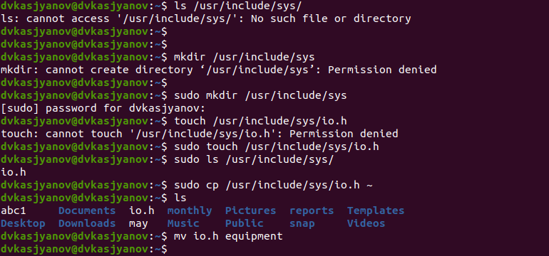

---
## Front matter
lang: ru-RU
title: Операционные системы 
author: Касьянов Даниил Владимирович
institute: RUDN University, Moscow, Russian Federation

date: 15 мая 2021 год

## Formatting
toc: false
slide_level: 2
theme: metropolis
header-includes: 
 - \metroset{progressbar=frametitle,sectionpage=progressbar,numbering=fraction}
 - '\makeatletter'
 - '\beamer@ignorenonframefalse'
 - '\makeatother'
aspectratio: 43
section-titles: true
---

# Лабораторная работа №6

## Ход работы

Выполняю все примеры, приведённые в первой части описания лабораторной работы.

Изменение прав командой `chmod`

## 

Выполню действия, зафиксировав в отчёте по лабораторной работе используемые при этом команды и результаты их выполнения.

Создание необходимого файла. Копирование и переименование

##

Определяю опции команды `chmod`, необходимые для того, чтобы присвоить файлам выделенные права доступа, считая, что в начале таких прав нет. Использую таблицу, приведённую в лабораторной работе.

Формы записи прав доступа

##

Изменение прав доступа

##

Выполняю упражнения, необходимые для закрепления навыков работы с командами.

Лишение владельца файла ~/feathers права на чтение

##

Прочитаю `man` по командам `mount`, `fsck`, `mkfs`, `kill`.

`man` по команде `mount`

## Выводы

Я ознакомился с файловой системой Linux, её структурой, именами и содержанием каталогов; приобрёл практическик навыки по применению команд для
работы с файлами и каталогами, по управлению процессами (и работами), по проверке использования диска и обслуживанию файловой системы.

## {.standout}

Спасибо за внимание!
