---
# Front matter
lang: ru-RU
title: "Отчёт лабораторной работы №7"
subtitle: "Дисциплина: Операционные системы"
author: "Касьянов Даниил Владимирович"

# Formatting
toc-title: "Содержание"
toc: true # Table of contents
toc_depth: 2
lof: true # List of figures
lot: true # List of tables
fontsize: 12pt
linestretch: 1.5
papersize: a4paper
documentclass: scrreprt
polyglossia-lang: russian
polyglossia-otherlangs: english
mainfont: PT Serif
romanfont: PT Serif
sansfont: PT Sans
monofont: PT Mono
mainfontoptions: Ligatures=TeX
romanfontoptions: Ligatures=TeX
sansfontoptions: Ligatures=TeX,Scale=MatchLowercase
monofontoptions: Scale=MatchLowercase
indent: true
pdf-engine: lualatex
header-includes:
  - \linepenalty=10 # the penalty added to the badness of each line within a paragraph (no associated penalty node) Increasing the value makes tex try to have fewer lines in the paragraph.
  - \interlinepenalty=0 # value of the penalty (node) added after each line of a paragraph.
  - \hyphenpenalty=50 # the penalty for line breaking at an automatically inserted hyphen
  - \exhyphenpenalty=50 # the penalty for line breaking at an explicit hyphen
  - \binoppenalty=700 # the penalty for breaking a line at a binary operator
  - \relpenalty=500 # the penalty for breaking a line at a relation
  - \clubpenalty=150 # extra penalty for breaking after first line of a paragraph
  - \widowpenalty=150 # extra penalty for breaking before last line of a paragraph
  - \displaywidowpenalty=50 # extra penalty for breaking before last line before a display math
  - \brokenpenalty=100 # extra penalty for page breaking after a hyphenated line
  - \predisplaypenalty=10000 # penalty for breaking before a display
  - \postdisplaypenalty=0 # penalty for breaking after a display
  - \floatingpenalty = 20000 # penalty for splitting an insertion (can only be split footnote in standard LaTeX)
  - \raggedbottom # or \flushbottom
  - \usepackage{float} # keep figures where there are in the text
  - \floatplacement{figure}{H} # keep figures where there are in the text
---

# Цель работы

Ознакомление с инструментами поиска файлов и фильтрации текстовых данных. Приобретение практических навыков: по управлению процессами (и заданиями), по проверке использования диска и обслуживанию файловых систем.

# Выполнение лабораторной работы

1. Осуществляю вход в систему (Рисунок 1).

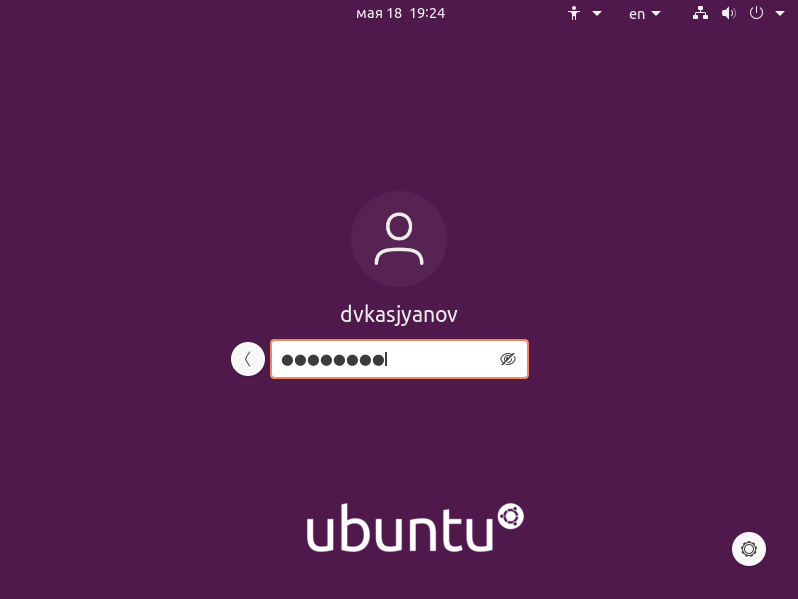

(Рисунок 1)

2. Запишу в файл file.txt названия файлов, содержащихся в каталоге /etc. Допишу в этот же файл названия файлов, содержащихся в домашнем каталоге (Рис. 2, 3, 4).

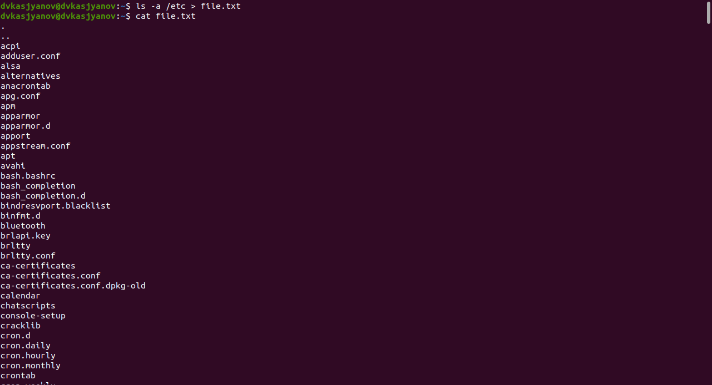

(Рисунок 2)

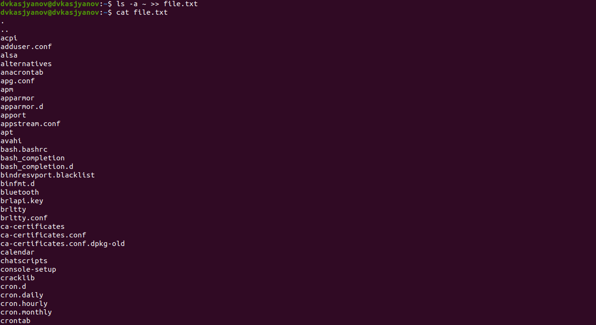

(Рисунок 3)

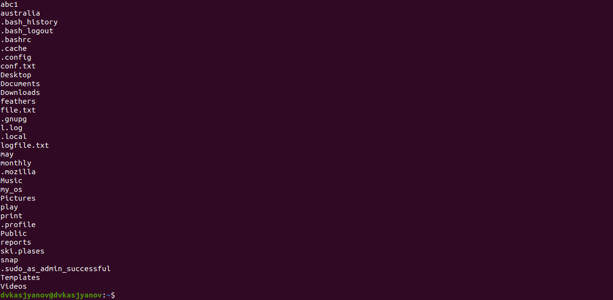

(Рисунок 4)

3. Выведу имена всех файлов из file.txt, имеющих расширение `.conf`, после чего запишу их в новый текстовой файл conf.txt с помощью команды `grep '\.conf$' file.txt > conf.txt` (Рисунок 5).

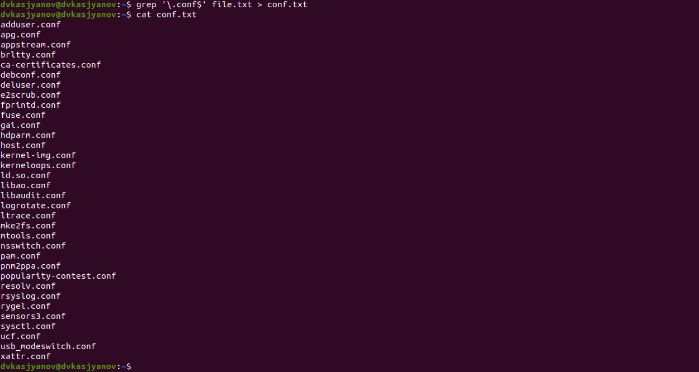

(Рисунок 5)

4. Определяю, какие файлы в моем домашнем каталоге имеют имена, начинающиеся с символа `c`. Это можно сделать несколькими способами:

* Используя команду `find -maxdepth 1 -name 'c*'` (`maxdepth` - глубина присмотра) (Рисунок 6):
    
    

    (Рисунок 6)

* Используя команду `ls ~ | grep c*` (Рисунок 7):

    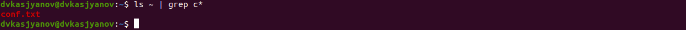

    (Рисунок 7)

5. Постранично выведу имена файлов из каталога /etc, начинающиеся с символа h (Рис. 8, 9).

(Рисунок 8)

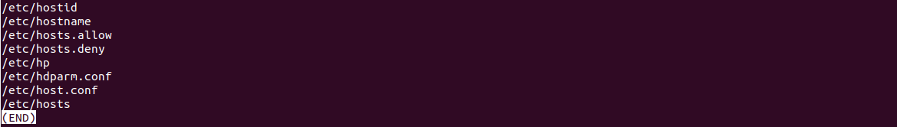

(Рисунок 9)

6. Запущу в фоновом режиме процесс, который будет записывать в файл ~/logfile файлы, имена которых начинаются с log (Рисунок 10).

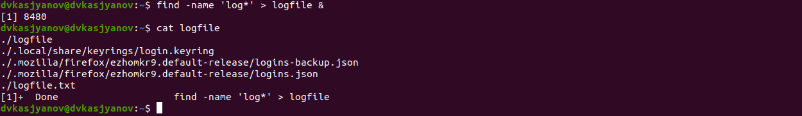

(Рисунок 10)

7. Удалю ~/logfile (Рисунок 11);

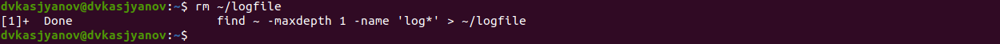

(Рисунок 11)

8. Запускаю из консоли в фоновом режиме редактор gedit (Рисунок 12):

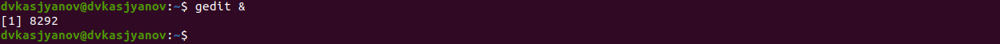

(Рисунок 12)

9. Определяю идентификатор процесса gedit, используя команду `ps`, конвейер и фильтр `grep` (Рисунок 13).

(Рисунок 13)

Определить этот идентификатор можно более простыми способами - с помощью команд `pgrep` и `pidof` (Рисунок 14).

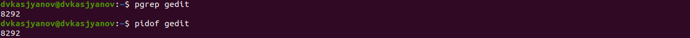

(Рисунок 14)

10.   Прочитаю справку `man` команды `kill` (Рисунок 15), после чего использую её для завершения процесса `gedit` (Рисунок 16).

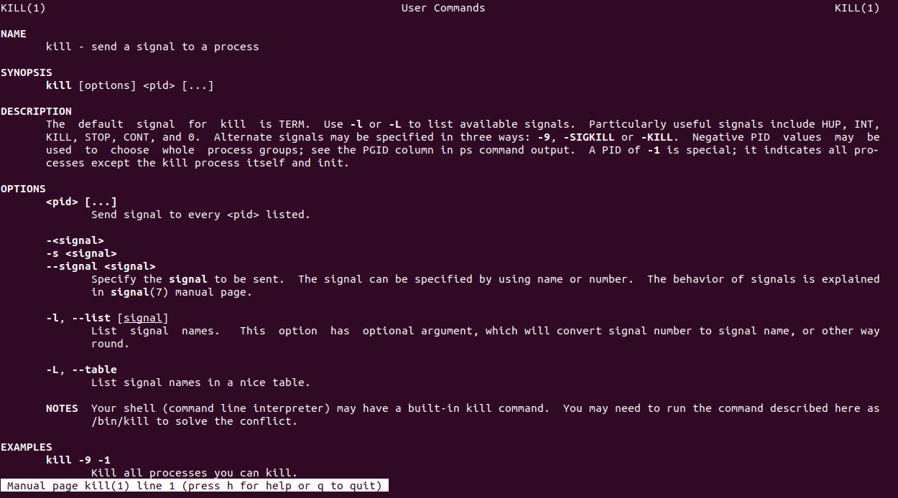

(Рисунок 15)

(Рисунок 16)

11.   Получаю более подробную информацию о командах `df` и `du` с помощью команды `man` (Рисунок 17). 

(Рисунок 17)

Выполняю команды `df` и `du` (Рис. 18, 19).

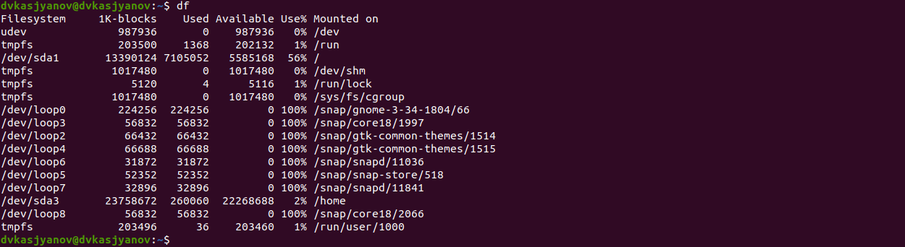

(Рисунок 18)

(Рисунок 19)

12.  Воспользовавшись справкой команды `find`, вывожу имена всех директорий, имеющихся в моем домашнем каталоге. Для этого использую команду `find ~ -maxdepth 1 -type d` (Рисунок 20).

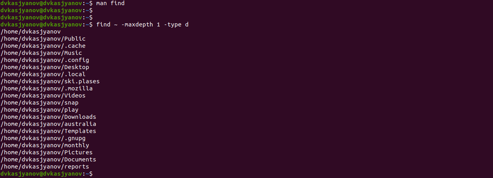

(Рисунок 20)

# Контрольные вопросы

1. В системе по умолчанию открыто три специальных потока:

   * `stdin` — стандартный поток ввода (по умолчанию: клавиатура), файловый дескриптор `0`;

   * `stdout` — стандартный поток вывода (по умолчанию: консоль), файловый дескриптор `1`;

   * `stderr` — стандартный поток вывод сообщений об ошибках (по умолчанию: консоль), файловый дескриптор `2`.

2. Операция `>` позволяет перенаправить поток вывода в какой-либо файл, при этом файл будет создан, если его не существует, или перезаписан, если такой файл уже есть.

    Операция `>>` имеет те же функции, но если файл существует, то она не перезаписывает его, а добавляет новые данные после старых.

3. Конвейер (`pipe`) служит для объединения простых команд или утилит в цепочки, в которых результат работы предыдущей команды передаётся последующей. Используются для автоматизации рутинных операций в консоли.

    Синтаксис следующий: `команда 1 | команда 2`, при этом вывод команды 1 передастся на ввод команде 2.

4. Процесс рассматривается операционной системой как заявка на потребление всех видов ресурсов, кроме одного − процессорного времени. Этот последний важнейший ресурс распределяется операционной системой между другими единицами работы − потоками, которые и получили свое название благодаря тому, что они представляют собой последовательности (потоки выполнения) команд.

    Основное различие между программой и процессом заключается в том, что программа представляет собой группу инструкций для выполнения определенной задачи, тогда как процесс представляет собой программу в процессе выполнения. Хотя процесс является активной сущностью, программа считается пассивной.

    Между процессом и программой существует отношение многие-к-одному, что означает, что одна программа может вызывать несколько процессов или, другими словами, несколько процессов могут быть частью одной и той же программы.

5. `PID` - идентификатор процесса.

   `GID` - идентификатор группы UNIX, под которым работает программа.

6. Запущенные фоном программы называются задачами (jobs). Ими можно управлять с помощью команды `jobs`, которая выводит список запущенных в данный момент задач.

7. `top` − это консольная программа, которая показывает список работающих процессов в системе. Программа в реальном времени отсортирует запущенные процессы по их нагрузке на процессор.
   
   `htop` − это продвинутый консольный мониторинг процессов. Утилита выводит постоянно меняющийся список системных процессов, который сортируется в зависимости от нагрузки на ЦПУ. Если делать сравнение с `top`, то `htop` показывает абсолютно все процессы в системе, время их непрерывного использования, загрузку процессоров и расход оперативной памяти.

8. `find` − команда для поиска файлов и каталогов на основе специальных условий. Ее можно использовать в различных обстоятельствах, например, для поиска файлов по разрешениям, владельцам, группам, типу, размеру и другим подобным критериям. 

    Синтаксис:
    `find [папка] [параметры] критерий шаблон [действие]`. `Папка` − каталог в котором производится поиск. `Параметры` − дополнительные параметры, например, глубина поиска. `Критерий` − критерий поиска: имя, дата создания, права, владелец и т.д. `Шаблон` – непосредственно значение по которому производится отбор файлов.

    * `-P` - никогда не открывать символические ссылки;

    * `-L` - получает информацию о файлах по символическим ссылкам. Важно для дальнейшей обработки, чтобы обрабатывалась не ссылка, а сам файл;

    * `-maxdepth` - максимальная глубина поиска по подкаталогам, для поиска только в текущем каталоге необходимо поставить `1`;

    * `-depth` - искать сначала в текущем каталоге, а потом в подкаталогах;

    * `-mount` искать файлы только в этой файловой системе;

    * `-version` - показать версию утилиты find;

    * `-print` - выводить полные имена файлов;

    * `-type f` - искать только файлы;

    * `-type d` - поиск папки в Linux;

    Основные критерии:

    * `-name` - поиск файлов по имени;

    * `-perm` - поиск файлов в Linux по режиму доступа;

    * `-user` - поиск файлов по владельцу;

    * `-group` - поиск по группе;

    * `-mtime` - поиск по времени модификации файла;

    * `-atime` - поиск файлов по дате последнего чтения;

    * `-nogroup` - поиск файлов, не принадлежащих ни одной группе;

    * `-nouser` - поиск файлов без владельцев;

    * `-newer` - найти файлы новее чем указанный;

    * `-size` - поиск файлов в Linux по их размеру;

    Примеры:
    
    * `find ~ -name 'purpose_of_life*'` - поиск в домашнем каталоге файлов, начинающихся с "purpose_of_life";

    * `find /tmp -maxdepth 3 -type f` - поиск файлов в каталоге /tmp глубины 3.

9. Да, для этого используется команда `grep "содержание файла, который мы ищем"`.

10. Для этого используется команда `df`.

11. Для этого используется команда `du`. Для домашнего каталога: `du ~`.

12. Основные сигналы, которые используются для завершения процесса:

    * `SIGINT` – самый безобидный сигнал завершения, означает Interrupt. Он отправляется процессу, запущенному из терминала с помощью сочетания клавиш Ctrl+C. Процесс правильно завершает все свои действия и возвращает управление;
    
    * `SIGQUIT` – это еще один сигнал, который отправляется с помощью сочетания клавиш, программе, запущенной в терминале. Он сообщает ей что нужно завершиться и программа может выполнить корректное завершение или проигнорировать сигнал. В отличие от предыдущего, она генерирует дамп памяти. Сочетание клавиш Ctrl+/;
    
    * `SIGHUP` – сообщает процессу, что соединение с управляющим терминалом разорвано, отправляется, в основном, системой при разрыве соединения с интернетом;
    
    * `SIGTERM` – немедленно завершает процесс, но обрабатывается программой, поэтому позволяет ей завершить дочерние процессы и освободить все ресурсы;

    * SIGKILL – тоже немедленно завершает процесс, но, в отличие от предыдущего варианта, он не передается самому процессу, а обрабатывается ядром. Поэтому ресурсы и дочерние процессы остаются запущенными. 
  
    Также для передачи сигналов процессам в Linux используется утилита `kill`, её синтаксис: `kill [-сигнал] [pid_процесса]`. Сигнал представляет собой один из выше перечисленных сигналов для завершения процесса. Перед тем, как выполнить остановку процесса, нужно определить его `PID`. 
    
    Утилита `pkill` – это оболочка для `kill`, она ведет себя точно так же, и имеет тот же синтаксис, только в качестве идентификатора процесса ей нужно передать его имя. `killal`l работает аналогично двум предыдущим утилитам. Она тоже принимает имя процесса в качестве параметра и ищет его `PID` в директории /proc. Но эта утилита обнаружит все процессы с таким именем и завершит их.

# Выводы

Я ознакомился с инструментами поиска файлов и фильтрации текстовых данных, приобрел практические навыки: по управлению процессами (и заданиями), по проверке использования диска и обслуживанию файловых систем.

# Библиография

[Linux: перенаправление](https://habr.com/ru/company/ruvds/blog/336320/)

[Потоки данных](https://habr.com/ru/post/55136/)
 
[Основы Linux от основателя Gentoo. Часть 2 (4/5): Обработка текста и перенаправления](https://habr.com/ru/post/105926/)

[Команда find в Linux – мощный инструмент сисадмина](https://habr.com/ru/company/alexhost/blog/525394/)

[Разница между программой и процессом](https://ru.gadget-info.com/difference-between-program)
