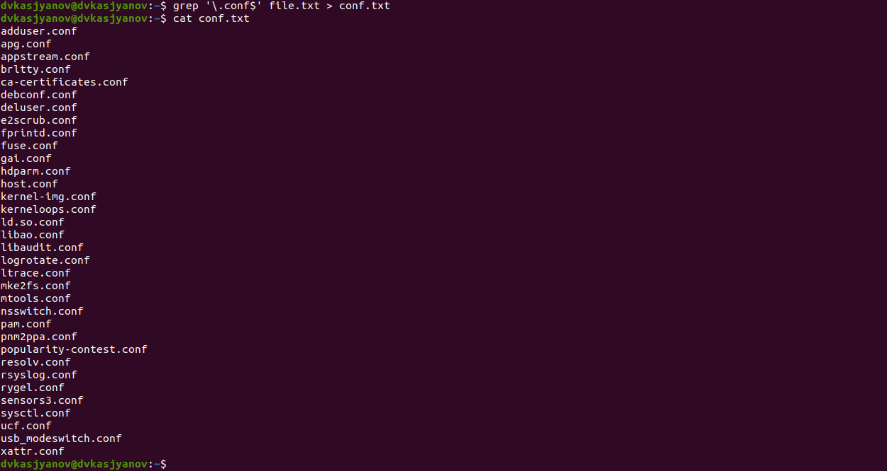

---
## Front matter
lang: ru-RU
title: Операционные системы 
author: Касьянов Даниил Владимирович
institute: RUDN University, Moscow, Russian Federation

date: 18 мая 2021 год

## Formatting
toc: false
slide_level: 2
theme: metropolis
header-includes: 
 - \metroset{progressbar=frametitle,sectionpage=progressbar,numbering=fraction}
 - '\makeatletter'
 - '\beamer@ignorenonframefalse'
 - '\makeatother'
aspectratio: 43
section-titles: true
---

# Лабораторная работа №7

## Ход работы

Использую `>` и `>>` для перенаправления потоков вывода, `|` для объединения команд в цепочки; использую команду `grep` для поиска указанной строки символов и для фильтрации.

Вывод имен всех файлов из file.txt, имеющих расширение `.conf`; запись в файл conf.txt с помощью команды `grep '\.conf$' file.txt > conf.txt`

##

Произвожу поиск файлов по критериям с помощью команды `find`.

Запись в фоновом режиме имен всех файлов домашнего каталога, начинающихся с 'log', в logfile

##

## Выводы

Я ознакомился с инструментами поиска файлов и фильтрации текстовых данных, приобрел практические навыки: по управлению процессами (и заданиями), по проверке использования диска и обслуживанию файловых систем.

## {.standout}

Спасибо за внимание!
