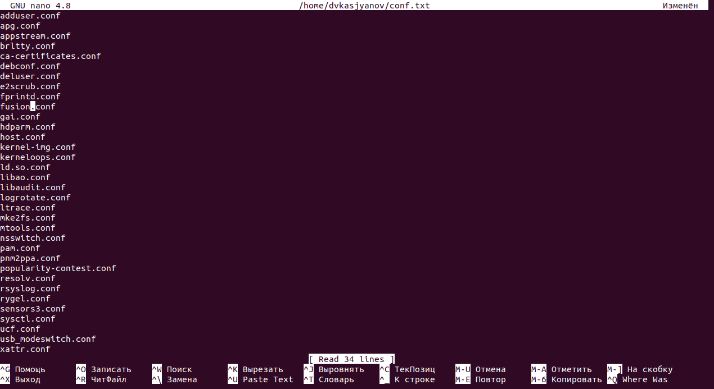
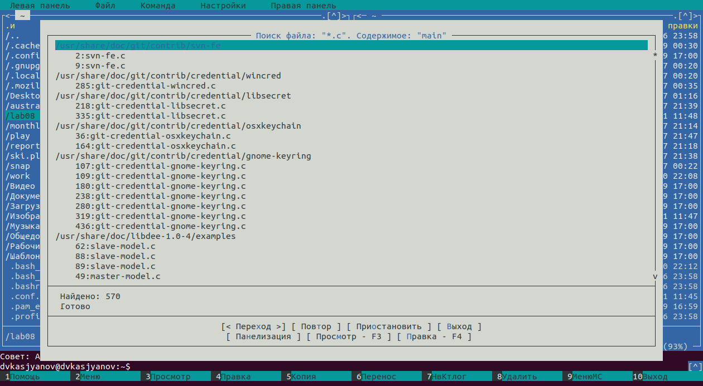
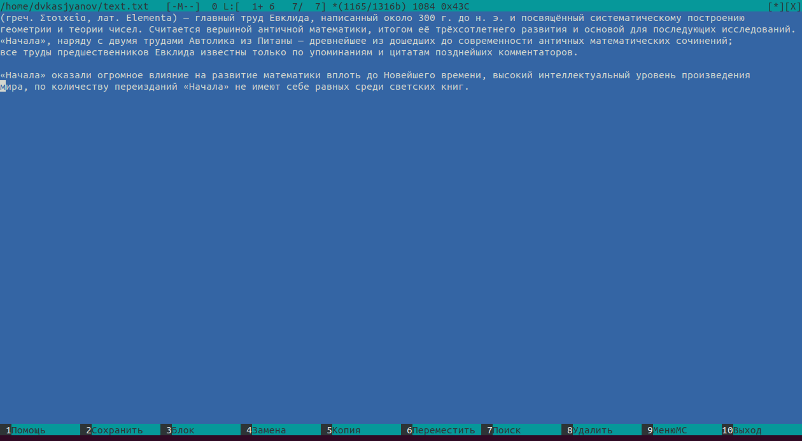

---
## Front matter
lang: ru-RU
title: Операционные системы 
author: Касьянов Даниил Владимирович
institute: RUDN University, Moscow, Russian Federation

date: 18 мая 2021 год

## Formatting
toc: false
slide_level: 2
theme: metropolis
header-includes: 
 - \metroset{progressbar=frametitle,sectionpage=progressbar,numbering=fraction}
 - '\makeatletter'
 - '\beamer@ignorenonframefalse'
 - '\makeatother'
aspectratio: 43
section-titles: true
---

# Лабораторная работа №8

## Ход работы

### Задание по `mc`

Изучаю структуру и меню `mc`. Выполняю простые операции, используя горячие клавиши.

Расширенный формат списка файлов

##

Изменение строки текста в файле **conf.txt**

##

С помощью соответствующих средств подменю **Команда** осуществляю поиск файлов с расширениями **.c** и **.cpp**, содержащих строку **main**.

Поиск файла с расширением **.c** и содержимым **main**

## 

### Задание по встроенному редактору **mc**

Создаю текстовой файл **text.txt**. Работаю с файлом, используя встроенный редактор **mc**.

Текст из интернета

##

Копирование текста

##

Удаление строки клавишей **F8**

## Выводы

Я освоил основные возможности командной оболочки **Midnight Commander**, приобрёл навыки практической работы по просмотру каталогов и файлов; манипуляций с ними.

## {.standout}

Спасибо за внимание!

