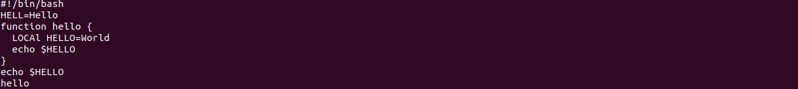
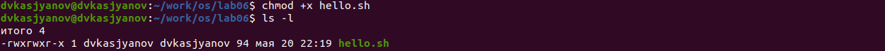
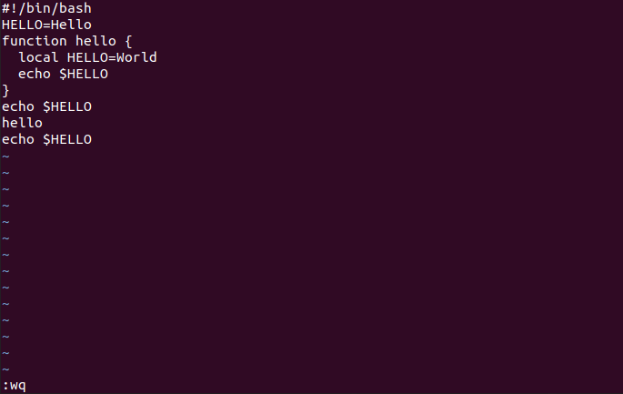

---
# Front matter
lang: ru-RU
title: "Отчёт лабораторной работы №9"
subtitle: "Дисциплина: Операционные системы"
author: "Касьянов Даниил Владимирович"

# Formatting
toc-title: "Содержание"
toc: true # Table of contents
toc_depth: 2
lof: true # List of figures
lot: true # List of tables
fontsize: 12pt
linestretch: 1.5
papersize: a4paper
documentclass: scrreprt
polyglossia-lang: russian
polyglossia-otherlangs: english
mainfont: PT Serif
romanfont: PT Serif
sansfont: PT Sans
monofont: PT Mono
mainfontoptions: Ligatures=TeX
romanfontoptions: Ligatures=TeX
sansfontoptions: Ligatures=TeX,Scale=MatchLowercase
monofontoptions: Scale=MatchLowercase
indent: true
pdf-engine: lualatex
header-includes:
  - \linepenalty=10 # the penalty added to the badness of each line within a paragraph (no associated penalty node) Increasing the value makes tex try to have fewer lines in the paragraph.
  - \interlinepenalty=0 # value of the penalty (node) added after each line of a paragraph.
  - \hyphenpenalty=50 # the penalty for line breaking at an automatically inserted hyphen
  - \exhyphenpenalty=50 # the penalty for line breaking at an explicit hyphen
  - \binoppenalty=700 # the penalty for breaking a line at a binary operator
  - \relpenalty=500 # the penalty for breaking a line at a relation
  - \clubpenalty=150 # extra penalty for breaking after first line of a paragraph
  - \widowpenalty=150 # extra penalty for breaking before last line of a paragraph
  - \displaywidowpenalty=50 # extra penalty for breaking before last line before a display math
  - \brokenpenalty=100 # extra penalty for page breaking after a hyphenated line
  - \predisplaypenalty=10000 # penalty for breaking before a display
  - \postdisplaypenalty=0 # penalty for breaking after a display
  - \floatingpenalty = 20000 # penalty for splitting an insertion (can only be split footnote in standard LaTeX)
  - \raggedbottom # or \flushbottom
  - \usepackage{float} # keep figures where there are in the text
  - \floatplacement{figure}{H} # keep figures where there are in the text
---

# Цель работы

Познакомиться с операционной системой Linux. Получить практические навыки работы с редактором vi, установленным по умолчанию практически во всех дистрибутивах.

# Выполнение лабораторной работы

## Задание 1. Создание нового файла с использованием vi

1. Создаю каталог с именем ~/work/os/lab06 (Рисунок 1).


(Рисунок 1)

2. Перехожу во вновь созданный каталог (Рисунок 2).


(Рисунок 2)

3. Вызываю `vi` и создаю файл hello.sh (Рисунок 3).


(Рисунок 3)

4. Нажимаю клавишу `i` и ввожу следующий текст (Рисунок 4):

```vi
#!/bin/bash
HELL=Hello
function hello {
LOCAL HELLO=World
echo $HELLO
}
echo $HELLO
hello
```



(Рисунок 4)

5. Нажимаю клавишу `Esc` для перехода в командный режим после завершения ввода текста.

6. Нажимаю `:` для перехода в режим последней строки. Внизу моего экрана появилось приглашение в виде двоеточия (Рисунок 5).


(Рисунок 5)

7. Нажимаю `w` (записать) и `q` (выйти), а затем нажмите клавишу `Enter` для сохранения моего текста и завершения работы (Рисунок 6).


(Рисунок 6)

8. Сделаю файл исполняемым: `chmod +x hello.sh` (Рисунок 7)



(Рисунок 7)

## Задание 2. Редактирование существующего файла

1. Вызову `vi` на редактирование файла: `vi ~/work/os/lab06/hello.sh` (Рисунок 8).


(Рисунок 8)

2. Установлю курсор в конец слова HELL второй строки, используя стрелки в командном режиме (Рисунок 9).


(Рисунок 9)

3. Перехожу в режим вставки (`i`) и заменяю HELL на HELLO. Нажимаю `Esc` для возврата в командный режим (Рисунок 10).


(Рисунок 10)

4. Устанавливаю курсор на четвертую строку (Рисунок 11) и стираю слово LOCAL с помощью клавиш `d` и `w` (Рисунок 12).


(Рисунок 11)


(Рисунок 12)

5. Перехожу в режим вставки и набираю следующий текст: `local`. Нажимаю `Esc` для возврата в командный режим (Рисунок 13).


(Рисунок 13)

6. Устанавливаю курсор на последней строке файла (Рисунок 14). Вставляю после неё строку, содержащую следующий текст: `echo $HELLO` (Рисунок 15).


(Рисунок 14)


(Рисунок 15)

7. Нажимаю `Esc` для перехода в командный режим.

8. Удаляю последнюю строку (Рисунок 16).


(Рисунок 16)

9.  Ввожу команду отмены изменений `u` для отмены последней команды (Рисунок 17).


(Рисунок 17)

10. Ввожу символ `:` для перехода в режим последней строки. Записываю произведённые изменения и выхожу из `vi`: `wq` (Рисунок 18).



(Рисунок 18)

# Контрольные вопросы

1. Редактор `vi` имеет три режима работы:

* *командный режим* − предназначен для ввода команд редактирования
и навигации по редактируемому файлу;

* *режим вставки* − предназначен для ввода содержания
редактируемого файла;

* *режим последней (или командной) строки* − используется для записи
изменений в файл и выхода из редактора.

2. Чтобы выйти из редактора, не сохраняя произведённые изменения, нужно в режиме командной строки ввести `:q!`.


3. Команды позиционирования:

* `0` (ноль) − переход в начало строки;

* `$` − переход в конец строки;

* `G` − переход в конец файла;

* n`G` − переход на строку с номером n.


4. При использовании прописных `W` и `B` под разделителями понимаются только пробел, табуляция и возврат каретки. При использовании строчных `w` и `b` под разделителями понимаются также любые знаки пунктуации.


5. Чтобы из любого места редактируемого файла перейти в начало (конец) файла, нужно в режиме командной строки нажать клавиши `1` `G` (`G`).


6. Команды редактирования:

#### Вставка текста

* `а` − вставить текст после курсора;

* `А` − вставить текст в конец строки;

* `i` − вставить текст перед курсором;

* n`i` − вставить текст n раз;

* `I` − вставить текст в начало строки.


#### Вставка строки

* `о` − вставить строку под курсором;

* `О` − вставить строку над курсором.


#### Удаление текста

* `x` − удалить один символ в буфер;

* `d` `w` − удалить одно слово в буфер;


* `d` `$` − удалить в буфер текст от курсора до конца строки;

* `d` `0` − удалить в буфер текст от начала строки до позиции
курсора;

* `d` `d` − удалить в буфер одну строку;

* n `d` `d` − удалить в буфер n строк.


#### Отмена и повтор произведённых изменений

* `u` − отменить последнее изменение;

* `.` − повторить последнее изменение.


#### Копирование текста в буфер

* `Y` − скопировать строку в буфер;

* n `Y` − скопировать n строк в буфер;

* `y` `w` − скопировать слово в буфер.


#### Вставка текста из буфера

* `p` − вставить текст из буфера после курсора;

* `P` − вставить текст из буфера перед курсором.


#### Замена текста

* `c` `w` − заменить слово;

* n `c` `w` − заменить n слов;

* `c` `$` − заменить текст от курсора до конца строки;

* `r` − заменить слово;

* `R` − заменить текст.


#### Поиск текста

* `/` текст − произвести поиск вперёд по тексту указанной строки
символов текст;

* `?` текст − произвести поиск назад по тексту указанной строки
символов текст.


#### Копирование и перемещение текста

* `:` n,m `d` – удалить строки с n по m;

* `:` i,j `m` k – переместить строки с i по j, начиная со строки k;

* `:` i,j `t` k – копировать строки с i по j в строку k;

* `:` i,j `w` имя-файла – записать строки с i по j в файл с именем
'имя-файла'.


7. Чтобы заполнить строку символами `$`, необходимо для начала перейти на эту строку, нажав клавиши n `G`, где n – номер строки, далее нажать `0` для перехода в начало строки. Теперь необходимо нажать `c` `$`, чтобы заменить текст от курсора до конца строки, и ввести символы `$`.


8. Чтобы отменить по одному предыдущему действию последовательно, необходимо нажать `u`. Чтобы отменить все изменения, произведённые со времени последней записи, нужно нажать `:` `e` `!`.


9. Команды редактирования в режиме командной строки:

#### Копирование и перемещение текста

* `:` n,m `d` − удалить строки с n по m;

* `:` i,j `m` k − переместить строки с i по j, начиная со строки k;

* `:` i,j `t` k − копировать строки с i по j в строку k;

* `:` i,j `w` имя-файла − записать строки с i по j в файл с именем
имя-файла.


#### Запись в файл и выход из редактора

* `:` `w` − записать изменённый текст в файл, не выходя из `vi`;

* `:` `w` имя-файла − записать изменённый текст в новый файл с именем 'имя-файла';

* `:` `w` `!` имя-файла − записать изменённый текст в файл с именем 'имя-файла';

* `:` `w` `q` − записать изменения в файл и выйти из `vi`;

* `:` `q` − выйти из редактора `vi`;

* `:` `q` `!` − выйти из редактора без записи;

* `:` `e` `!` − вернуться в командный режим, отменив все изменения, произведённые со времени последней записи.


#### Опции

Опции редактора `vi` позволяют настроить рабочую среду. Для задания опций используется команда `set` (в режиме последней строки):

* `: set all` − вывести полный список опций;

* `: set nu` − вывести номера строк;

* `: set list` − вывести невидимые символы;

* `: set ic` − не учитывать при поиске, является ли символ
прописным или строчным.

Если вы хотите отказаться от использования опции, то в команде `set` перед именем опции надо поставить `no`.


10.  Чтобы определить, не перемещая курсора, позицию, в которой заканчивается строка, нужно в командном режиме находясь на нужной строке нажать `$` и посмотреть на число после запятой в правом нижнем углу экрана.


11.  Опции редактора `vi` позволяют настроить рабочую среду. Для задания опций используется команда `set`. Если вы хотите отказаться от использования опции, то в команде `set` перед именем опции надо поставить `no`. Чтобы просмотреть опции редактора `vi`, необходимо нажать `: set all`. Нажав `: help` “название_опции”, можно узнать назначение конкретной опции.

12. В режиме командной строки внизу редактора присутствует `:`, в режиме ввода – `-- ВСТАВКА --`, в командном режиме ничего нет.

13. 

# Выводы

Я познакомился с операционной системой Linux, получить практические навыки работы с редактором vi, установленным по умолчанию практически во всех дистрибутивах.

# Библиография

[Лабораторная работа № 9 - "Текстовой редактор vi"](https://esystem.rudn.ru/mod/resource/view.php?id=718598)
