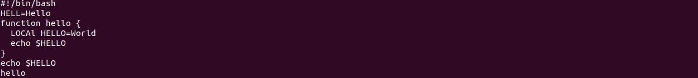
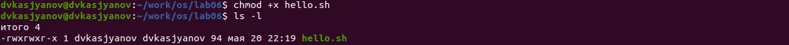
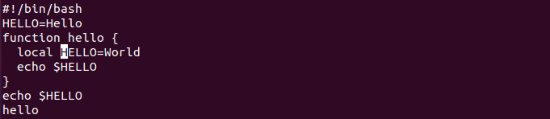
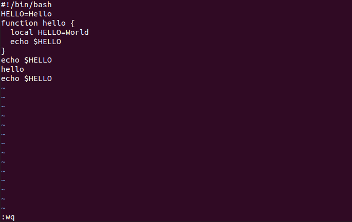

---
## Front matter
lang: ru-RU
title: Операционные системы 
author: Касьянов Даниил Владимирович
institute: RUDN University, Moscow, Russian Federation

date: 18 мая 2021 год

## Formatting
toc: false
slide_level: 2
theme: metropolis
header-includes: 
 - \metroset{progressbar=frametitle,sectionpage=progressbar,numbering=fraction}
 - '\makeatletter'
 - '\beamer@ignorenonframefalse'
 - '\makeatother'
aspectratio: 43
section-titles: true
---

# Лабораторная работа №9

## Ход работы

Создаю файл в каталоге, записываю в него текст, используя редактор `vi`.

Текст, записанный в файле

##

Изменяю права данного файла.

Добавление права на выполнение

##

Редактирую файл, используя `vi`. Использую горячие клавиши.

Замена LOCAL на local

##

Сохраняю изменения. Закрываю файл.

Сохранение и выход. Команда `:wq`

## Выводы

Я познакомился с операционной системой Linux, получить практические навыки работы с редактором vi, установленным по умолчанию практически во всех дистрибутивах.

## {.standout}

Спасибо за внимание!
