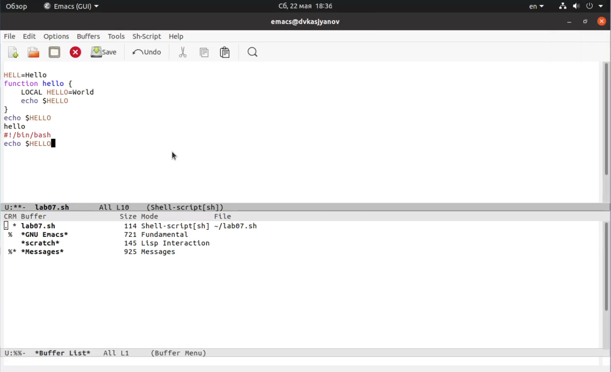
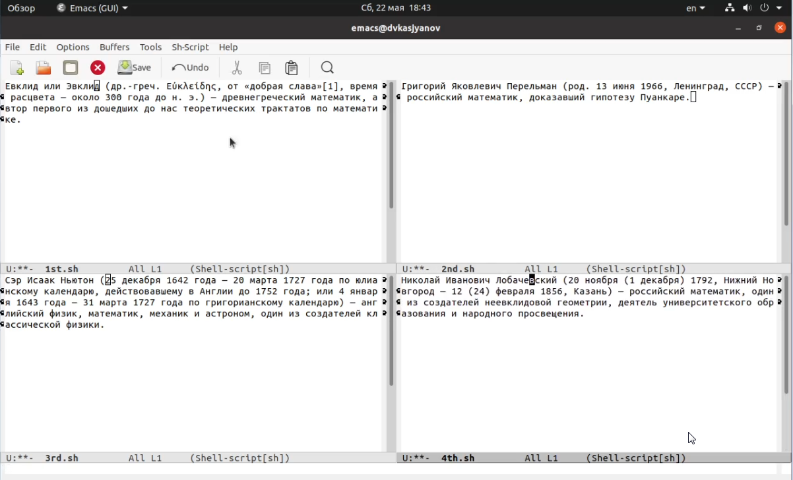
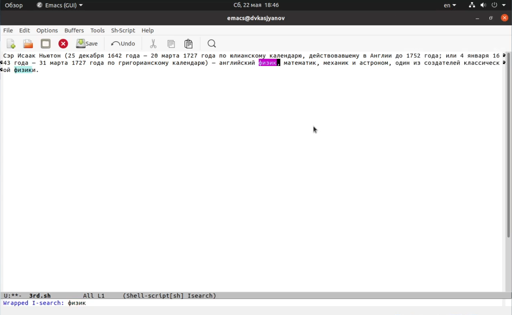

---
## Front matter
lang: ru-RU
title: Операционные системы 
author: Касьянов Даниил Владимирович
institute: RUDN University, Moscow, Russian Federation

date: 18 мая 2021 год

## Formatting
toc: false
slide_level: 2
theme: metropolis
header-includes: 
 - \metroset{progressbar=frametitle,sectionpage=progressbar,numbering=fraction}
 - '\makeatletter'
 - '\beamer@ignorenonframefalse'
 - '\makeatother'
aspectratio: 43
section-titles: true
---

# Лабораторная работа №10

## Ход работы

Открываю `emacs`. Учусь использовать основные команды редактора, пользуясь горячими клавишами.

Копирование строки

##

Использую основные команды по перемещению курсора.

Перемещение курсора в начало буфера

##

Управляю буферами.

Вывод списка активных буферов

##

Управляю окнами.

Работа с четыремя файлами одновременно

## 

Использую режими поиска.

Режим поиска

## Выводы

Я познакомился с операционной системой Linux, получил практические навыки работы с редактором `Emacs`.

## {.standout}

Спасибо за внимание!
