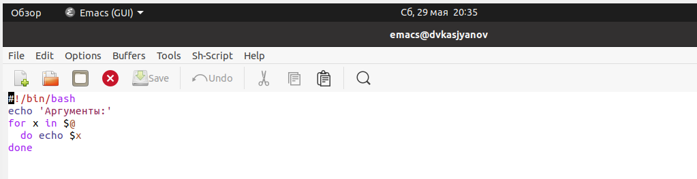

---
## Front matter
lang: ru-RU
title: Операционные системы 
author: Касьянов Даниил Владимирович
institute: RUDN University, Moscow, Russian Federation

date: 15 мая 2021 год

## Formatting
toc: false
slide_level: 2
theme: metropolis
header-includes: 
 - \metroset{progressbar=frametitle,sectionpage=progressbar,numbering=fraction}
 - '\makeatletter'
 - '\beamer@ignorenonframefalse'
 - '\makeatother'
aspectratio: 43
section-titles: true
---

# Лабораторная работа №11

## Ход работы

1. Пишу скрипт, который сохраняет архив копии самого себя в директории **~/backup**.

Скрипт 1

##

Проверка работы скрипта

## 

2. Пишу командный файл, печатающий значения любого произвольного числа аргументов командной строки.

Скрипт 2

##

Проверка работы скрипта

## 

3. Пишу командный файл — аналог команды `ls`.

Скрипт 3

##

Проверка работы скрипта

## 

4. Пишу командный файл, который вычисляет количество файлов в указанной директории с заданным форматом (.txt, .doc, .jpg, .pdf и т.д.).

Скрипт 4

##

Проверка работы скрипта

## Выводы

Я изучил основы программирования в оболочке ОС UNIX/Linux и научился писать небольшие командные файлы.

## {.standout}

Спасибо за внимание!