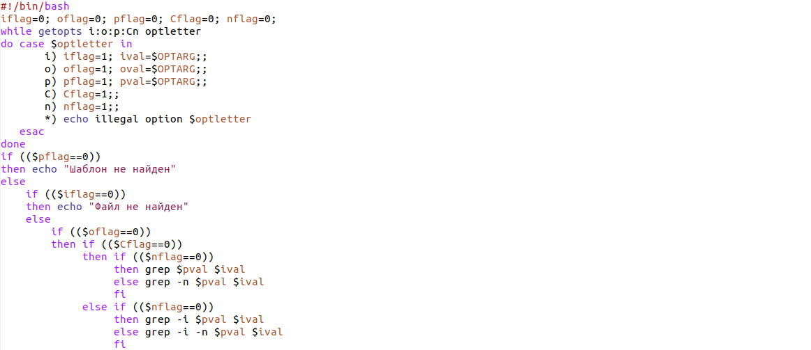
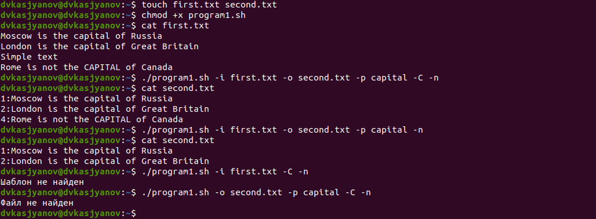
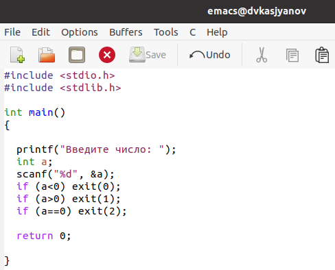
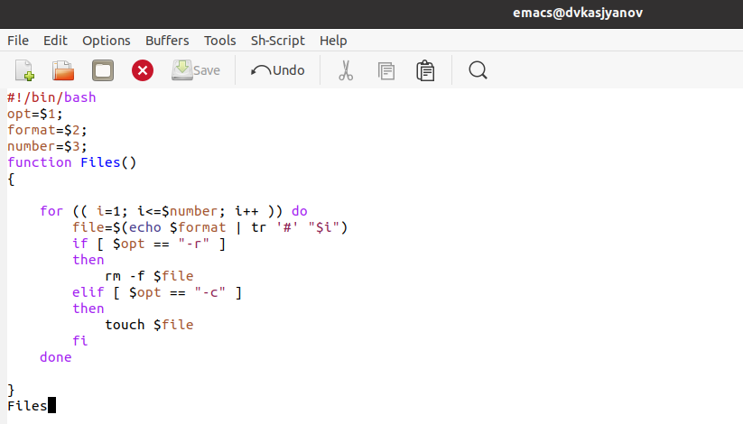
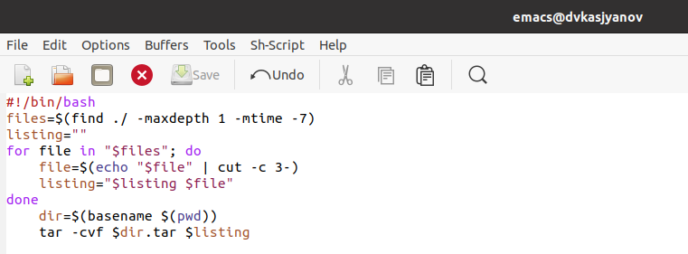

---
## Front matter
lang: ru-RU
title: Операционные системы 
author: Касьянов Даниил Владимирович
institute: RUDN University, Moscow, Russian Federation

date: 15 мая 2021 год

## Formatting
toc: false
slide_level: 2
theme: metropolis
header-includes: 
 - \metroset{progressbar=frametitle,sectionpage=progressbar,numbering=fraction}
 - '\makeatletter'
 - '\beamer@ignorenonframefalse'
 - '\makeatother'
aspectratio: 43
section-titles: true
---

# Лабораторная работа №12

## Ход работы

1. Пишу скрипт **program1.sh**, который анализирует командную строку с ключами.

Скрипт 1

##

Проверка работы скрипта

## 

1. Пишу программу, которая вводит число и определяет, является ли оно больше нуля, меньше нуля или равно нулю.

Скрипт 2

##

Проверка работы скрипта

## 

3. Пишу командный файл, создающий указанное число файлов, пронумерованных последовательно от 1 до N.

Скрипт 3

##

Проверка работы скрипта

## 

4. Пишу командный файл, который с помощью команды tar запаковывает в архив все файлы в указанной директории.

Скрипт 4

##

Проверка работы скрипта

## Выводы

Я изучить основы программирования в оболочке ОС UNIX. Научится писать более сложные командные файлы с использованием логических управляющих конструкций и циклов.

## {.standout}

Спасибо за внимание!