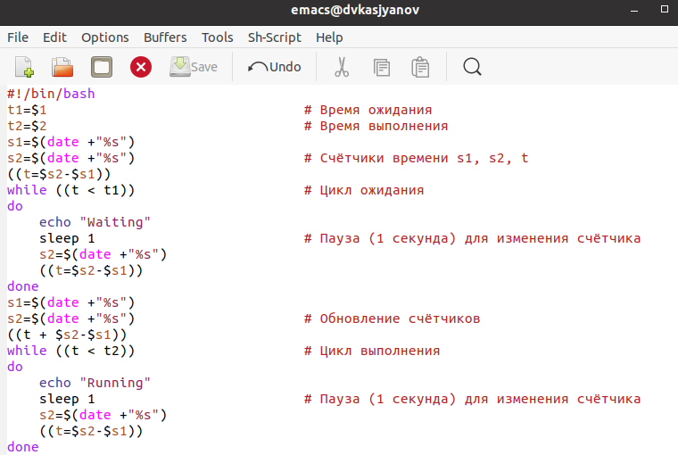
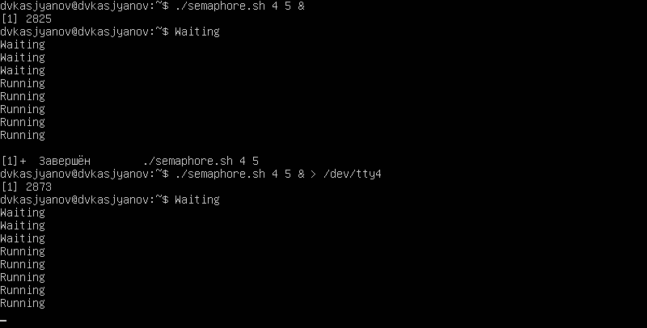
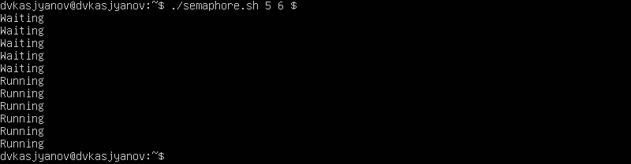
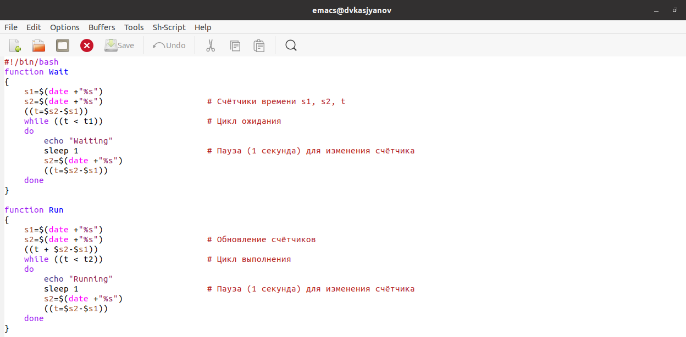
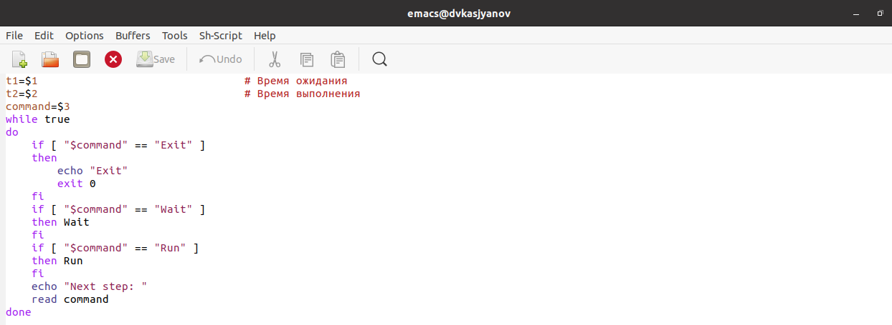
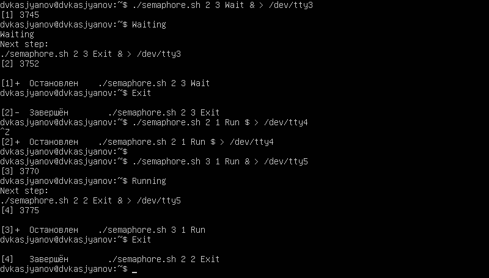
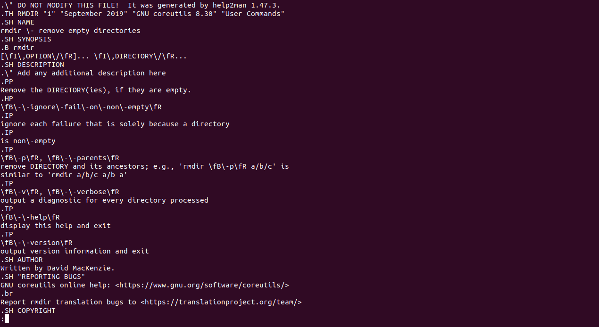
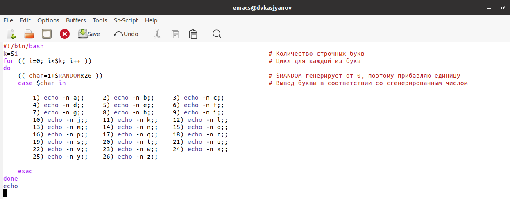
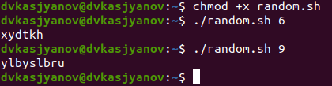

---
# Front matter
lang: ru-RU
title: "Отчёт лабораторной работы №13"
subtitle: "Дисциплина: Операционные системы"
author: "Касьянов Даниил Владимирович"

# Formatting
toc-title: "Содержание"
toc: true # Table of contents
toc_depth: 2
lof: true # List of figures
lot: true # List of tables
fontsize: 12pt
linestretch: 1.5
papersize: a4paper
documentclass: scrreprt
polyglossia-lang: russian
polyglossia-otherlangs: english
mainfont: PT Serif
romanfont: PT Serif
sansfont: PT Sans
monofont: PT Mono
mainfontoptions: Ligatures=TeX
romanfontoptions: Ligatures=TeX
sansfontoptions: Ligatures=TeX,Scale=MatchLowercase
monofontoptions: Scale=MatchLowercase
indent: true
pdf-engine: lualatex
header-includes:
  - \linepenalty=10 # the penalty added to the badness of each line within a paragraph (no associated penalty node) Increasing the value makes tex try to have fewer lines in the paragraph.
  - \interlinepenalty=0 # value of the penalty (node) added after each line of a paragraph.
  - \hyphenpenalty=50 # the penalty for line breaking at an automatically inserted hyphen
  - \exhyphenpenalty=50 # the penalty for line breaking at an explicit hyphen
  - \binoppenalty=700 # the penalty for breaking a line at a binary operator
  - \relpenalty=500 # the penalty for breaking a line at a relation
  - \clubpenalty=150 # extra penalty for breaking after first line of a paragraph
  - \widowpenalty=150 # extra penalty for breaking before last line of a paragraph
  - \displaywidowpenalty=50 # extra penalty for breaking before last line before a display math
  - \brokenpenalty=100 # extra penalty for page breaking after a hyphenated line
  - \predisplaypenalty=10000 # penalty for breaking before a display
  - \postdisplaypenalty=0 # penalty for breaking after a display
  - \floatingpenalty = 20000 # penalty for splitting an insertion (can only be split footnote in standard LaTeX)
  - \raggedbottom # or \flushbottom
  - \usepackage{float} # keep figures where there are in the text
  - \floatplacement{figure}{H} # keep figures where there are in the text
---

# Цель работы

Изучить основы программирования в оболочке ОС UNIX. Научиться писать более сложные командные файлы с использованием логических управляющих конструкций и циклов.

# Выполнение лабораторной работы

1. Написать командный файл, реализующий упрощённый механизм семафоров. Командный файл должен в течение некоторого времени **t1** дожидаться освобождения ресурса, выдавая об этом сообщение, а дождавшись его освобождения, использовать его в течение некоторого времени **t2<>t1**, также выдавая информацию о том, что ресурс используется соответствующим командным файлом (процессом). Запустить командный файл в одном виртуальном терминале в фоновом режиме, перенаправив его вывод в другой (**> /dev/tty#**, где **#** — номер терминала куда перенаправляется вывод), в котором также запущен этот файл, но не фоновом, а в привилегированном режиме. Доработать программу так, чтобы имелась возможность взаимодействия трёх и более процессов.

Создаю файл **semaphore.sh** и открываю его, используя **emacs** (Рисунок 1). Пишу скрипт (Рисунок 2).


(Рисунок 1)



(Рисунок 2)

Проверяю командный файл. Для этого добавляю ему право на выполнение и запускаю, используя аргументы **2** и **3** (Рисунок 3):


(Рисунок 3)

Запускаю командный файл в терминале **tty4** в привилегированном режиме и в терминале **tty3** в фоновом режиме. Перенаправляю вывод из терминала **tty3** в **tty4**: `> /dev/tty4` (Рис. 4, 5).



(Рисунок 4)



(Рисунок 5)

Доработаю программу для взаимодействия трёх и более процессов (Рис. 6, 7).



(Рисунок 6)



(Рисунок 7)

Проверю работу скрипта (Рис. 8-11).



(Рисунок 8)


(Рисунок 9)


(Рисунок 10)


(Рисунок 11)

Программа работает корректно.

2. Реализовать команду **man** с помощью командного файла. Изучить содержимое каталога **/usr/share/man/man1**. В нем находятся архивы текстовых файлов, содержащих справку по большинству установленных в системе программ и команд. Каждый архив можно открыть командой **less** сразу же просмотрев содержимое справки. Командный файл должен получать в виде аргумента командной строки название команды и в виде результата выдавать справку об этой команде или сообщение об отсутствии справки, если соответствующего файла нет в каталоге **man1**.

Просматриваю содержимое каталога **/usr/share/man/man1** (Рисунок 12).


(Рисунок 12)

Создаю файл **man.sh** и открываю его, используя **emacs** (Рисунок 13). Пишу скрипт (Рисунок 14).


(Рисунок 13)


(Рисунок 14)

Проверю работу скрипта.  

Выведу справку по команде `rmdir` (Рис. 15, 16).


(Рисунок 15)



(Рисунок 16)

Попробую использовать аргумент, который не является командой и, следовательно, не имеет мануала: `qwerty`. В результате получим сообщение об отсутствии мануала (Рисунок 17).


(Рисунок 17)

Программа работает корректно.

3. Используя встроенную переменную **\$RANDOM**, написать командный файл, генерирующий случайную последовательность букв латинского алфавита. Учесть, что **$RANDOM** выдаёт псевдослучайные числа в диапазоне от **0** до **32767**.

Создаю файл **random.sh** и открываю его, используя **emacs** (Рисунок 18). Пишу скрипт (Рисунок 19).


(Рисунок 18)



(Рисунок 19)

Проверю работу скрипта на аргументах **6** и **9** (Рисунок 20).



(Рисунок 20)

Программа работает корректно.

# Контрольные вопросы

1) `while [$1 != "exit"]`

В данной строчке допущены следующие ошибки:

* Не хватает пробелов после первой скобки **[** и перед второй скобкой **]**.

* Выражение **$1** необходимо взять в **""**, потому что эта переменная может содержать пробелы.

Таким образом, правильный вариант должен выглядеть так: `while [ "$1" != "exit" ]`

2) Для проведения конкатенации можно воспользоваться несколькими способами:

* 
  ```
  VAR1="Hello,"
  VAR2=" World"
  VAR3="$VAR1$VAR2"
  echo "$VAR3"
  ```

* 
  ```
  VAR1="Hello, "
  VAR1+=" World"
  echo "$VAR1"
  ```
  
В обоих случаях результатом будет строка `Hello, World`.

3) Команда `seq` в Linux используется для генерации чисел от **первого** до **последнего** шага **INCREMENT**.

Параметры:

* `seq LAST`: если задан только один аргумент, он создает числа от **1** до **LAST** с шагом шага, равным **1**. Если **LAST** меньше **1**, значение is не выдает.

* `seq FIRST LAST`: когда заданы два аргумента, он генерирует числа от **FIRST** до **LAST** с шагом **1**, равным **1**. Если **LAST** меньше **FIRST**, он не выдает никаких выходных данных.

* `seq FIRST INCREMENT LAST`: когда заданы три аргумента, он генерирует числа от **FIRST** до **LAST** на шаге **INCREMENT**. Если **LAST** меньше, чем **FIRST**, он не производит вывод.

* `seq -f «FORMAT» FIRST INCREMENT LAST`: эта команда используется для генерации последовательности в форматированном виде. **FIRST** и **INCREMENT** являются необязательными.

* `seq -s «STRING» ПЕРВЫЙ ВКЛЮЧЕНО`: Эта команда используется для **STRING** для разделения чисел. По умолчанию это значение равно **/n**. **FIRST** и **INCREMENT** являются необязательными.

* `seq -w FIRST INCREMENT LAST`: эта команда используется для выравнивания ширины путем заполнения начальными нулями. **FIRST** и **INCREMENT** являются необязательными.

4) Результатом данного выражения **$((10/3))** будет **3**, потому что это целочисленное деление без остатка.

5) Отличия командной оболочки **zsh** от **bash**:

* В **zsh** более быстрое автодополнение для `cd` с помощью Тab.

* В **zsh** существует калькулятор **zcalc**, способный выполнять вычисления внутри терминала.

* В **zsh** поддерживаются числа с плавающей запятой.

* В **zsh** поддерживаются структуры данных «хэш».

* В **zsh** поддерживается раскрытие полного пути на основе неполных данных.

* В **zsh** поддерживается замена части пути.

* В **zsh** есть возможность отображать разделенный экран, такой же как разделенный экран **vim**.

6) `for ((a=1; a <= LIMIT; a++))`. Синтаксис верный, потому что при использовании двойных круглых скобок можно не писать **$** перед переменными.

7) Преимущества скриптового языка **bash**:

* **Bash** является одним из самых распространенных скриптовых языков и ставится по умолчанию в большинстве дистрибутивах Linux, MacOS.

* Удобное перенаправление ввода/вывода.

* Большое количество команд для работы с файловыми системами Linux.

* Можно писать собственные скрипты, упрощающие работу в Linux.

* Дополнительные библиотеки других языков позволяют выполнить больше действий.

Недостатки скриптового языка **bash**:

* **Bash** не является языком общего назначения.

* Утилиты, при выполнении скрипта, запускают свои процессы, которые, в свою очередь, отражаются на быстроте выполнения.

* Скрипты, написанные на **bash**, нельзя запустить на других операционных системах без дополнительных действий.

# Выводы

Я изучил основы программирования в оболочке ОС UNIX, научился писать более сложные командные файлы с использованием логических управляющих конструкций и циклов.

# Библиография

[Лабораторная работа №13 - "Программирование в командном процессоре ОС UNIX. Расширенное программирование"](https://esystem.rudn.ru/mod/resource/view.php?id=718610)