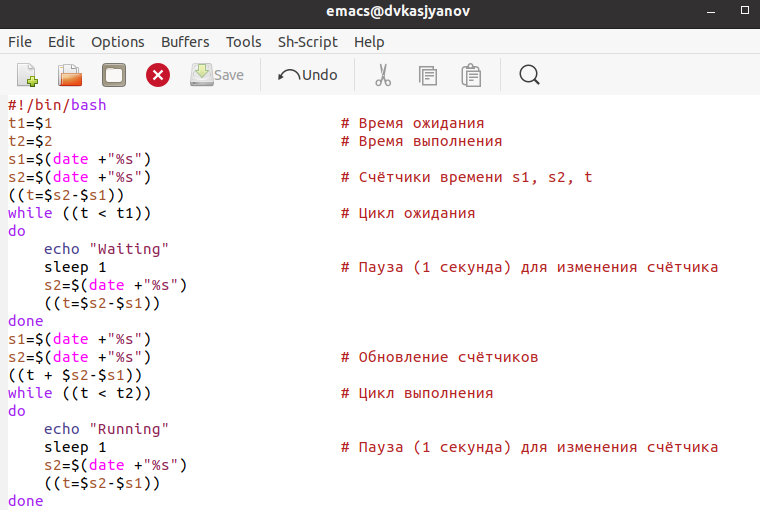
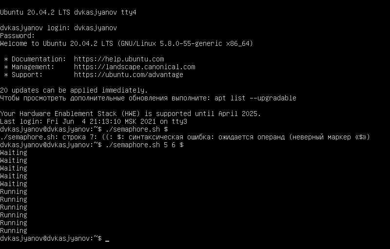
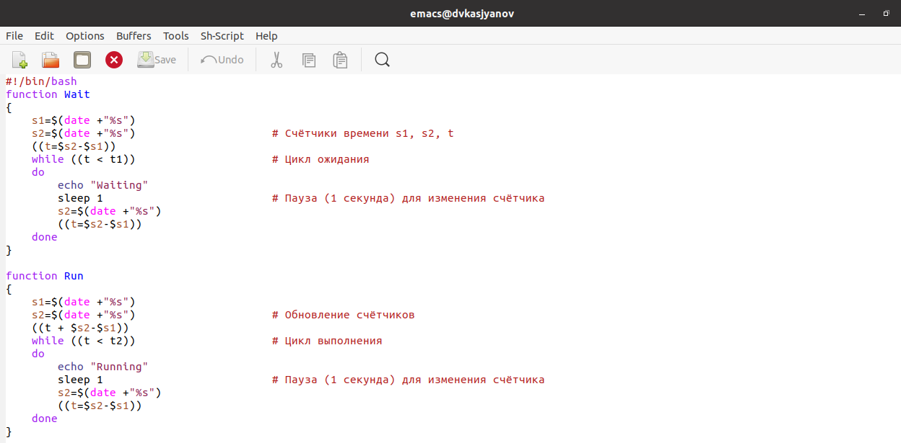
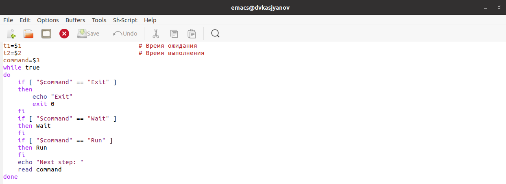
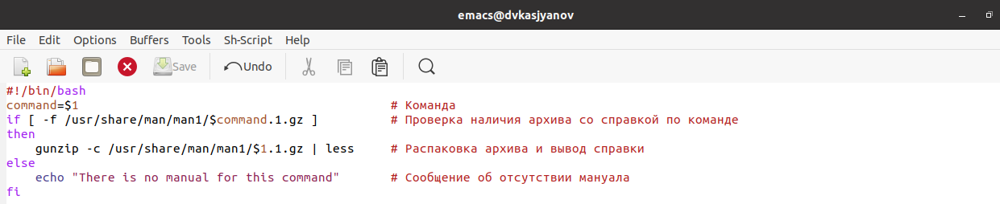
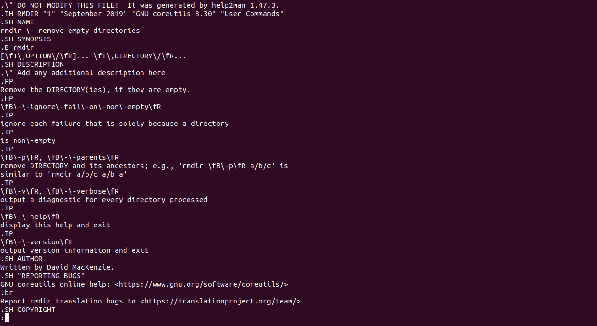
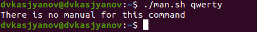
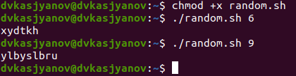

---
## Front matter
lang: ru-RU
title: Операционные системы 
author: Касьянов Даниил Владимирович
institute: RUDN University, Moscow, Russian Federation

date: 18 мая 2021 год

## Formatting
toc: false
slide_level: 2
theme: metropolis
header-includes: 
 - \metroset{progressbar=frametitle,sectionpage=progressbar,numbering=fraction}
 - '\makeatletter'
 - '\beamer@ignorenonframefalse'
 - '\makeatother'
aspectratio: 43
section-titles: true
---

# Лабораторная работа №13

## Ход работы

Создаю командный файл **semaphore.sh**, реализующий упрощённый механизм семафоров.

**semaphore.sh**

##

Проверяю его работу в терминале и в виртуальных консолях.

**semaphore.sh** в tty3

##

Дорабатываю программу так, чтобы имелась возможность взаимодействия трёх и более процессов.

Доработанный **semaphore.sh** 1/2

##

Доработанный **semaphore.sh** 2/2

##

Работа файла в нескольких терминалах

##

Реализую команду **man** с помощью командного файла.

**man.sh**

##

Проверяю работу скрипта.

**man** по `rmdir`

##

Несуществующая команда

##

Пишу командный файл, генерирующий случайную последовательность букв латинского алфавита.

**random.sh**

##

Проверяю работу скрипта.

Проверка на аргументах 6 и 9

## Выводы

Я изучил основы программирования в оболочке ОС UNIX, научился писать более сложные командные файлы с использованием логических управляющих конструкций и циклов.

## {.standout}

Спасибо за внимание!
