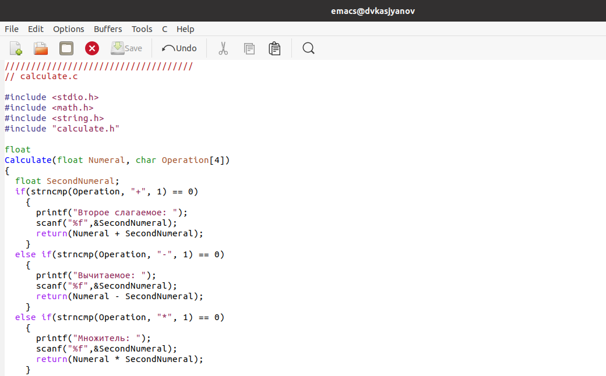
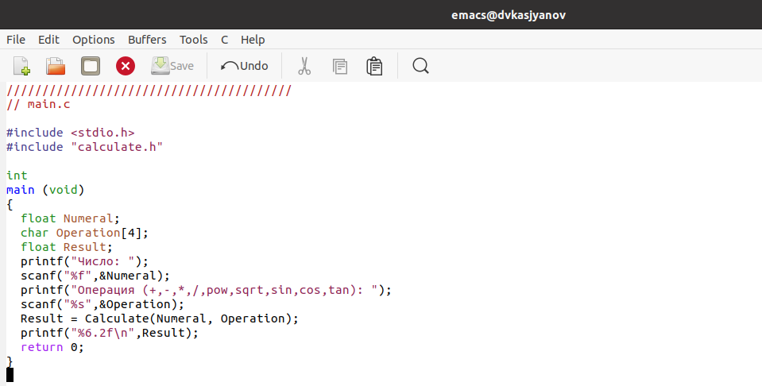
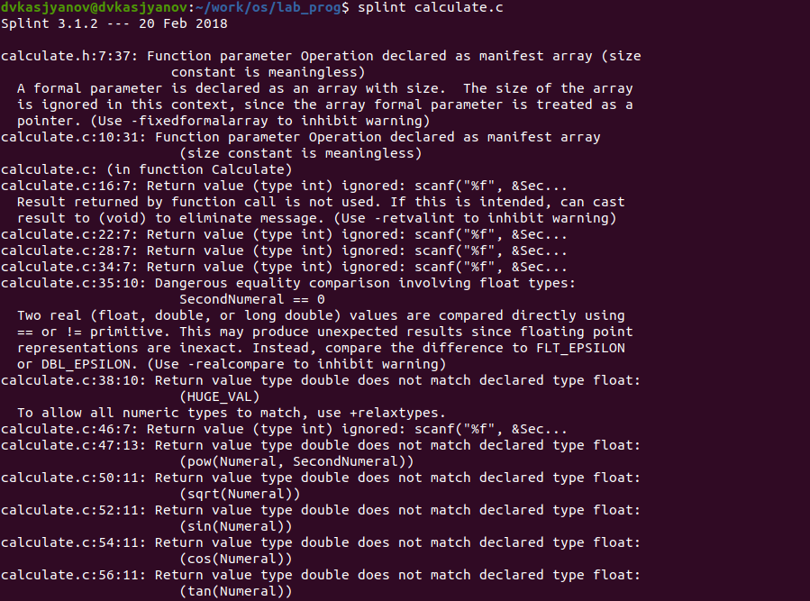

---
# Front matter
lang: ru-RU
title: "Отчёт лабораторной работы №14"
subtitle: "Дисциплина: Операционные системы"
author: "Касьянов Даниил Владимирович"

# Formatting
toc-title: "Содержание"
toc: true # Table of contents
toc_depth: 2
lof: true # List of figures
lot: true # List of tables
fontsize: 12pt
linestretch: 1.5
papersize: a4paper
documentclass: scrreprt
polyglossia-lang: russian
polyglossia-otherlangs: english
mainfont: PT Serif
romanfont: PT Serif
sansfont: PT Sans
monofont: PT Mono
mainfontoptions: Ligatures=TeX
romanfontoptions: Ligatures=TeX
sansfontoptions: Ligatures=TeX,Scale=MatchLowercase
monofontoptions: Scale=MatchLowercase
indent: true
pdf-engine: lualatex
header-includes:
  - \linepenalty=10 # the penalty added to the badness of each line within a paragraph (no associated penalty node) Increasing the value makes tex try to have fewer lines in the paragraph.
  - \interlinepenalty=0 # value of the penalty (node) added after each line of a paragraph.
  - \hyphenpenalty=50 # the penalty for line breaking at an automatically inserted hyphen
  - \exhyphenpenalty=50 # the penalty for line breaking at an explicit hyphen
  - \binoppenalty=700 # the penalty for breaking a line at a binary operator
  - \relpenalty=500 # the penalty for breaking a line at a relation
  - \clubpenalty=150 # extra penalty for breaking after first line of a paragraph
  - \widowpenalty=150 # extra penalty for breaking before last line of a paragraph
  - \displaywidowpenalty=50 # extra penalty for breaking before last line before a display math
  - \brokenpenalty=100 # extra penalty for page breaking after a hyphenated line
  - \predisplaypenalty=10000 # penalty for breaking before a display
  - \postdisplaypenalty=0 # penalty for breaking after a display
  - \floatingpenalty = 20000 # penalty for splitting an insertion (can only be split footnote in standard LaTeX)
  - \raggedbottom # or \flushbottom
  - \usepackage{float} # keep figures where there are in the text
  - \floatplacement{figure}{H} # keep figures where there are in the text
---

# Цель работы

Приобрести простейшие навыки разработки, анализа, тестирования и отладки приложений в ОС типа UNIX/Linux на примере создания на языке программирования С калькулятора с простейшими функциями.


# Выполнение лабораторной работы

1. В домашнем каталоге создаю подкаталог **~/work/os/lab_prog** (Рисунок 1).


(Рисунок 1)

2. Создаю в нём файлы **calculate.h**, **calculate.c**, **main.c** (Рисунок 2). Это будет примитивнейший калькулятор, способный складывать, вычитать, умножать и делить, возводить число в степень, брать квадратный корень, вычислять **sin**, **cos**, **tan**. При запуске он будет запрашивать первое число, операцию, второе число. После этого программа выведет результат и остановится.


(Рисунок 2)

Скопирую тексты из лабораторной работы и вставлю в файлы.

* **calculate.c** (Рис. 3, 4, 5):

  

  (Рисунок 3)

  

  (Рисунок 4)

  

  (Рисунок 5)

* **calculate.h** (Рис. 6, 7):

  

  (Рисунок 6)

  

  (Рисунок 7)

* **main.c** (Рис. 8, 9):

  

  (Рисунок 8)

  

  (Рисунок 9)

3. Выполняю компиляцию программы посредством **gcc** (Рисунок 10).


(Рисунок 10)

В результате компиляции программа выдала ошибку.

4. Исправляю синтаксические ошибки в файле **main.c**: в строке `scanf("%s", &Operation);` нужно убрать знак **&**, потому что имя массива символов уже является указателем на первый элемент этого массива (Рисунок 11).


(Рисунок 11)

Снова выполняю компиляцию программы посредством **gcc** (Рисунок 12).


(Рисунок 12)

Программа работает корректно.

5. Создаю **Makefile** (Рисунок 13). Переписываю в него текст программы из лабораторной работы (Рисунок 14).


(Рисунок 13)


(Рисунок 14)

Данный **Makefile** необходим для автоматической компиляции файлов **calculate.c**, **main.c**, а также их объединения в один исполняемый файл **calcul**; **clean** автоматически удаляет объектные и исполняемые файлы. Переменная **CC** отвечает за утилиту для компиляции. Переменная **CFLAGS** отвечает за опции. Переменная **LIBS** отвечает за опции для объединения объектных файлов в один исполняемый файл.

6. Исправлю **Makefile** (Рисунок 15): 

* `CFLAGS = -g` - добавляю опцию **g**, необходимую для компиляции объектных файлов и их использования в программе отладчика **GDB**.

* Для того, чтобы утилита компиляции выбиралась с помощью переменной **CC**, заменяю `gcc` на `$(CC)`.


(Рисунок 15)

Используя **Makefile**, удаляю исполняемые и объектные файлы (Рисунок 16), выполняю компиляцию файлов (Рисунок 17).


(Рисунок 16)


(Рисунок 17)

**Makefile** работает корректно.


* Запускаю отладчик **GDB**, загрузив в него программу **calcul** для отладки (Рисунок 18): 

  

  (Рисунок 18)

* Для запуска программы внутри отладчика ввожу команду `run`. Складываю числа **3** и **5** (Рисунок 19): 

  

  (Рисунок 19)

* Для постраничного (по **10** строк) просмотра исходного код использую команду `list`(Рисунок 20): 

  

  (Рисунок 20)

* Для просмотра строк с **12** по **15** основного файла использую `list 12,15` (Рисунок 21): 

  

  (Рисунок 21)

* Для просмотра определённых строк не основного файла использую `list calculate.c:20,29` (Рисунок 22): 

  

  (Рисунок 22)

* Установлю точку останова в файле **calculate.c** на строке номер **21** (Рисунок 23):
  ```
  list calculate.c:20,27
  break 21
  ```

  

  (Рисунок 23)

* Вывожу информацию об имеющихся в проекте точках останова, используя `info breakpoints` (Рисунок 24): 

  

  (Рисунок 24)

* Запускаю программу внутри отладчика. Программа останавливается в момент прохождения точки останова (Рисунок 25):

  

  (Рисунок 25)

* Смотрю, чему равно на этом этапе значение переменной **Numeral**, используя команду `print Numeral` (Рисунок 26):

  

  (Рисунок 26)

  На экран выводится число **5**.

* Сравниваю с результатом вывода на экран после использования команды `display Numeral` (Рисунок 27):

  

  (Рисунок 27)

  Значения совпадают.

* Убираю точки останова (Рисунок 28):
  ```
  info breakpoints
  delete 1 
  ```
  

  (Рисунок 28)

7. С помощью утилиты **splint** проанализирую коды файлов **calculate.c** и **main.c**.



(Рисунок 29)


(Рисунок 30)


(Рисунок 31)

Выяснилось, что **calculate.c** и **main.c** возвращают некоторое целое значение.

Некоторый параметр в **main.c** является массивом из нескольких элементов, но размер массива в данном контексте игнорируется, т.к. имя массива является указателем на его первый элемент. Именно с этим связана ошибка компиляции **gcc**.

Выводится предупреждение о том, что в файле **calculate.c** происходит сравнение вещественного числа с нулем, что может привести к неожиданным результатам. Это связано со внутренним представлением чисел с плавающей запятой. Также возвращаемые значения (тип **double**) в функциях **pow**, **sqrt**, **sin**, **cos** и **tan** записываются в переменную типа **float**, что свидетельствует о потери точности и значимости.

# Контрольные вопросы

1) Чтобы получить информацию о возможностях программ **gcc**, **make**, **gdb** и др. нужно воспользоваться командой man или опцией `-help (-h)` для каждой команды.

2) Процесс разработки программного обеспечения обычно разделяется на следующие этапы:

* **Планирование**, включающее сбор и анализ требований к функционалу и другим характеристикам разрабатываемого приложения;

* **Проектирование**, включающее в себя разработку базовых алгоритмов и спецификаций, определение языка программирования;

* **Непосредственная разработка приложения**: o кодирование − по сути создание исходного текста программы (возможно в нескольких вариантах); – анализ разработанного кода; o сборка, компиляция и разработка исполняемого модуля; o тестирование и отладка, сохранение произведённых изменений;

* **Документирование**. Для создания исходного текста программы разработчик может воспользоваться любым удобным для него редактором текста: **vi**, **vim**, **mceditor**, **emacs**, **geany** и др. После завершения написания исходного кода программы (возможно состоящей из нескольких файлов), необходимо её скомпилировать и получить исполняемый модуль.

3) Для имени входного файла **суффикс** определяет какая компиляция требуется. Суффиксы указывают на тип объекта. Файлы с расширением (суффиксом) .c воспринимаются gcc как программы на языке С, файлы с расширением .cc или .C − как файлы на языке C++, а файлы c расширением .o считаются объектными. Например, в команде «gcc -c main.c»: gcc по расширению (суффиксу) .c распознает тип файла для компиляции и формирует объектный модуль − файл с расширением .o. Если требуется получить исполняемый файл с определённым именем (например, hello), то требуется воспользоваться опцией -o и в качестве параметра задать имя создаваемого файла: `gcc -o hello main.c`.

4) Основное назначение компилятора языка Си в UNIX заключается в компиляции всей программы и получении исполняемого файла/модуля.

5) Для сборки разрабатываемого приложения и собственно компиляции полезно воспользоваться утилитой **make**. Она позволяет автоматизировать процесс преобразования файлов программы из одной формы в другую, отслеживает взаимосвязи между файлами.

6) Для работы с утилитой **make** необходимо в корне рабочего каталога с Вашим проектом создать файл с названием **makefile** или **Makefile**, в котором будут описаны правила обработки файлов Вашего программного комплекса. В самом простом случае **Makefile** имеет следующий синтаксис:
```
<цель_1> <цель_2> ... : <зависимость_1> <зависимость_2> ...
<команда 1>
...
<команда n>
```
Сначала задаётся список целей, разделённых пробелами, за которым идёт двоеточие и список зависимостей. Затем в следующих строках указываются команды. Строки с командами обязательно должны начинаться с табуляции. В качестве цели в Makefile может выступать имя файла или название какого-то действия. Зависимость задаёт исходные параметры (условия) для достижения указанной цели. Зависимость также может быть названием какого-то действия. Команды − собственно действия, которые необходимо выполнить для достижения цели.

Общий синтаксис Makefile имеет вид:
```
target1 [target2...]:[:] [dependment1...]
[(tab)commands] [#commentary]
[(tab)commands] [#commentary]
```
Здесь знак **#** определяет начало комментария (содержимое от знака # и до конца строки не будет обрабатываться. Одинарное двоеточие указывает на то, что последовательность команд должна содержаться в  одной строке. Для переноса можно в длинной строке команд можно использовать обратный слэш (\). Двойное двоеточие указывает на то, что последовательность команд может содержаться в нескольких последовательных строках.

Пример более сложного синтаксиса Makefile:
```
#
# Makefile for abcd.c
#
CC = gcc
CFLAGS =
# Compile abcd.c normaly
abcd: abcd.c
$(CC) -o abcd $(CFLAGS) abcd.c
clean:
-rm abcd *.o *~
# End Makefile for abcd.c
```
В этом примере в начале файла заданы три переменные: **CC** и **CFLAGS**. Затем указаны цели, их зависимости и соответствующие команды. В командах происходит обращение к значениям переменных. Цель с именем **clean** производит очистку каталога от файлов, полученных в результате компиляции. Для её описания использованы регулярные выражения.


7) Во время работы над кодом программы программист неизбежно сталкивается с появлением ошибок в ней. Использование отладчика для поиска и устранения ошибок в программе существенно облегчает жизнь программиста. В комплект программ GNU для ОС типа UNIX входит отладчик **GDB** (**GNU Debugger**).  Для использования **GDB** необходимо скомпилировать анализируемый код программы таким образом, чтобы отладочная информация содержалась в результирующем бинарном файле. Для этого следует воспользоваться опцией `-g` компилятора **gcc**: `gcc -c file.c -g`

После этого для начала работы с gdb необходимо в командной строке ввести одноимённую команду, указав в качестве аргумента анализируемый бинарный файл: `gdb file.o`

8) Основные команды отладчика **gdb**:

* **backtrace** − вывод на экран пути к текущей точке останова (по сути вывод − названий всех функций)

* **break** − установить точку останова (в качестве параметра может быть указан номер строки или название функции)

* **clear** − удалить все точки останова в функции

* **continue** − продолжить выполнение программы

* **delete** − удалить точку останова

* **display** − добавить выражение в список выражений, значения которых отображаются при достижении точки останова программы

* **finish** − выполнить программу до момента выхода из функции

* **info breakpoints** − вывести на экран список используемых точек останова

* **info watchpoints** − вывести на экран список используемых контрольных выражений

* **list** − вывести на экран исходный код (в качестве параметра может быть указано название файла и через двоеточие номера начальной и конечной строк)

* **next** − выполнить программу пошагово, но без выполнения вызываемых в программе функций

* **print** − вывести значение указываемого в качестве параметра выражения

* **run** − запуск программы на выполнение

* **set** − установить новое значение переменной

* **step** − пошаговое выполнение программы

* **watch** − установить контрольное выражение, при изменении значения которого программа будет остановлена. 

Для выхода из gdb можно воспользоваться командой **quit** (или её сокращённым вариантом **q**) или комбинацией клавиш **Ctrl-d**.

Более подробную информацию по работе с gdb можно получить с помощью команд `gdb -h` и `man gdb`.

9) Cхема отладки программы показана в пункте 6.

10) В коде программы **main.c** допущена ошибка: в строке `scanf("%s", &Operation);` нужно убрать знак **&**, потому что имя массива символов уже является указателем на первый элемент этого массива.

11) Система разработки приложений UNIX предоставляет различные средства, повышающие понимание исходного кода. К ним относятся:

* **cscope** − исследование функций, содержащихся в программе,
* **lint** − критическая проверка программ, написанных на языке Си.

12) Утилита **splint** анализирует программный код, проверяет корректность задания аргументов использованных в программе функций и типов возвращаемых значений, обнаруживает синтаксические и семантические ошибки. В отличие от компилятора C анализатор **splint** генерирует комментарии с описанием разбора кода программы и осуществляет общий контроль, обнаруживая такие ошибки, как одинаковые объекты, определённые в разных файлах, или объекты, чьи значения не используются в работе  программы, переменные с некорректно заданными значениями и типами и многое другое.

# Выводы

Я приобрёл простейшие навыки разработки, анализа, тестирования и отладки приложений в ОС типа UNIX/Linux на примере создания на языке программирования С калькулятора с простейшими функциями.


# Библиография

[Лабораторная работа №14 - "Средства для создания приложений в ОС UNIX"](https://esystem.rudn.ru/mod/resource/view.php?id=718613)

[Обзор процесса разработки программного обеспечения](https://habr.com/ru/post/255991/)

[makefile:4: *** missing separator. Stop](https://stackoverflow.com/questions/16931770/makefile4-missing-separator-stop)