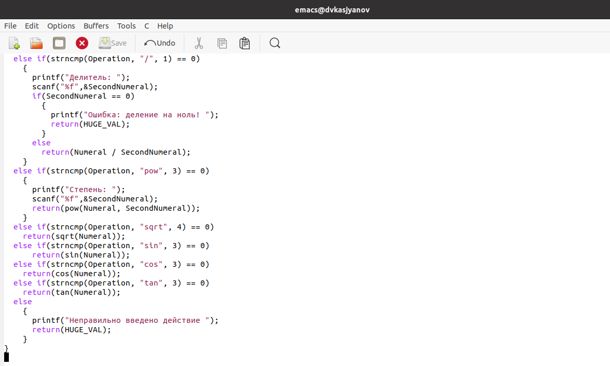
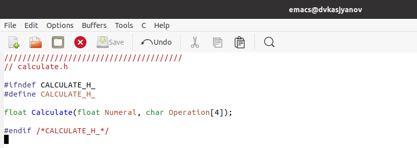
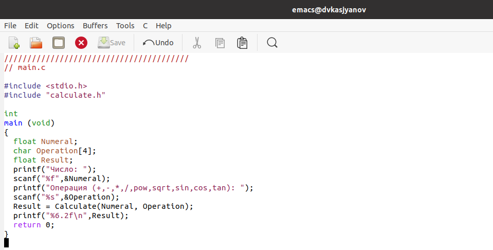
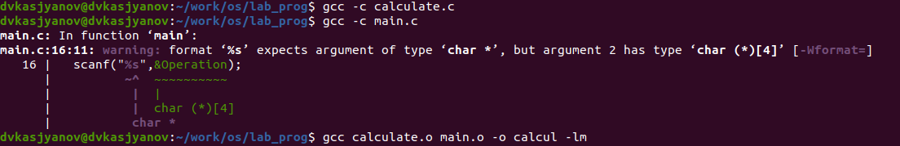
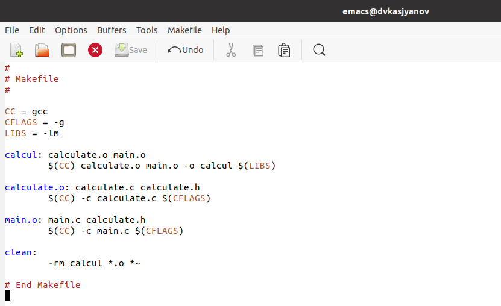
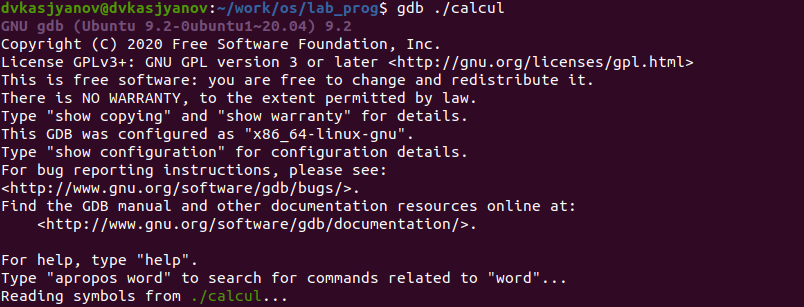
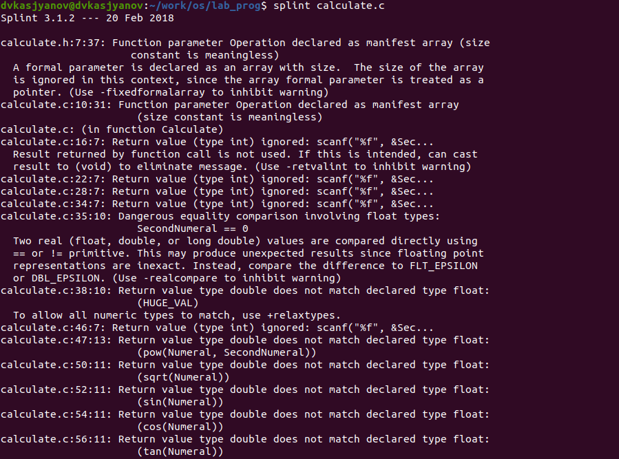

---
## Front matter
lang: ru-RU
title: Операционные системы 
author: Касьянов Даниил Владимирович
institute: RUDN University, Moscow, Russian Federation

date: 18 мая 2021 год

## Formatting
toc: false
slide_level: 2
theme: metropolis
header-includes: 
 - \metroset{progressbar=frametitle,sectionpage=progressbar,numbering=fraction}
 - '\makeatletter'
 - '\beamer@ignorenonframefalse'
 - '\makeatother'
aspectratio: 43
section-titles: true
---

# Лабораторная работа №14

## Ход работы

Создаю командные файлы **calculate.h**, **calculate.c**, **main.c** для реализации простейшего калькулятора.

**calculate.c** 1/2

##

**calculate.c** 2/2

##

**calculate.h**

##

**main.c**

## 

Исправляю синтаксические ошибки.

Ошибка с типами данных

##

Создаю Makefile. Исправляю его.

Исправленный Makefile

##

Произвожу отладку. Учусь ставить точку останова.

Отладка **calcul** с помощью **gdb**

##

Анализирую коды файлов, используя **splint**.

**Splint** по **calculate.c**

## Выводы

Я приобрёл простейшие навыки разработки, анализа, тестирования и отладки приложений в ОС типа UNIX/Linux на примере создания на языке программирования С калькулятора с простейшими функциями.

## {.standout}

Спасибо за внимание!
