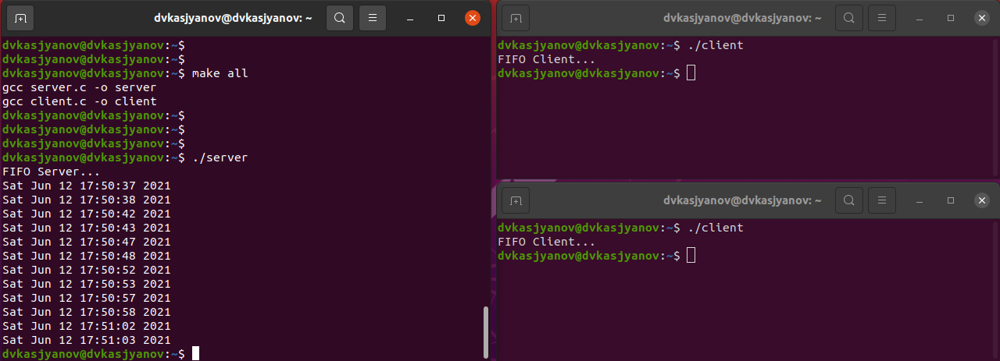

---
## Front matter
lang: ru-RU
title: Операционные системы 
author: Касьянов Даниил Владимирович
institute: RUDN University, Moscow, Russian Federation

date: 12 июня 2021 год

## Formatting
toc: false
slide_level: 2
theme: metropolis
header-includes: 
 - \metroset{progressbar=frametitle,sectionpage=progressbar,numbering=fraction}
 - '\makeatletter'
 - '\beamer@ignorenonframefalse'
 - '\makeatother'
aspectratio: 43
section-titles: true
---

# Лабораторная работа №15

## Прагматика выполнения лабораторной работы

Целью лабораторной работы является приобретение практических навыков работы с именованными каналами.

Задача лабораторной работы заключается в создании программ с системой клиент-сервер. Для этого необходимо внести сооствествующие изменения в образец из лабораторной работы.

## Результаты выполнения лабораторной работы

В ходе работы я создал программу, позволяющую работать нескольким клиентам сервера. При этом клиенты передают текущее время с периодичностью в пять секунд, а сервер прекращает работу через 30 секунд.

Работа нескольких клиентов сервера

##

Я приобрёл практические навыки работы с именованными каналами.

## {.standout}

Спасибо за внимание!
